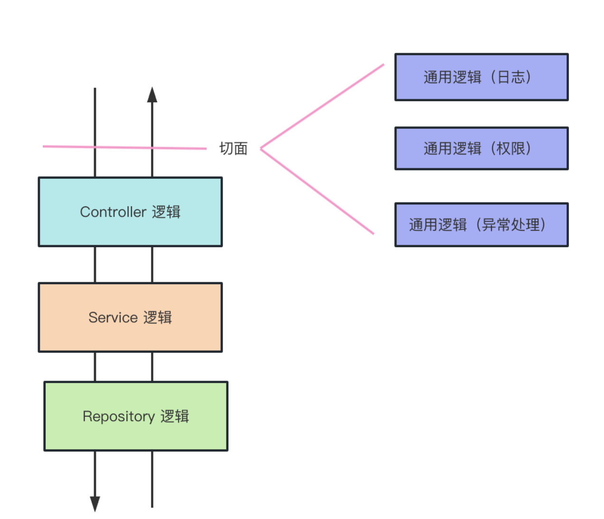
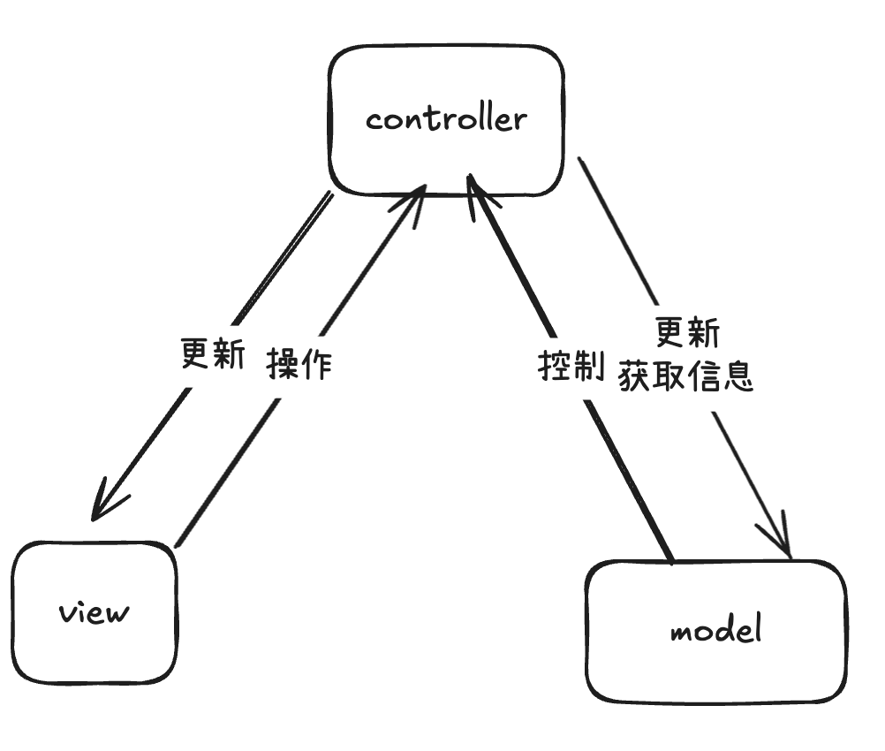
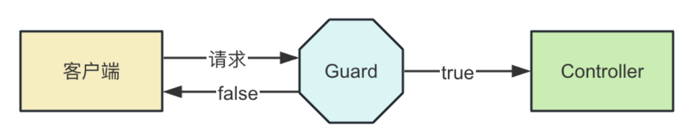
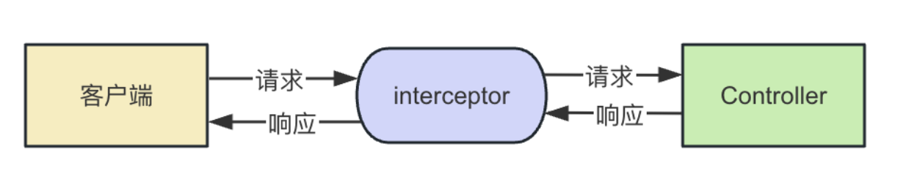
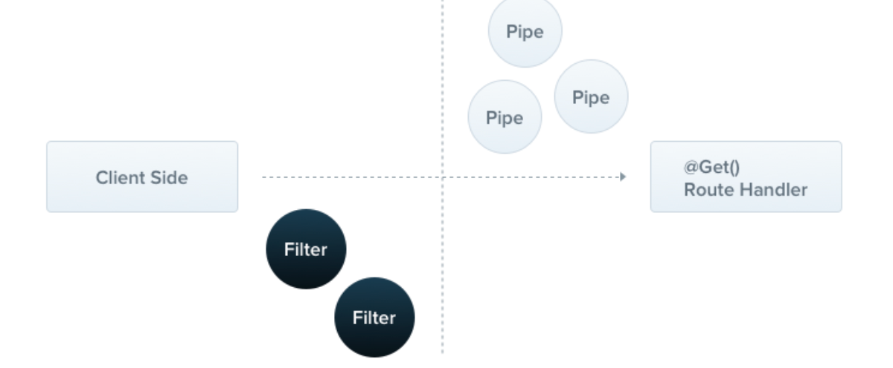
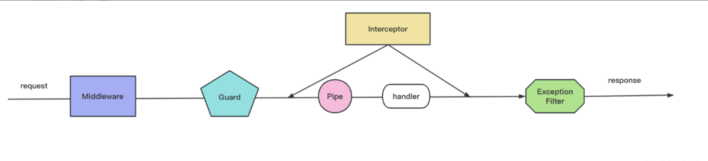

# Nest 学习笔记

nest 采用的适配器的设计模式
Nest 本身只依赖 HttpServer 接口，并不和具体的库耦合。
nest 对标的 java 的 spring 框架。

/user/create、/user/list 这些是不同的路由这些路由在 Controller 中声明。
通过装饰器语法来实现路由的拦截器。

### 小试牛刀

```typescript
@Controller("/user")
export class UserController {
  @Post("/create")
  createUser(@Body() createUserDto: CreateUserDto) {
    return "create user";
  }

  @Get("/list")
  listUser() {
    return "list user";
  }
}
```

- @Param 获取 url 中的参数

```typescript
@Get("/:id")
getUser(@Param("id") id: string) {
  return `get user ${id}`;
}
```

- @Query 获取 url 中的 query 参数

```typescript
@Get("/list")
xxx(@Query("name") name: string) {
  return `get user ${name}`;
}
```

- @Body 获取请求体中的参数

```typescript
@Post("/create")
createUser(@Body() createUserDto: CreateUserDto) {
  return `create user ${createUserDto.name}`;
}
```

tips:请求体一般会传递 json，比如 { username: 'xxx', password: 'xxx' }我们会通过 dto （data transfer object）来接收。

- @Res 响应对象

```typescript
@Get("/list")
```

总结上面的用法

- controller 是处理路由和解析请求参数的
- service 里做业务逻辑的具体实现，比如操作数据库等
- dto 是封装请求参数的。
- entity 是数据库的表结构。
  每个模块里都包含 controller 和 service：

```typescript
@Module({
    controllers: [UserController],
    providers: [UserService],
})
```

nest 通过@Module 来定义一个模块，nest 通过一个依赖注入的机制(ioC 控制反转)来实现声明、创建依赖
每个模块都应该有 controller、service、module、dto、entities
controller 接收请求参数，交给 model 处理（model 就是处理 service 业务逻辑，处理 repository 数据库访问），然后返回 view，也就是响应。

跨多个 controller 时，nest 提供了 AOP 的机制，让一个方法在多个 controller 中都能执行。
通用的处理可以作为一个切面（aspect）来实现。

### nest/cli

nest/cli 是 nest 的脚手架工具，可以快速生成项目结构、文件、代码。
常用命令:

- nest new project-name 创建项目
- nest generate resource/module/service/controller xxx: 创建一整个模块、module、service、controller。它同样会自动在 AppModule 引入
- nest build 生成项目
- nest start 启动项目 (nest build 之后)
- nest info 查看 nest 版本信息

### 数据传输

- url params: 通过 @Param() 装饰器获取 url 中的参数。
- query params: 通过 @Query() 装饰器获取 url 中的 query 参数。
- form-urlencoded data: 通过 @Body() 装饰器获取请求体中的参数。
- formData data: 通过 @Body() 装饰器获取请求体中的参数。
- json data: 通过 @Body() 装饰器获取请求体中的参数。

url params:

```
http://www.baidu.com/user
```

user 是 url params。

query params:

```
http://www.baidu.com/user?name=xxx
```

name 是 query params。(只支持 ascii 字符，中文和特殊字符需要 encodeURIComponent 处理)

form-urlencoded data:
类似于 query params，但是请求体中的参数是 application/x-www-form-urlencoded 格式。相当于数据放在了请求体中。

formData data:用 --------- + 一串数字做为 boundary 分隔符。

json data: 请求体中的参数是 json 格式。
指定 content type 为 application/json

调用下 useStaticAssets 来支持静态资源的请求

```typescript
import { NestExpressApplication } from "@nestjs/platform-express";

async function bootstrap() {
  const app = await NestFactory.create<NestExpressApplication>(AppModule);
  app.useStaticAssets("public", { prefix: "/static/" });
  await app.listen(3000);
}
bootstrap();
```

IoC 控制反转
在对象上声明依赖关系，而不是在对象创建时声明。Nest 通过依赖注入（DI）来实现控制反转。通过装饰器语法来实现
@Injectable 通过这个声明，表示这个类可以被注入，注入分为 属性注入 和 构造器注入。

属性注入：

```typescript
import { Controller } from "@nestjs/common";
import { UserService } from "./user.service";
@Controller()
export class UserController {
  @Inject(UserService)
  private readonly userService: UserService;
}
```

构造器注入：

```typescript
import { Controller } from "@nestjs/common";
import { UserService } from "./user.service";
@Controller()
export class UserController {
  constructor(private readonly userService: UserService) {}
}
```

通过 @Module 声明模块，其中 controllers 是控制器，只能被注入。
IoC 机制是在 class 上标识哪些是可以被注入的，它的依赖是什么，然后从入口开始扫描这些对象和依赖，自动创建和组装对象。

### provider

providers 是可以被注入的对象，可以是类、值、工厂函数。

```typescript
// app.service.ts
import { Injectable } from "@nestjs/common";

@Injectable()
export class AppService {
  getHello(): string {
    return "Hello World!";
  }
}

//app.module.ts
import { Module } from "@nestjs/common";
import { AppController } from "./app.controller";
import { AppService } from "./app.service";
@Module({
  imports: [],
  controllers: [AppController],
  providers: [AppService],
})
export class AppModule {}
```

这个就是一个 provider
@Moudule 中 providers 数组中的每一项除了是类之外还可以是对象

```typescript
@Module({
    providers: [
        {
            provide: 'APP_SERVICE',
            useClass: AppService
        },
        {
            provide: 'person2',
            useValue: {
                name: 'John',
                age: 30
            }
        },
        {
            provide:'person',
            useFactory: () => ({ name: 'John', age: 30 })
        }
    ]
})
```

模块导出 provider，另一个模块需要 imports 它才能用这些 provider。

但如果这个模块被很多模块依赖了，那每次都要 imports 就很麻烦。
这里就可以使用全局模块，把 provider 注册到全局，然后其他模块都可以直接使用。

```typescript
// aaa.module.ts
import {Module, Global} from "@nestjs/common";
import {AAAService} from "./aaa.service";
import {AAAController} from "./aaa.controller";
@Global()
@Module({
    controllers: [AAAController],
    providers: [AAAService],
    exports: [AAAService]
})

// bbb.module.ts
import {Module} from "@nestjs/common";
import {BBBService} from "./bbb.service";
import {BBBController} from "./bbb.controller";

@Module({
    imports: [],//这里不用显示声明AAAModule，因为它已经被注册到全局了
    controllers: [BBBController],
    providers: [BBBService]
})

// bbb.service.ts
import { Injectable, Inject } from "@nestjs/common";

@Injectable()
export class BBBService {
  constructor(private readonly aaaService: AAAService){}
  getHello(): string {
    return this.aaaService.getHello();
  }
}
```

全局模块可以被其他模块依赖，也可以被其他模块导入。不用再显式声明。
但是也有个弊端，如果过度使用，就无法得知 provider 的来源，也不方便排查问题。类似于 vue 的 mixin

生命周期:
Nest 在启动的时候，会递归解析 Module 依赖，扫描其中的 provider、controller，注入它的依赖。
这里有生命周期的方法

- 初始化生命周期
  - onModuleInit() 在模块初始化之后调用，只会被调用一次。
  - onApplicationBootstrap() 在应用启动之后调用，只会被调用一次。
    首先，递归初始化模块，会依次调用模块内的 controller、provider 的 onModuleInit 方法，然后再调用 module 的 onModuleInit 方法。
    全部初始化完之后，再依次调用模块内的 controller、provider 的 onApplicationBootstrap 方法，然后调用 module 的 onApplicationBootstrap 方法

nest 提供了两个接口

```typescript
export interface onModuleInit {
  onModuleInit(): any;
}
export interface onApplicationBootstrap {
  onApplicationBootstrap(): any;
}
```

可以分别在 controller、provider、module 实现这两个接口，然后在 Nest 启动的时候，会自动调用这两个方法。

```typescript
import {
  Injectable,
  onModuleInit,
  onApplicationBootstrap,
} from "@nestjs/common";
@Injectable()
export class AService implements onModuleInit, onApplicationBootstrap {
  onModuleInit() {
    console.log("onModuleInit");
  }
  onApplicationBootstrap() {
    console.log("onApplicationBootstrap");
  }
}

//a.controller.ts
import {
  Controller,
  onModuleInit,
  onApplicationBootstrap,
} from "@nestjs/common";
import { AService } from "./a.service";
@Controller()
export class AController implements onModuleInit, onApplicationBootstrap {
  onModuleInit() {
    console.log("onModuleInit");
  }
  onApplicationBootstrap() {
    console.log("onApplicationBootstrap");
  }
}

// a.module.ts
import { Module, onModuleInit, onApplicationBootstrap } from "@nestjs/common";
import { AService } from "./a.service";

@Module({
  imports: [],
  controllers: [AController],
  providers: [AService],
})
export class AModule implements onModuleInit, onApplicationBootstrap {
  onModuleInit() {
    console.log("onModuleInit");
  }
  onApplicationBootstrap() {
    console.log("onApplicationBootstrap");
  }
}
```

- 销毁生命周期
  - onModuleDestroy() 在模块销毁之前调用，只会被调用一次。
  - beforeApplicationShutdown() 在应用关闭之前调用，只会被调用一次。
  - onApplicationShutdown() 在应用关闭之前调用，只会被调用一次。
    先调用每个模块的 controller、provider 的 onModuleDestroy 方法，然后调用 Module 的 onModuleDestroy 方法。
    之后再调用每个模块的 controller、provider 的 beforeApplicationShutdown 方法，然后调用 Module 的 beforeApplicationShutdown 方法。
    然后停止监听网络端口。
    之后调用每个模块的 controller、provider 的 onApplicationShutdown 方法，然后调用 Module 的 onApplicationShutdown 方法。

beforeApplicationShutdown 和 onApplicationShutdown 的区别：

beforeApplicationShutdown 能够传入一个 signal 系统信号量，比如 SIGTERM。

这些终止信号是别的进程传过来的，让它做一些销毁的事情，比如用 k8s 管理容器的时候，可以通过这个信号来通知它。

```typescript
const app = await NestFactory.create(AppModule);
await app.listen(3000);
app.close(); // 关闭应用
```

## AOP 架构

后端框架基本都是 MVC(Model View Controller)架构的。MVC 架构下，请求会先发送给 Controller，由它调度 Model 层的 Service 来完成业务逻辑，然后返回对应的 View。

AOP 面向切片编程
切片:

直接增加一个切片，不影响原来的逻辑。

这样的横向扩展点就叫做切面，这种透明的加入一些切面逻辑的编程方式就叫做 AOP （面向切面编程）。
比如 express 的中间件(洋葱模型)也是 AOP 的一种实现。

```typescript
app.use(() => {
  console.log("this is middleware");
});
```

而 Nest 实现 AOP 的方式更多，一共有五种，包括 Middleware、Guard、Pipe、Interceptor、ExceptionFilter。

- Middleware: 处理请求和响应，可以对请求和响应进行操作，比如日志记录、验证、权限等。
  

```typescript
import { NextFunction, Request, Response } from "@nestjs/common";
import { NestFactory } from "@nestjs/core";
import { AppModule } from "./app.module";

async function bootstrap() {
  const app = await NestFactory.create(AppModule);

  app.use((req: Request, res: Response, next: NextFunction) => {
    console.log("this is middleware");
  });
}
```

这样子可以实现一些日志打印。

```shell
nest g middleware log --no-spec --flat
```

不生成测试文件+平铺目录

```ts
import { Injectable, NestMiddleware } from "@nestjs/common";

@Injectable()
export class LogMiddleware implements NestMiddleware {
  use(req: Request, res: Response, next: () => void) {
    console.log("before", req.url);
    next();
    console.log("after");
  }
}
```

然后在 AppModule 中导入

```ts
export class AppModule implements NestModule {
  configure(consumer: MiddlewareConsumer) {
    consumer.apply(LogMiddleware).forRoutes("users");
  }
}
```

然后当访问 users 路由时，会先打印 before，然后再打印 after。
全局路由: `app.use(fn)`
局部路由: `consumer.apply(fn).forRoutes("users")`

- Guard: 守卫，可以对请求进行拦截，比如权限验证、登录验证等。
  创建通过
  

```shell
nest g guard auth --no-spec --flat
```

```ts
import { Injectable, CanActivate, ExecutionContext } from "@nestjs/common";
import { Observable } from "rxjs";

@Injectable()
export class AuthGuard implements CanActivate {
  canActivate(
    context: ExecutionContext
  ): boolean | Promise<boolean> | Observable<boolean> {
    const request = context.switchToHttp().getRequest();
    return true;
  }
}
```

需要实现 canActivate 方法，返回 true 表示允许访问，返回 false 表示禁止访问。

局部使用

```ts
export class AppController {
  @UseGuards(AuthGuard)
  @Get()
  getHello() {
    return "Hello World!";
  }
}
```

全局使用

```ts
// 在app里面直接注册或者在module里面注册
async function bootstrap() {
  const app = await NestFactory.create(AppModule);
  app.useGlobalGuards(new AuthGuard());
  await app.listen(3000);
}

// module里面注册
@Module({
  imports: [],
  controllers: [AppController],
  providers: [{
    provide:APP_GUARD,
    useClass:AuthGuard
  }],
})
```

两种方式的差异点在于:用 provider 的方式声明的 Guard 是在 IoC 容器里的，可以注入别的 provider

比如上方的 Module 注入之后可以在原来的 AuthGuard 添加一些东西

```ts
@Injectable()
export class AuthGuard implements CanActivate {
  constructor(private readonly appService: AppService) {}
  canActivate(
    context: ExecutionContext
  ): boolean | Promise<boolean> | Observable<boolean> {
    const request = context.switchToHttp().getRequest();
    console.log(this.appService.getHello());
    return true;
  }
}
```

- interceptor: 拦截器，可以对请求进行拦截，比如请求参数验证、响应数据处理等。
  
  他和 Guard 的区别就是:

  - Guard 是在进入路由之前进行拦截且只做是否放行的操作
  - Interceptor 是在请求前后进行拦截，可以对请求和响应进行操作。

创建 interceptor`nest g interceptor time --no-spec --flat`

```ts
import {
  CallHandler,
  ExecutionContext,
  Injectable,
  NestInterceptor,
} from "@nestjs/common";
import { Observable, tap } from "rxjs";

@Injectable()
export class TimeInterceptor implements NestInterceptor {
  intercept(context: ExecutionContext, next: CallHandler): Observable<any> {
    const startTime = Date.now();

    return next.handle().pipe(
      tap(() => {
        console.log("time: ", Date.now() - startTime);
      })
    );
  }
}
```

生成的 interceptor 如上所示。

Interceptor 要实现 NestInterceptor 接口，实现 intercept 方法，调用 next.handle() 就会调用目标 Controller，可以在之前和之后加入一些处理逻辑。

nest 通过 rxjs 来处理异步操作。

使用:

```ts
@Controller()
export class AppController {
  @Get("bbb")
  @UseInterceptors(TimeInterceptor)
  bbb() {
    return "bbb";
  }
}
//也可以放在全部的类上
@Controller()
@UseInterceptors(TimeInterceptor)
export class AppController {
  @Get("aaa")
  aaa() {
    return "aaa";
  }
}
```

此外全局启动和 Guard 一致。可以直接`app.useGlobalInterceptors(new TimeInterceptor())`也可以在@Module 中注册 provide:APP_INTERCEPTOR

- pipe: 管道，可以对请求参数进行处理，比如验证、类型转换等。
  

`nest g pipe validate --no-spec --flat`

```ts
import {
  ArgumentMetadata,
  BadRequestException,
  Injectable,
  PipeTransform,
} from "@nestjs/common";

@Injectable()
export class ValidatePipe implements PipeTransform {
  transform(value: any, metadata: ArgumentMetadata) {
    if (Number.isNaN(parseInt(value))) {
      throw new BadRequestException(`参数${metadata.data}错误`);
    }

    return typeof value === "number" ? value * 10 : parseInt(value) * 10;
  }
}
```

Pipe 要实现 PipeTransform 接口，实现 transform 方法，里面可以对传入的参数值 value 做参数验证，比如格式、类型是否正确，不正确就抛出异常。也可以做转换，返回转换后的值。

使用
对参数生效

```ts
export class AppController {
  @Get("ccc")
  ccc(@Query("num", ValidatePipe) num: number) {
    return num + 1;
  }
}
```

这里是先执行 ValidatePipe 的操作，然后把参数 num 传给 ccc 方法。
也可以对整个 controller 生效

```ts
@Controller()
@UsePipes(ValidatePipe)
export class AppController {
  @Get("ddd")
  ddd(@Query("num") num: number) {
    return num + 1;
  }
}
```

此外全局启动和 Guard 一致。可以直接`app.useGlobalPipes(new TimeInterceptor())`也可以在@Module 中注册 provide:APP_PIPE

- ExceptionFilter 可以对抛出的异常做处理，返回对应的响应：
  

`nest g filter test --no-spec --flat`

```ts
import {
  ArgumentsHost,
  BadRequestException,
  Catch,
  ExceptionFilter,
} from "@nestjs/common";
import { Response } from "express";

@Catch(BadRequestException)
export class TestFilter implements ExceptionFilter {
  catch(exception: BadRequestException, host: ArgumentsHost) {
    const response: Response = host.switchToHttp().getResponse();

    response.status(400).json({
      statusCode: 400,
      message: "test: " + exception.message,
    });
  }
}
```

实现 ExceptionFilter 接口，实现 catch 方法，就可以拦截异常了。

拦截什么异常用 @Catch 装饰器来声明，然后在 catch 方法返回对应的响应，给用户更友好的提示。

局部使用

```ts
@Get('ccc')
@UseFilters(TestFilter)
ccc(@Query('num',ValidatePipe) num: number){
  return num + 1;
}
// controller使用
@Controller()
@UseFilters(TestFilter)
export class AppController {}
```

此外全局启动和 Guard 一致。可以直接`app.useGlobalFilters(new TimeInterceptor())`也可以在@Module 中注册 provide:APP_FILTER

几者的执行顺序:


Nest 基于 express 这种 http 平台做了一层封装，应用了 MVC、IOC、AOP 等架构思想。
通过这种 AOP 的架构方式，实现了松耦合、易于维护和扩展的架构。

### 装饰器

装饰器氛围有两种：
自带装饰器和自定义装饰器。

自带装饰器有

- @Module 声明模块

```ts
@Module({
  imports: [],
  controllers: [AppController],
  providers: [AppService],,
})
export class AppModule {}
```

- @Controller 声明控制器

```ts
@Controller()
export class AppController {}
```

- @Injectable 声明 provider,provider 又主要分为三类
  - 任意的 class
  - 构造器注入
  - 属性注入
  - useFactory、useValue 注入这时候需要指定注入的 token(对应 provider 的 provide 值)

```ts
// class
@Injectable() //表示这个类可以被注入
export class AppService {}

// constructor
import { AppService } from "./app.service";
@Injectable()
export class Aaa {
  constructor(private readonly appService: AppService) {}
}

// property属性注入  等同于构造器注入不过这个更加方便
import { AppService } from "./app.service";
@Injectable()
export class Aaa {
  @Inject(AppService)
  appService: AppService;
}

// useFactory、useValue 注入
@Module({
  imports: [],
  controllers: [AppController],
  providers: [
    {
      provide: "Bbb",
      useFactory: () => {
        return { name: "Bbb" };
      },
    },
  ],
})
export class AppController {
  @Inject("Bbb")
  private readonly bbb: Record<string, any>;
}
```

- @Global()声明全局模块,全局模块可以被其他模块依赖,不用显示的声明放在 providers 中

```ts
//比如把Aaa声明到全局
@Global()
@Module({
  imports: [],
  controllers: [AaaController],
  providers: [AaaService],
})
export class AaaModule {}

//然后Bbb不用直接import就能够使用
@Module({
    imports: [],//这里不用显示声明AAAModule，因为它已经被注册到全局了
    controllers: [BBBController],
    providers: [BBBService]
})

// bbb.service.ts
import { Injectable, Inject } from "@nestjs/common";

@Injectable()
export class BBBService {
  constructor(private readonly aaaService: AAAService){}
  getHello(): string {
    return this.aaaService.getHello();
  }
}
```

- @Catch 声明异常过滤器,指定处理的异常。 比如 filter 处理抛出且没有被捕获的异常。然后通过 UseFilters 装饰器放在 handler 上

```ts
import {
  HttpException,
  ArgumentsHost,
  Catch,
  ExceptionFilter,
} from "@nestjs/common";
@Catch(HttpException)
export class AaaFilter implements ExceptionFilter {
  catch(exception: HttpException, host: ArgumentsHost) {
    const response = host.switchToHttp().getResponse();
    response.status(exception.getStatus()).json({
      msg: exception.message,
    });
  }
}

@Controller()
export class AaaController {
  @Get()
  @UseFilters(AaaFilter)
  @UseGuards(AaaGuard)
  @UseInterceptors(AaaInterceptor)
  @UsePipes(AaaPipe)
  getHello() {
    throw new HttpException("error", 400);
  }
  @Get("aaa")
  getHello2(
    @Query("num", parseIntPipe) num: number,
    @Param("id", parseIntPipe) id: number
  ) {}
}
```

pipe 通常还是对参数起作用更多
localhost:3000/aaa/333?num=123
@Param 取到的就是 aaa/333(路径中的参数)
@Query 取到的是 123(?后面的部分)

- @Get/Post/Put/Delete/Pathch/Options/Head 等 声明路由,指定请求方式为 get/post/put/delete/patch/options/head,并指定路由地址

- @SetMetadata 声明元数据,可以用来声明一些元数据,比如路由地址、请求方式、请求参数、请求头、请求体等。

```ts
// 对于handler和class都可以 声明元数据
@Controller()
@SetMetadata("roles", ["user"])
export class AaaController {
  @Get()
  @SetMetadata("roles", ["admin"])
  @UseGuards(AaaGuard)
  @UseInterceptors(AaaInterceptor)
  getHello() {}
}
//然后通过Guard或者Interceptor可以获取到元数据
import { Reflector } from "@nestjs/core";
@Injectable()
export class AaaGuard implements CanActivate {
  @Inject(Reflector)
  canActivate(
    context: ExecutionContext
  ): boolean | Promise<boolean> | Observable<boolean> {
    const classMeta = this.reflector.get("roles", context.getClass());
    const handlerMeta = this.reflector.get("roles", context.getHandler());

    console.log(classMeta, handlerMeta);
    return true;
  }
}
```

- @Headers 装饰器，拿到请求头;@Body 装饰器,拿到请求体

```ts
@Get('/ccc')
header(@Headers('Accept') accept: string, @Headers() headers:Record<string,any>){
  console.log(accept, headers)
}
```

@Head 和@Headers 的区别:
@Head 声明的是方法，处理 HTTP HEAD 请求，返回响应头信息，不返回响应体。（可以快速的响应资源是否存在等）
@Headers 声明的是参数装饰器，可以拿到请求头信息。

- @Ip 装饰器，拿到请求的 IP 地址

```ts
@Get('/ip')
ip(@Ip() ip: string){
  console.log(ip)
}
```

- @Session 装饰器，拿到请求的 session 对象

```ts
@Get('/session')
session(@Session() session: any){}
// session不能直接使用，但是可以通过express-session中间件实现。

async function bootstrap() {
  const app = await NestFactory.create(AppModule);
  const sessionMiddleware = session({
    secret: "keyboard cat",
    resave: false,
    saveUninitialized: false,
  });
  app.use(sessionMiddleware);
  await app.listen(3000);
}
```

- @HostParam 装饰器，拿到请求的 host 参数

```ts
import { Controller, Get, HostParam } from "@nestjs/common";

@Controller({ host: ":host.0.0.1", path: "aaa" })
export class AaaController {
  @Get("bbb")
  hello(@HostParam("host") host: string) {
    return `hello ${host}`;
  }
}
```

当 app 注入 AaaController 之后，再次直接访问 Aaa/bbb 是无法直接访问到的
http://127.0.0.1:3000/Aaa/hello 只有这个才能正常返回
而访问 localhost:3000/Aaa/bbb 会返回 404

- @Req/@Request 装饰器，拿到请求对象

```ts
@Get('ccc')
ccc(@Req() req: Request){
  console.log(req.query)
  console.log(req.url)
}
```

- @Res/@Response 装饰器，拿到响应对象

```ts
@Get('ccc')
ccc(@Res() res: Response){
  res.status(200).json({
    msg: 'ok'
  })
  res.end(`111`)
}
```

当使用的 response 对象后，就不能直接正常返回，因为此时的 handler 返回值不 会当做响应结果处理。
需要使用`res.end()`

reason:Nest 这么设计是为了避免你自己返回的响应和 Nest 返回的响应的冲突。
还可以通过 passthrough 参数来确定是否将 handler 的返回值作为响应结果。

```ts
@Get('ccc')
ccc(@Res({ passthrough: true }) res: Response){
  return '1'
}
```

- @Next 装饰器，拿到下一个中间件函数
  同时@Next 不会返回响应

```ts
@Get('ccc')
ccc(@Next() next: NextFunction){
  console.log('ccc');
  next()
  return '1'
}
@Get('ccc')
ccc2(){
  console.log('ccc2');
  return '2'
}
```

- @HttpCode 装饰器，修改响应状态码。handler 默认的状态码是 200。

```ts
@Get('ccc')
@HttpCode(201)
ccc(){
  return '1'
}

```

- @Header 装饰器，修改返回响应头信息

```ts
@Get('ccc')
@Header('Content-Type', 'application/json')
ccc(){
  return '1'
}

```

- @Redirect 装饰器，重定向到指定地址

```ts
@Get('ccc')
@Redirect('https://www.baidu.com')
ccc(){
  return '1'
}
```

**自定义装饰器**
`nest g decorator aaa --flat`
然后创建出来

```ts
import { SetMetadata } from "@nestjs/common";

export const Aaa = (...args: string[]) => SetMetadata("aaa", args);
```

然后使用:

```ts
import { Controller, Get, SetMetadata, UseGuards } from "@nestjs/common";
import { AppService } from "./app.service";
import { AaaGuard } from "./aaa.guard";

@Controller()
export class AppController {
  constructor(private readonly appService: AppService) {}

  @Get()
  @SetMetadata("aaa", "bbb")
  @UseGuards(AaaGuard)
  getHello(): string {
    return this.appService.getHello();
  }
}

// aaa.guard.ts
import { CanActivate, ExecutionContext, Injectable } from "@nestjs/common";
import { Observable } from "rxjs";
import { Reflector } from "@nestjs/core";
@Injectable()
export class AaaGuard implements CanActivate {
  constructor(private readonly reflector: Reflector) {}
  canActivate(
    context: ExecutionContext
  ): boolean | Promise<boolean> | Observable<boolean> {
    console.log(this.reflector.get("aaa", context.getHandler()));
    return true;
  }
}
```
