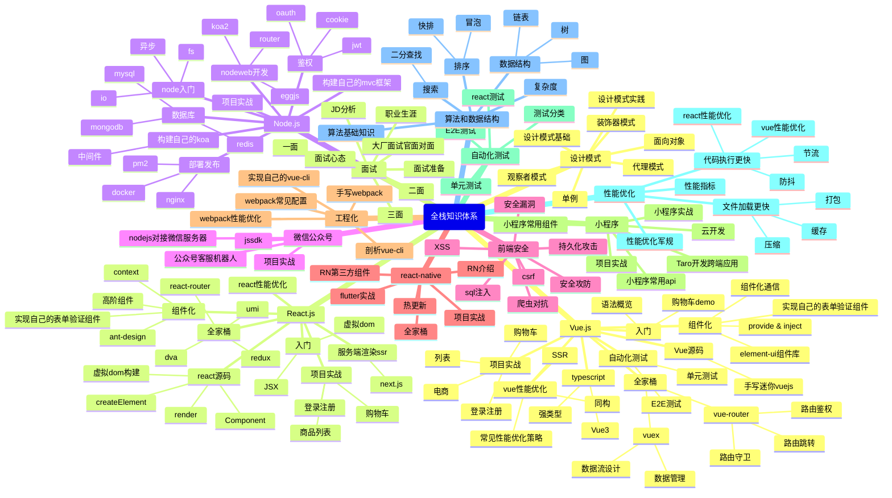

```mermaid
mindmap
  root(全栈知识体系)
    Vue.js
      入门
        语法概览
        购物车demo
      组件化
        组件化通信
        provide & inject
        element-ui组件库
        实现自己的表单验证组件
      全家桶
        vuex
          数据管理
          数据流设计
        vue-router
          路由跳转
          路由守卫
          路由鉴权
      项目实战
        电商
        列表
        购物车
        登录注册
      Vue源码
        手写迷你vuejs
      vue性能优化
        SSR
        同构
        常见性能优化策略
      typescript
        强类型
        Vue3
      自动化测试
        单元测试
        E2E测试
    React.js
      入门
        JSX
        虚拟dom
      组件化
        context
        ant-design
        高阶组件
        实现自己的表单验证组件
      全家桶
        redux
        react-router
        umi
        dva
      项目实战
        商品列表
        购物车
        登录注册
      react源码
        虚拟dom构建
        createElement
        Component
        render
      react性能优化
      服务端渲染ssr
        next.js
    Node.js
      node入门
        异步
        io
        fs
      nodeweb开发
        koa2
        router
        eggjs
      项目实战
      鉴权
        cookie
        jwt
        oauth
      部署发布
        pm2
        nginx
        docker
      构建自己的koa
        中间件
      构建自己的mvc框架
      数据库
        mysql
        redis
        mongodb
    微信公众号
      项目实战
      nodejs对接微信服务器
      jssdk
      公众号客服机器人
    前端安全
      持久化攻击
      爬虫对抗
      安全攻防
      sql注入
      安全漏洞
      XSS
      csrf
    react-native
      RN介绍
      RN第三方组件
      项目实战
      热更新
      flutter实战
      全家桶
    工程化
      webpack常见配置
      webpack性能优化
      实现自己的vue-cli
      剖析vue-cli
      手写webpack
    小程序
      项目实战
      云开发
      Taro开发跨端应用
      小程序实战
      小程序常用组件
      小程序常用api
    自动化测试
      测试分类
      单元测试
      react测试
      E2E测试
    性能优化
      性能指标
      性能优化军规
      代码执行更快
        防抖
        节流
        vue性能优化
        react性能优化
      文件加载更快
        打包
        压缩
        缓存
    算法和数据结构
      算法基础知识
      复杂度
      数据结构
        链表
        树
        图
      排序
        冒泡
        快排
      搜索
        二分查找
    设计模式
      设计模式基础
      面向对象
      单例
      设计模式实践
      观察者模式
      代理模式
      装饰器模式
    面试
      面试准备
      JD分析
      一面
      二面
      三面
      大厂面试官面对面
      职业生涯
      面试心态
```
[[ex]]