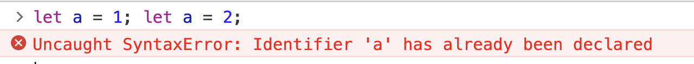
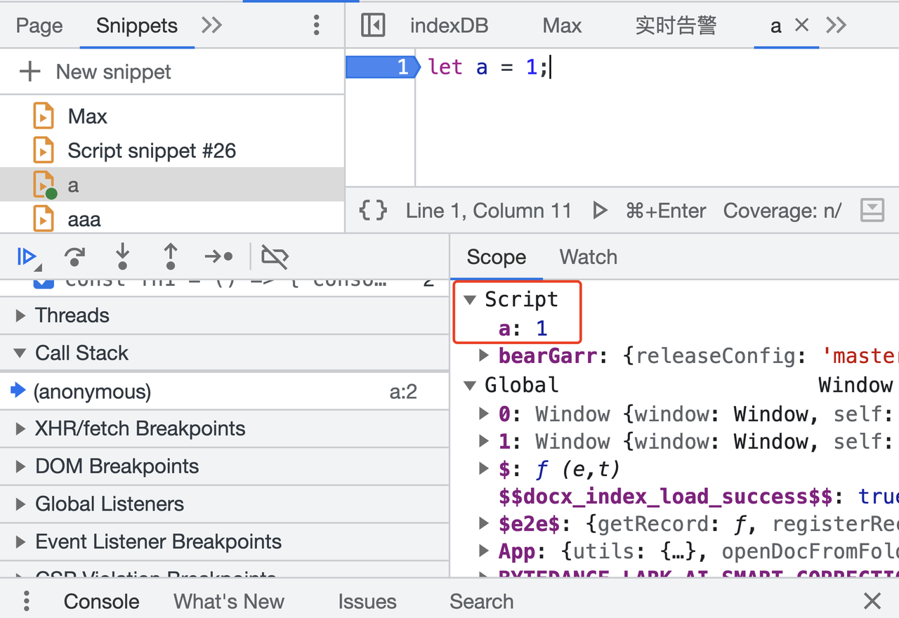
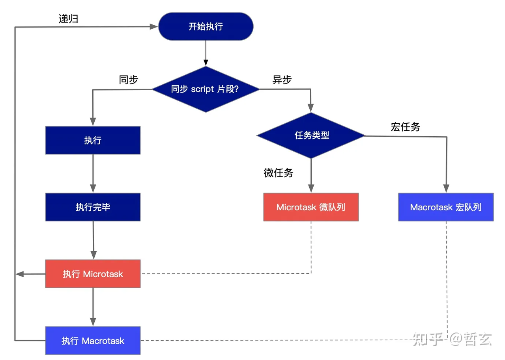
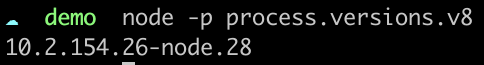
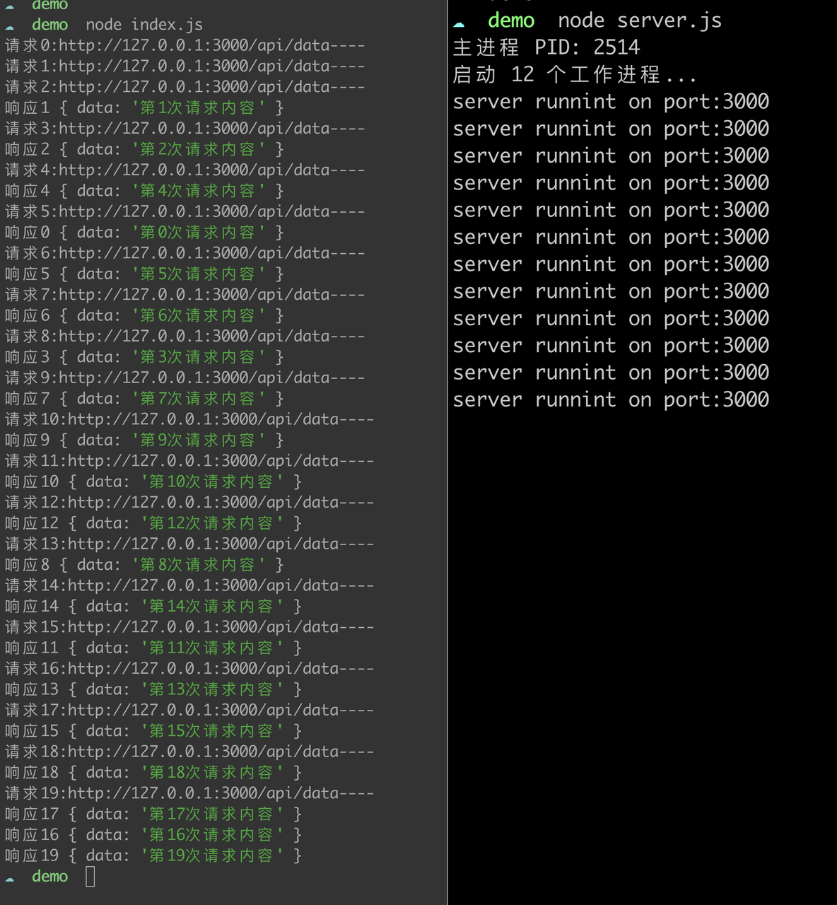
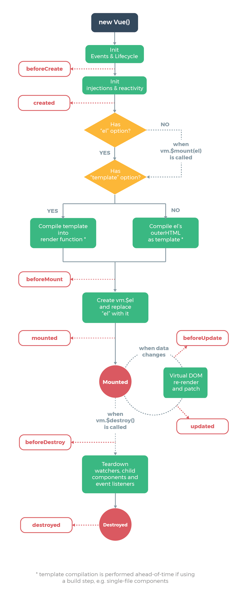
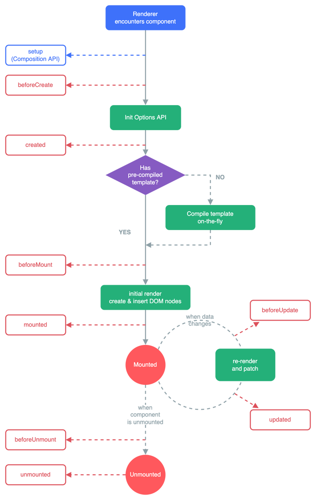
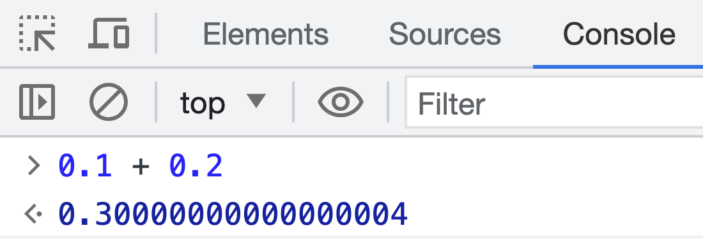
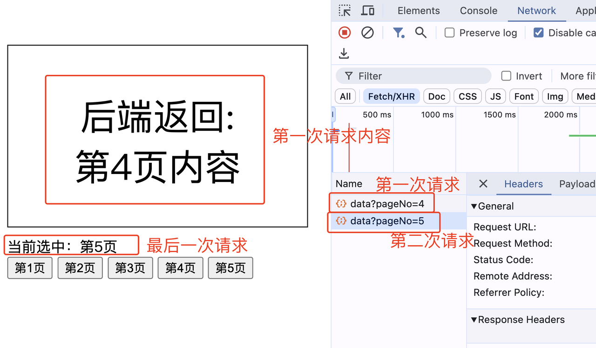

***

# HTML + CSS 题目

## 1. 问题：什么是重绘，什么是回流？如何减少回流？

* **重绘（Repaint）：**
  重绘是指当元素样式发生改变，但不影响其布局的情况下，浏览器重新绘制元素的过程。例如，修改元素的背景颜色、字体颜色等。
* **回流（Reflow）：**
  回流是指当元素的布局属性发生改变，需要重新计算元素在页面中的布局位置时，浏览器重新进行布局的过程。例如，修改元素的宽度、高度、位置等。
* 回流的成本比重绘高得多，因为它涉及重新计算元素的几何属性和页面布局。而重绘只需要重新绘制已计算好的元素样式。

* **如何减少：**
	* **使用 CSS 动画代替 JavaScript 动画**：CSS 动画利用 GPU 加速，在性能方面通常比 JavaScript 动画更高效。使用 CSS 的 `transform` 和 `opacity` 属性来创建动画效果，而不是改变元素的布局属性，如宽度、高度等。
	  * **使用 `translate3d` 开启硬件加速**：将元素的位移属性设置为 `translate3d(0, 0, 0)`，可以强制使用 GPU 加速。这有助于避免回流，并提高动画的流畅度。
	  * **避免频繁操作影响布局的样式属性**：当需要对元素进行多次样式修改时，可以考虑将这些修改合并为一次操作。通过添加/移除 CSS 类来一次性改变多个样式属性，而不是逐个修改。
	  * **使用 `requestAnimationFrame`**：通过使用 `requestAnimationFrame` 方法调度动画帧，可以确保动画在浏览器的重绘周期内执行，从而避免不必要的回流。这种方式可确保动画在最佳时间点进行渲染。
	  * **使用文档片段（Document Fragment）**：当需要向 DOM 中插入大量新元素时，可以先将这些元素添加到文档片段中，然后再将整个文档片段一次性插入到 DOM 中。这样做可以减少回流次数。(虚拟 dom vue 的方式)
	- 让元素脱离文档流：position:absolute / position:fixed / float:left，（只是减少回流，不是避免回流。）
	  * **使用 `visibility: hidden` 替代 `display: none`**：`visibility: hidden` 不会触发回流，因为元素仍然占据空间，只是不可见。而使用 `display: none` 则会将元素从渲染树中移除，引起回流。


***

## 2. 问题：Margin 塌陷问题如何解决？BFC 是什么？ 怎么触发？

* **margin塌陷问题**：上面例子两个 div 的间隔为200px，取 margin 重叠部分的更大值（这是正常情况，符合 CSS 的外边距合并规则），如果希望间隔 300px，可为每个 div 触发 BFC。
* **BFC定义**：全称叫块级格式化上下文 （Block Formatting Context），一个独立的渲染区域，有自己的渲染规则，与外部元素不会互相影响。
* **BFC触发方式：**
  * 设置了 float 属性（值不为 none）
  * 设置了 position 属性为 absolute 或 fixed
  * 设置了 display 属性为 inline-block
  * 设置了 overflow 属性（值不为 visible）

***
## 3. 问题：如何隐藏一个元素

| **方式**                         | **占位** | **点击事件** |
| ------------------------------ | ------ | -------- |
| display: none                  | ❌      | ❌        |
| opacity: 0                     | ✅      | ✅        |
| visibility: hidden             | ✅      | ❌        |
| clip-path: circle(0)           | ✅      | ❌        |
| position:absolute;top: -999px; | ❌      | ✅        |


***

## 4. 问题：overflow 不同值的区别。

| **属性值**        | **效果**                                                                |
| -------------- | --------------------------------------------------------------------- |
| `visible`（默认值） | 内容溢出容器时，会呈现在容器之外，不会被隐藏或截断。这意味着溢出的内容会覆盖其他元素。                           |
| `hidden`       | 内容溢出容器时，会被隐藏，不可见。这意味着超出容器的部分将被截断并隐藏。                                  |
| `scroll`       | 如果内容溢出容器，将会显示滚动条以便查看溢出内容。用户可以滚动内容以查看被隐藏的部分。即使内容没有溢出，也会显示滚动条，但它们会被禁用。  |
| `auto`         | 与 `scroll` 类似，如果内容溢出容器，会显示滚动条。但与 `scroll` 不同的是，滚动条仅在内容溢出时才会出现，否则会被禁用。 |
| `inherit`      | 继承父元素的 `overflow` 值。                                                  |

***
## 5. 问题：三栏布局的实现方式（圣杯模型）
三栏布局是一种常见的网页布局方式，通常包括一个固定宽度的左侧栏、一个固定宽度的右侧栏以及一个自适应宽度的主要内容区域。
* **Flex 布局**
```html
<html>​
  <head>​
    <style type="text/css">​
      .container {​
        display: flex;​
      }​
​
      .left, .right {​
        width: 200px;​
      }​
​
      .main {​
        flex: 1; /* 自动扩展填充剩余空间 */​
      }​
    </style>​
  </head>​
  <body>​
    <div class="container">​
      <div class="left" style="border: 1px solid black;">Left Sidebar</div>​
      <div class="main" style="border: 1px solid black;">Main Content</div>​
      <div class="right" style="border: 1px solid black;">Right Sidebar</div>​
    </div>​
  </body>​
</html>
```
* **浮动布局**
```html
<html>​
  <head>​
    <style type="text/css">​
      .container {​
        width: 100%;​
      }​
​
      .left {​
        width: 200px;​
        float: left;​
      }​
​
      .main {​
        margin-left: 200px; /* 宽度等于左侧栏宽度 */​
        margin-right: 200px; /* 宽度等于右侧栏宽度 */​
      }​
​
      .right {​
        width: 200px;​
        float: right;​
      }​
    </style>​
  </head>​
  <body>​
    <div class="container">​
      <div class="left" style="border: 1px solid black;">Left Sidebar</div>​
      <div class="right" style="border: 1px solid black;">Right Sidebar</div>​
      <div class="main" style="border: 1px solid black;">Main Content</div>​
    </div>​
  </body>​
</html><html>​
  <head>​
    <style type="text/css">​
      .container {​
        width: 100%;​
      }​
​
      .left {​
        width: 200px;​
        float: left;​
      }​
​
      .main {​
        margin-left: 200px; /* 宽度等于左侧栏宽度 */​
        margin-right: 200px; /* 宽度等于右侧栏宽度 */​
      }​
​
      .right {​
        width: 200px;​
        float: right;​
      }​
    </style>​
  </head>​
  <body>​
    <div class="container">​
      <div class="left" style="border: 1px solid black;">Left Sidebar</div>​
      <div class="right" style="border: 1px solid black;">Right Sidebar</div>​
      <div class="main" style="border: 1px solid black;">Main Content</div>​
    </div>​
  </body>​
</html>
```
* **Grid 布局：**
```html
<html>​
  <head>​
    <style type="text/css">​
      .container {​
        display: grid;​
        grid-template-columns: 200px 1fr 200px; /* 列的宽度 */​
      }​
    </style>​
  </head>​
  <body>​
    <div class="container">​
      <div class="left" style="border: 1px solid black;">Left Sidebar</div>​
      <div class="main" style="border: 1px solid black;">Main Content</div>​
      <div class="right" style="border: 1px solid black;">Right Sidebar</div>​
    </div>​
  </body>​
</html>
```
* **绝对定位布局：**
```html
<html>​
  <head>​
    <style type="text/css">​
      .container {​
        position: relative;​
      }​
​
      .left, .right {​
        width: 200px;​
        position: absolute;​
        top: 0;​
      }​
​
      .left {​
        left: 0;​
      }​
​
      .right {​
        right: 0;​
      }​
​
      .main {​
        margin: 0 200px; /* 宽度等于左右侧栏宽度 */​
      }​
    </style>​
  </head>​
  <body>​
    <div class="container">​
      <div class="left" style="border: 1px solid black;">Left Sidebar</div>​
      <div class="main" style="border: 1px solid black;">Main Content</div>​
      <div class="right" style="border: 1px solid black;">Right Sidebar</div>​
    </div>​
  </body>​
</html>
```

***

## 6. 问题：calc() 方法

`calc()` 是 CSS 中的一个函数，用于动态计算样式属性的值。`calc()` 主要用于解决以下问题：

**响应式布局：**`calc()` 可以根据不同的屏幕尺寸和视口大小，动态调整元素的尺寸或间距，以实现响应式布局。这有助于确保页面在不同设备上的显示效果良好。

**动态尺寸调整：**`calc()` 可用于根据其他元素的尺寸或动态内容的大小来计算元素的尺寸。这在构建复杂的布局时非常有用。

**优化代码：**`calc()` 可减少不必要的 CSS 代码和样式属性的硬编码，以实现更灵活、可维护和自适应的布局。
```css
property: calc(expression);
```

其中 `expression` 是一个包含数值、运算符和单位的表达式。您可以在 `calc()` 中执行各种数学运算，例如加法、减法、乘法和除法。 **加减法需要空格隔开运算符**

以下是一些示例，展示了 `calc()` 如何用于解决不同问题：

* 自适应宽度：
```css
.container {​
  width: calc(100% - 200px); /* 宽度减去200像素 */​
}
```
* 响应式间距：
```css
.box {​

margin: calc(1rem + 5%); /* 间距基于字体大小和视口宽度 */​

}
```
* 动态尺寸：
```css
.dynamic {​
  width: calc(50% - 20px); /** 宽度减去20像素 */
  height: calc(2  3em); /* 高度是字体大小的3倍 */​
}
```


***

## 7. 问题：实现 一个固定长宽div 在屏幕上垂直水平居中

```html
<html>​
  <head>​
    <style type="text/css">​
      .centered-div {​
        width: 200px; /* 设置固定宽度 */​
        height: 100px; /* 设置固定高度 */​
        background-color: #f0f0f0;​
        position: absolute;​
        top: 50%; /* 上边距设置为屏幕高度的一半 */​
        left: 50%; /* 左边距设置为屏幕宽度的一半 */​
        transform: translate(-50%, -50%); /* 使用 transform 属性将 div 居中 */​
        text-align: center; /* 文本水平居中 */​
        line-height: 100px; /* 文本垂直居中 */​
      }​
    </style>​
  </head>​
  <body>​
    <div class="centered-div">​
      <p>This is a centered div.</p>​
    </div>​
  </body>​
</html>
```

***

## 8. 问题：渐进增强（progressive enhancement）和优雅降级（graceful degradation）

"渐进增强"（progressive enhancement）和 "优雅降级"（graceful degradation）都是前端开发中的策略，旨在处理不同浏览器和设备的兼容性问题。有助于确保您的网站在各种环境中能够提供尽可能良好的用户体验。

**渐进增强（progressive enhancement）：**
* 渐进增强的理念是从基本的、核心的功能开始，然后逐渐增强用户体验。
* 首先为所有用户提供基本的功能和内容，确保网站在所有浏览器和设备上都可以访问和使用。
* 随着浏览器能力的提升，逐步添加更高级和更复杂的功能和效果，以提供更富有吸引力的用户体验。
* 渐进增强强调的是从用户需求和核心功能出发，然后根据能力来增强功能和效果。

**考虑一个按钮样式的示例：**
```css
/* 基本样式：无样式的按钮 */​
.button {​
  padding: 10px 20px;​
  border: none;​
  background-color: transparent;​
  color: #333;​
}​
​
/* 增强样式：添加背景颜色和鼠标悬停效果 */​
.button-enhanced {​
  background-color: #007bff;​
  color: #fff;​
  cursor: pointer;​
}​
​
/* 渐进增强：所有按钮都具有基本样式，但只有现代浏览器支持增强样式 */
```
在这个示例中，按钮具有基本样式，即使在不支持 CSS3 的旧浏览器中也可以正常工作。然后，在现代浏览器中，使用增强样式来提供更好的外观和交互效果。


**优雅降级（graceful degradation）：**
* 优雅降级的理念是首先构建功能丰富的版本，然后在较低能力的浏览器上提供一种相对简化的版本。
* 先构建适用于现代浏览器的版本，包括高级功能和效果。
* 针对不支持这些功能的旧浏览器，提供一个更基本、但仍然可访问的版本，以确保核心功能仍然可用。
* 优雅降级强调的是在功能丰富的版本的基础上创建简化版本，以适应旧浏览器或不支持某些功能的情况。
**考虑一个多媒体播放器的示例：**
```css
/* 高级样式：包括大型播放按钮和控件 */​
.player {​
  /* 高级样式的 CSS 规则 */​
}​
​
/* 简化样式：隐藏高级控件，仅显示基本播放器 */​
.player-simple {​
  /* 仅包括基本样式的 CSS 规则 */​
}​
​
/* 优雅降级：高级浏览器使用高级样式，不支持高级样式的浏览器使用简化样式 */
```
在这个示例中，高级浏览器使用包括大型播放按钮和更多控件的高级样式。但在不支持这些样式的浏览器中，简化样式将隐藏高级控件，仅显示基本的播放器控件。


***

## 9. 问题：iframe 有哪些优缺点及使用场景

`<iframe>`（内联框架）是 HTML 中的一个标签，用于在当前页面中嵌入另一个页面。

**优点：**

* 分离内容：`<iframe>` 允许将不同来源或不同内容的页面嵌套在一起。这有助于将内容分隔开，允许不同团队或服务提供商提供各自的内容。
* 实现跨域通信：`<iframe>` 可用于实现跨域通信，例如在父页面和嵌套的 `<iframe>` 页面之间传递数据，从而创建丰富的嵌入式应用程序。
* 安全性：`<iframe>` 可以提高安全性，因为它可以将来自不受信任的来源的内容隔离在一个独立的沙盒中，以防止对主页面的恶意攻击。
* 无需刷新：`<iframe>` 允许在不刷新整个页面的情况下加载新内容，这对于实现动态加载内容或应用程序非常有用。

**缺点：**

* 性能问题：每个 `<iframe>` 都会加载一个新页面，这可能会导致性能问题，特别是在多个嵌套的 `<iframe>` 页面存在时。
* 可访问性问题：`<iframe>` 可能会导致可访问性问题，因为屏幕阅读器可能不会正确处理嵌套的页面。确保提供替代文本和合适的ARIA标记以提高可访问性。
* 不利于 SEO：搜索引擎通常不会索引嵌套在 `<iframe>` 中的内容，这可能对网站的搜索引擎优化（SEO）产生负面影响。
* 兼容性问题：某些浏览器和设备可能不正确支持 `<iframe>`，或者可能需要特殊处理以确保它们正确显示。

**使用场景：**

* 嵌入外部内容：例如，将 YouTube 视频、Google 地图或社交媒体小部件嵌入网页。
* 分离组件：将不同部分的网页分开以进行模块化开发。这对于大型应用程序或团队协作非常有用。
* 安全沙盒：将不受信任的内容隔离在一个沙盒中，以提高安全性。
* 跨域通信：在不同源的页面之间进行数据交换，以创建富客户端应用程序。


***

## 10. 问题：CSS 盒子模型

用于排列和定位网页上的元素的基本概念。它定义了每个HTML元素周围的一个矩形区域（或盒子），这个盒子包括内容、内边距、边框和外边距。CSS盒子模型有以下四个主要部分：

* **内容（Content）：**&#x8FD9;是盒子的内部部分，包含元素的实际内容，例如文本、图像或其他媒体。内容的大小可以通过设置宽度（`width`）和高度（`height`）属性来控制。
* **内边距（Padding）：**&#x5185;边距是内容和边框之间的空白区域。可以使用`padding`属性来设置内边距的大小。内边距的大小影响了内容与盒子边界之间的距离。
* **边框（Border）：**&#x8FB9;框位于内边距的外部，围绕着内容和内边距。边框的样式、颜色和宽度可以通过`border`属性进行设置。
* **外边距（Margin）：**&#x5916;边距是盒子与其相邻元素之间的空白区域。外边距的大小可以通过`margin`属性来设置。外边距影响了盒子与其他元素之间的距离。

```scss
+-----------------------------------+​
|   Margin (外边距)          |​
|                                    |​
|   +---------------------------+  |​
|   |   Border (边框)     |   |​
|   |                             |   |​
|   |   Padding (内边距)  |   |​
|   |                              |   |​
|   |   Content (内容)    |   |​
|   |                              |   |​
|   +---------------------+          |​
|                                    |​
|   Margin (外边距)         |​
|                                    |​
+----------------------------------+
```

***

## 11. 问题：HTML5 的特性

* **语义元素：** HTML5引入了一些新的语义元素，如`<header>`、`<footer>`、`<nav>`、`<section>`等，以更好地描述网页的结构，提高可读性和可访问性。

* **多媒体支持：** HTML5提供了内置的多媒体支持，包括`<audio>`和`<video>`元素，使音频和视频的嵌入更加简单，而无需使用第三方插件（如Flash）。

* **Canvas：** 引入了`<canvas>`元素，允许通过JavaScript创建和操作图形，用于绘制图表、游戏和应用程序。

* **本地存储：** HTML5引入了Web Storage和IndexedDB，允许在客户端存储数据，以提高离线应用程序的性能。

* **新表单元素：** HTML5引入了新的表单元素，如`<input type="date">`、`<input type=email">`、`<input type="range">`等，使表单更具交互性和用户友好性。

* **Web Workers：** HTML5引入了Web Workers，允许在后台运行JavaScript，以提高Web应用程序的响应性，而不会阻塞用户界面。

* **WebSocket：** 引入了WebSocket，一种用于实时通信的协议，可用于创建实时聊天和多人游戏等

* **地理位置：** HTML5允许网页访问用户的地理位置信息，以便创建地理位置相关的应用程序，如地图和位置服务。

* **SVG：** HTML5支持可缩放矢量图形（SVG），允许创建矢量图形和图表，以便在不同分辨率的屏幕上显示。

* **拖放：** HTML5引入了拖放API，允许在网页中实现拖放操作，使用户界面更直观。

* **离线应用程序：** HTML5引入了应用程序缓存，使Web应用程序能够在离线时继续工作。

* **新事件API：** HTML5引入了新的事件API，如`addEventListener`，使事件处理更加灵活和强大。


***

## 12. 问题：CSS3 的特性

* **圆角边框：** 通过`border-radius`属性，可创建圆角边框，包括圆形、椭圆和自定义形状。

* **阴影和发光效果）：** 使用`box-shadow`和`text-shadow`属性，可以为元素添加阴影和发光效果。

* **渐变背景：** 通过`linear-gradient`和`radial-gradient`属性，可以创建渐变背景，包括线性和径向渐变。

* **多列布局：** 通过`column-count`和`column-width`等属性，可以创建多列布局，类似于报纸的排版。

* **变换：**&#x4F7F;用`transform`属性，可以对元素进行旋转、缩放、倾斜和平移等变换。

* **过渡：**&#x901A;过`transition`属性，可以创建元素状态之间的平滑过渡效果，例如鼠标悬停时的渐变效果。

* **动画：**&#x4F7F;用`@keyframes`规则和`animation`属性，可创建CSS动画，使元素可实现复杂的运动和效果。

* **2D和3D转换：**&#x43;SS3支持2D和3D转换，可以实现元素在平面和三维空间的旋转、缩放和倾斜。

* **字体嵌入：**&#x901A;过`@font-face`规则，可以在网页上嵌入自定义字体，以提供更多的字体选择。

* **透明度：**&#x4F7F;用`opacity`属性，可以控制元素的透明度，使元素可以半透明或完全不透明。

* **栅格布局：**&#x901A;过`display: grid`属性，可以创建更复杂的网格布局，用于定位和对齐元素。

* **自定义属性：**&#x4F7F;用CSS变量（`var()`）来定义和重用自定义属性，以简化样式表的管理。

* **用户界面控件：**&#x43;SS3引入了样式化的用户界面控件，如滚动条、复选框和单选框的自定义样式。

* **响应式设计：**&#x901A;过媒体查询和弹性布局，CSS3支持响应式设计，以适应不同的屏幕尺寸和设备。


***

## 13. 问题：CSS 中选择器的优先级，权重计算方式。

1. **!important规则：**&#x5982;果有`!important`声明，那么该规则具有最高的优先级。

2. **特定性：**&#x7279;定性值的大小来排序，特定性值较大的规则具有更高的优先级，**权重计算方式**如下：

   * 内联样式：每个内联样式规则的特定性为1000。

   * ID选择器：每个ID选择器的特定性为100。

   * 类选择器、属性选择器和伪类选择器：每个类选择器、属性选择器和伪类选择器的特定性为10。

   * 元素选择器和伪元素选择器：每个元素选择器和伪元素选择器的特定性为1。

案例：

* **覆盖规则：**&#x5982;果两个规则具有相同的特定性，后面定义的规则将覆盖先前定义的规则，因此后定义的规则具有更高的优先级。


***

## 14. 问题：HTML5 input 元素 type 属性

* **text：**&#x7528;于接受单行文本输入。

* **password：**&#x7528;于密码输入，输入的字符会被掩盖。

* **radio：**&#x7528;于单选按钮，用户可以在一组选项中选择一个。

* **checkbox：**&#x7528;于复选框，用户可以选择多个选项。

* **number：**&#x7528;于输入数字，可以包括上下箭头来增减数值。

* **range：**&#x7528;于输入范围，例如滑动条。

* **date：**&#x7528;于日期输入。

* **time：**&#x7528;于时间输入。

* **file：**&#x7528;于文件上传。

* **color：**&#x7528;于颜色选择器。

* **hidden：**&#x7528;于存储数据，但不会在页面中显示。

* **submit：**&#x7528;于提交表单。

* **reset：**&#x7528;于重置表单。

* **button：**&#x7528;于创建自定义按钮。


***

## 15. 问题：CSS 中属性的继承性


**可继承的属性（Inherited Properties）：**

1. `color`：控制文本颜色。

2. `font`：包括`font-family`、`font-size`、`font-style`、`font-weight`等属性。

3. `line-height`：控制行高。

4. `text-align`：控制文本对齐方式。

5. `text-indent`：控制首行缩进。

6. `text-transform`：控制文本转换为大写、小写或首字母大写。

7. `visibility`：控制元素的可见性。


**不可继承的属性（Non-inherited Properties）：**

1. `border`：包括`border-width`、`border-style`、`border-color`等属性。

2. `margin`：包括`margin-top`、`margin-right`、`margin-bottom`、`margin-left`。

3. `padding`：包括`padding-top`、`padding-right`、`padding-bottom`、`padding-left`。

4. `background`：包括`background-color`、`background-image`、`background-repeat`等属性。

5. `width`：控制元素的宽度。

6. `height`：控制元素的高度。

7. `position`：控制元素的定位方式（例如，`relative`、`absolute`、`fixed`）。

8. `top`、`right`、`bottom`、`left`：控制元素的位置。

9. `display`：控制元素的显示方式（例如，`block`、`inline`、`none`）。

10. `float`：控制元素的浮动方式。


***

## 16. 问题：画一条 0.5px  的线

####

***

## 17. 问题：position 的值

* **static（静态定位）：**

  * 默认值。

  * 元素按照文档流正常排列，不受其他定位属性影响。

  * `top`、`right`、`bottom`、`left`属性不起作用。

* **relative（相对定位）：**

  * 元素相对于其正常位置定位。

  * 可以使用`top`、`right`、`bottom`、`left`属性来调整元素的位置。

  * 相对定位不会脱离文档流，其他元素仍然占据原来的位置。

* **absolute（绝对定位）：**

  * 元素相对于最近的已定位祖先元素定位，如果没有已定位的祖先元素，则相对于初始包含块（通常是浏览器窗口）定位。

  * 使用`top`、`right`、`bottom`、`left`属性来精确控制位置。

  * 绝对定位会脱离文档流，不再占据原来的位置。

* f**ixed（固定定位）：**

  * 元素相对于视口定位，不随页面滚动而移动。

  * 使用`top`、`right`、`bottom`、`left`属性来控制位置。

  * 固定定位脱离文档流，不占据原来的位置。

* **sticky（粘性定位）：**

  * 元素在跨越特定阈值前表现为相对定位，之后表现为固定定位。

  * 通常用于创建“粘性”导航栏或侧边栏。

  * 使用`top`、`right`、`bottom`、`left`属性来控制位置。


***

## 18. 问题：什么是浮动，浮动会引起什么问题，有何解决方案？

浮动（float）是CSS中的一种布局属性，用于控制元素在其父元素中的位置，使元素可以浮动到其父元素的左侧或右侧。浮动通常用于实现文本环绕图片、创建多列布局等效果。

**导致问题：**

* 高度塌陷（Collapsing）：浮动元素会导致其父元素的高度塌陷，使父元素无法自动适应浮动元素的高度。

* 元素重叠（Overlapping）：浮动元素可能会重叠在一起，导致布局混乱。

**解决方案：**

* 清除浮动（Clearing Floats）：在包含浮动元素的父元素之后，可以使用`clear`属性来清除浮动。

* 使用布局技巧：为了防止高度塌陷，可以使用现代CSS布局技巧，如Flexbox和Grid，来替代浮动布局。

* 使用`display: inline-block`：将需要浮动的元素设置为`display: inline-block`，可以模拟浮动效果，但不会导致高度塌陷，因为`inline-block`元素会受到文本行的影响。

* 使用`position: absolute`：在某些情况下，`position: absolute`也可以替代浮动，但需要搭配适当的定位属性来控制元素的位置。

* 使用`overflow: hidden`：在包含浮动元素的父元素上添加`overflow: hidden`可以清除浮动，但可能会剪切内容，因此需谨慎使用。


***

## 19. 问题：line-height 和 height 的区别

* **line-height（行高）**：

  * `height 控制元素 content 高度`

  * 它用于指定行内元素的文本行的垂直间距，可以影响文本的垂直居中和行距等。

  * `line-height`通常用于文本元素，如段落、标题等，以调整文本在行内框中的垂直位置。

* **height（高度）**：

  * `height` 控制元素的整体高度，不仅包括文本内容，还包括内边距和边框。

  * 它用于指定块级元素的高度，可以确保元素的高度与其他元素一致。

  * `height`通常用于块级元素，如`<div>`、`<section>`等，以设置元素的具体高度。

**总结：** `line-height`用于控制文本行的垂直间距，而`height`用于控制整个元素的高度，包括文本内容、内边距和边框。它们在不同的上下文中有不同的用途，根据布局需求选择合适的属性来控制高度。


***

## 20. 问题：设置一个元素的背景颜色会填充的区域。

* **内容区域：**&#x80CC;景颜色会填充元素的内容区域，即文本和内联元素所在的区域。

* **内边距区域：**&#x5982;果元素具有内边距（通过 `padding` 属性设置），背景颜色也会填充内边距区域。

* **边框区域：**&#x5982;果元素具有边框（通过 `border` 属性设置），且背景颜色为 transparent，也会填充边框区域。

背景颜色不会填充元素的外边距区域。外边距是元素与其他元素之间的间距，背景颜色通常不会扩展到外边距。

这意味着背景颜色将覆盖元素的内容、内边距和边框，但不会覆盖外边距。这是CSS中背景颜色的标准行为。


***

## 21. 问题：inline-block、inline 和 block 的区别

* block：块级元素

  * 块级元素会独占一行，它们在页面上按从上到下的顺序垂直排列。

  * 块级元素可以设置宽度、高度、内边距和外边距，并会自动换行。

* inline：内联元素

  * 内联元素不会独占一行，它们在同一行内水平排列，直到一行不足以容纳它们，然后换行。

  * 内联元素通常不可以设置宽度和高度，它们的尺寸由其内容决定。

* inline-block：内联块级元素

  * 内联块级元素结合了块级元素和内联元素的特点。它们在同一行内水平排列，但可以设置宽度、高度、内边距和外边距，同时也会换行。

  * 内联块级元素通常用于创建水平排列的块状元素，如按钮或导航链接。


***

## 22. 问题：为什么 img 是 inline 但是可以设置宽高

关于为什么`img`元素通常被视为内联元素，但可以设置宽度和高度，这是因为HTML规范中对`img`元素的默认样式有特殊的定义。默认情况下，`img`元素是内联元素，但可以设置其宽度和高度。这是因为`img`元素通常需要具体的宽度和高度信息，以确保图像以正确的尺寸显示，而不会引起页面重新布局。因此，即使是内联元素，`img`元素也可以具有宽度和高度属性。


***

## 23. 问题：box-sizing 的作用，如何使用？

`box-sizing` 是一个CSS属性，用于控制元素的盒模型如何计算尺寸。它有两个主要取值：

* content-box（默认值）：元素的宽度和高度只包括内容区域，不包括内边距和边框。这是传统的盒模型。

* border-box：元素的宽度和高度包括内容区域、内边距和边框。这意味着设置元素的宽度和高度时，内边距和边框不会增加元素的总宽度和高度，而会占用内容区域内的空间。

在上述示例中，当`box-sizing`设置为`border-box`时，设置的宽度值（100px）包括了内边距和边框，而内容区域的宽度会自动减少以适应内边距和边框。这可以帮助更精确地控制元素的总宽度。

**注意：**`box-sizing`通常在全局样式中设置，以确保整个页面使用一致的盒模型。


***

## 24. 问题：CSS 实现动画

CSS动画可以通过使用CSS的`@keyframes`规则和`animation`属性来实现。以下是实现CSS动画的基本步骤：

1. **定义关键帧（Keyframes）：**&#x4F7F;用`@keyframes`规则定义动画的关键帧，即动画在不同时间点的状态。每个关键帧定义了一个或多个CSS属性的值。

2. **应用动画：**&#x5C06;关键帧应用到元素上，使用`animation`属性。可指定动画名称、持续时间、延迟、重复次数等。

3. **触发动画：**&#x60A8;可以通过添加类名或通过JavaScript来触发动画。

   1. 使用类名触发动画：

   2. 使用JavaScript触发动画：

**可选设置：**&#x6839;据需要，您还可以使用其他`animation`属性，如

* `animation-fill-mode`（指定动画结束后元素的状态）

* `animation-direction`（指定动画播放的方向）

* `animation-play-state`（控制动画的播放状态）


CSS动画是一种简单而有效的方式来创建元素的过渡和动画效果。您可以根据需求和创意来定义动画的关键帧和属性。动画可以在不编写JavaScript的情况下实现，但也可以与JavaScript一起使用，以响应用户交互或动态生成动画效果。


***

## 25. 问题：transition 和 animation 的区别？

`transition` 和 `animation` 是CSS用于创建动画效果的两种不同的属性。


**Transition（过渡）：**

* `transition`允许元素在状态改变时平滑地过渡到新的样式。它可应用于元素各属性，如颜色、尺寸、位置等。

* 过渡是由触发状态变化的事件触发的，比如鼠标悬停、焦点获得、类名变化等。

* 过渡通常使用简单的语法定义，包括要过渡的属性、过渡持续时间、过渡的时间函数和延迟时间。

* 过渡通常是在元素的常规和伪类状态之间进行切换，例如`hover`、`focus`。


**Animation（动画）：**

* `animation`允许您创建更复杂的动画，它可以定义关键帧，以便在动画的不同阶段应用不同的样式。

* 动画是在元素的状态、时间轴或事件触发下进行的。

* 动画可以更精细地控制动画的每一帧，包括持续时间、循环次数、缓动函数等。

* 动画通常用于创建更复杂的动画序列，可以包括多个关键帧和自定义时间函数。


**总结：**

* 使用 `transition` 可以创建简单的状态过渡效果，适用于鼠标悬停、焦点等触发的状态变化。

* 使用 `animation` 可以创建更复杂的动画，包括关键帧、持续时间、循环和更精细的控制。它适用于需要更多控制和复杂度的动画场景。


***

## 26. 问题：如何实现在某个容器中居中的？


***

## 27. 问题：如何改变一个 DOM 元素的字体颜色？


***

## 28. 问题：相对布局和绝对布局，position:relative 和 absolute。

* **相对布局（Relative Positioning）：**

  * 使用`position: relative;`将元素的位置相对于其自身在正常文档流中的位置进行调整。

  * 相对布局会保留元素原有的空间，但可以通过`top`、`right`、`bottom`和`left`属性来调整元素的位置，使其相对于原始位置上下左右偏移。

* **绝对布局（Absolute Positioning）：**

  * 使用`position: absolute;`将元素的位置相对于其最近的具有相对定位或绝对定位的父元素进行调整。

  * 绝对布局会使元素脱离正常文档流，不保留原有的空间，因此不会影响其他元素的位置。

在绝对定位中，通常需要指定元素相对于哪个父元素进行定位，这可以通过为父元素添加`position: relative;`来实现。如果没有明确的相对定位的父元素，绝对定位将相对于文档的根元素进行定位。


***

## 29. 问题：弹性盒子 flex 布局

Flex 布局的核心概念包括以下几点：

* **容器和项：**&#x5728; Flex 布局中，存在容器元素和容器内的项（子元素）。容器元素通过设置 `display: flex;` 或 `display: inline-flex;` 来启用 Flex 布局。

* **主轴和交叉轴：**&#x46;lex 布局定义了主轴和交叉轴。主轴是项排列的主要方向，而交叉轴是垂直于主轴的方向。

* **弹性布局：**&#x46;lex 布局允许项根据可用空间自动调整大小，以填充容器。这意味着项可以具有弹性的宽度或高度，以适应不同屏幕尺寸。

* **对齐和排序：**&#x60A8;可以轻松地控制项在主轴和交叉轴上的对齐方式，以及它们的排序顺序。

* **自动换行：**&#x5982;果项在主轴上无法适应容器的宽度，它们可以自动换行到下一行，而无需使用浮动布局。

* **嵌套支持：**&#x60A8;可以嵌套多个 Flex 容器以创建复杂的布局结构。


***

## 30. 问题：Less 和 SCSS 的区别

Less（Leaner Style Sheets）和 SCSS（Sassy CSS）都是CSS预处理器，它们添加了一些功能和语法糖来帮助开发人员更轻松地管理和组织样式代码。

* 语法:

  * Less: Less 使用较少的特殊字符，例如，变量定义以`@`开头，Mixin以`.`开头，选择器嵌套使用`&`等。

  * SCSS:  SCSS采用类似于CSS的语法，使用大括号`{}`和分号`;`来定义块和分隔属性。

* 编译:

  * Less: Less编译后生成的是纯CSS文件，文件扩展名通常为`.css`。

  * SCSS: SCSS编译后也生成纯CSS文件，文件扩展名通常为`.css`，与Less一样。

* 兼容性:

  * Less: Less在早期版本中对CSS语法更宽松，因此较容易与现有的CSS文件集成。最新版本的Less也支持更严格的CSS语法。

  * SCSS: SCSS采用了更接近标准CSS的语法，因此对于已经熟悉CSS的开发人员来说更容易上手。

* 生态系统:

  * Less: Less在生态系统方面较早出现，因此有一些基于Less的工具和库。

  * SCSS: SCSS在Sass的基础上发展而来，因此与Sass的生态系统整合紧密，也有许多相关工具和库。

* 特性:

  * Less: Less提供了一些常见的CSS功能，如变量、嵌套、Mixin等，但在某些高级功能方面不如SCSS强大。

  * SCSS: SCSS具有更丰富的功能集，包括控制指令、函数、循环等，因此在某些情况下更强大。

* 扩展名:

  * Less: Less文件的扩展名通常为`.less`。

  * SCSS: SCSS文件的扩展名通常为`.scss`。


***

## 31. 问题：CSS3 伪类，伪元素

CSS3中引入了许多新的伪类和伪元素，它们用于选择文档结构中的元素，并使其具有不同的样式和行为。这些伪类和伪元素是CSS中的特殊选择器，用于更精确地定位和样式化页面元素。


**CSS3 伪类（Pseudo-classes）：**&#x4F2A;类用于选择文档中的特定元素，通常基于它们的状态、位置或属性。

1. `:hover`：选择鼠标悬停的元素。

2. `:active`：选择被点击的元素。

3. `:focus`：选择获得焦点的元素，如表单元素。

4. `:nth-child(n)`：选择某元素在其父元素的第n个位置。

5. `:not(selector)`：选择不匹配指定选择器的元素。

6. `:first-child`：选择某元素的父元素中的第一个子元素。

7. `:last-child`：选择某元素的父元素中的最后一个子元素。


**CSS3 伪元素（Pseudo-elements）：**&#x4F2A;元素用于在文档中生成虚拟元素，通常用于添加样式或内容。

1. `::before`：在元素内容之前生成内容，通常用于添加装饰或图标。

2. `::after`：在元素内容之后生成内容，也常用于添加装饰或图标。

3. `::first-line`：选择元素的首行文本，用于样式化段落中的首行文字。

4. `::first-letter`：选择元素的首字母，用于样式化段落或标题的首字母。

5. `::selection`：选择用户选择的文本部分，允许自定义选中文本的样式。


这些伪类和伪元素扩展了CSS的能力，使开发人员可以更精确地选择和样式化文档中的元素。它们在创建各种效果、优化用户界面和提供更丰富的用户体验方面非常有用。


***

## 32. 问题：::before 和 ::after 中双冒号和单冒号的区别

`::before` 和 `::after` 伪元素选择器都用于在元素的内容之前和之后插入生成的内容，通常用于添加额外的样式或内容。在CSS中，双冒号 `::` 和单冒号 `:` 的区别主要在于标准的规范化。双冒号 `::` 用于伪元素，而单冒号 `:` 用于伪类。虽然在实际使用中，双冒号 `::` 和单冒号 `:` 在大多数现代浏览器中通常都可以互换使用，但根据CSS规范，应该使用双冒号 `::` 来表示伪元素。

**总结：**

* `::before` 和 `::after` 是伪元素选择器。

* 根据CSS规范，应该使用双冒号 `::`，如 `::before` 和 `::after`。

* 大多数现代浏览器也允许使用单冒号 `:`，但为了规范化和未来兼容性，建议使用双冒号 `::`。


***

## 33. 问题：响应式布局的实现方案

响应式布局是一种适应不同屏幕尺寸和设备的设计方法，以确保网站在各种设备上都能提供良好的用户体验。

* **使用媒体查询（Media Queries）：**&#x5A92;体查询是CSS3的一项功能，允许根据屏幕宽度、高度、分辨率等条件来应用不同的样式。通过在CSS中嵌入媒体查询，可以为不同的屏幕尺寸定义不同的样式规则。

* **流式布局（Fluid Layout）：**&#x901A;过使用百分比宽度而不是固定像素宽度来定义布局，使网站能够随着屏幕尺寸的变化而自动调整。这种方法可确保网站的内容能够适应不同的屏幕尺寸。

* **弹性布局（Flexbox）：**&#x4F7F;用Flexbox布局模型可以轻松实现网页中的水平和垂直居中，以及自适应布局。Flexbox提供了更高级的布局控制。

* **图片大小调整：**&#x4F7F;用`max-width: 100%;`或`width: 100%;`来确保图像能够根据屏幕尺寸缩放，以避免图像在小屏幕上溢出。


***

## 34. 问题：link 标签和 import 标签的区别？

`<link>` 标签和 `@import` 规则都用于引入外部CSS文件，区别如下：

* **语法和用法：**

  * `<link>` 标签是HTML标记，用于在HTML文档的`<head>`部分中引入外部CSS文件。它具有自己的属性，例如`rel`（关系）、`href`（资源链接）、`type`（MIME类型）等。

  * `@import` 是CSS规则，用于在CSS样式表中引入外部CSS文件。它必须位于CSS样式表中，通常放在样式表的顶部，可以用于导入其他CSS文件。

* **加载方式：**

  * `<link>` 标签会在页面加载过程中同时加载CSS文件，这可以并行进行，不会阻止页面的渲染。

  * `@import` 规则只能在当前CSS文件加载完成后才会加载引入的外部CSS文件，这会导致页面渲染的延迟，因为它会阻止页面的渲染。

* **兼容性：**

  * `<link>` 标签的支持广泛，可以用于所有HTML版本。

  * `@import` 规则是CSS2引入的特性，较旧的浏览器可能不支持，尤其是在CSS1规范中并没有这个特性。但在现代浏览器中，它通常能够正常工作。

* **维护和管理：**

  * 使用`<link>`标签更容易维护和管理，因为它与HTML文档分开，并且可以在文档的`<head>`部分中轻松找到。

  * 使用`@import`规则时，CSS代码和引入的CSS文件混在一起，可能会导致维护复杂度增加，特别是在大型项目中。


***

## 35. 问题：块元素、行元素、置换元素的区别

在HTML和CSS中，元素可以根据它们的行为和显示方式分为

1. 块级元素（Block-level Elements）、

2. 内联元素（Inline Elements）

3. 置换元素（Replaced Elements）。


**块级元素（Block-level Elements）：**

* 块级元素通常以新行开始，占据父元素可用宽度的整个宽度。

* 块级元素可以包含其他块级元素和内联元素。

* 常见的块级元素包括`<div>`、`<p>`、`<h1>`-`<h6>`、`<ul>`、`<ol>`、`<li>`等。


**内联元素（Inline Elements）：**

* 内联元素通常不会导致新行的开始，它们只占据它们的内容宽度。

* 内联元素通常包含在块级元素内部，可以与其他内联元素在同一行上。

* 常见的内联元素包括`<span>`、`<a>`、`<strong>`、`<em>`、``、`<br>`等。


**置换元素（Replaced Elements）：**

* 置换元素是一种特殊类型的元素，其内容通常由外部资源（如图像、视频或浏览器默认样式）来替代。

* 置换元素的尺寸和外观通常由外部资源定义，而不是CSS样式。

* 常见的置换元素包括``、`<video>`、`<iframe>`等。


**注意：**&#x8FD9;些术语描述了元素的默认行为，但CSS可以用于修改元素的显示方式。例如，可以使用CSS将内联元素转换为块级元素，或者使用`display`属性将块级元素转换为内联元素。置换元素的行为通常是固定的，但也可以通过CSS进行一些控制。这些概念对于理解和掌握HTML和CSS的布局和显示方式非常重要，因为它们影响到页面结构和样式的创建和控制。


***

## 36. 问题：单行元素的文本省略号实现方式


***

## 37. 问题：HTML 语义化标签 &#x20;

HTML语义化标签是指在HTML文档中使用具有明确定义和语义含义的标签，以描述文档的结构和内容。这些标签有助于开发人员和浏览器更好地理解文档的内容和结构，提高可访问性、可维护性和搜索引擎优化（SEO），以及改进文档的可读性：

1. **`<header>`：**&#x5B9A;义文档或文档的一部分的页眉。通常包括网站的标题、标志、导航菜单等。

2. **`<nav>`：**&#x7528;于定义导航部分，通常包括导航链接、菜单、目录等。

3. **`<main>`：**&#x8868;示文档的主要内容区域，通常每个文档只有一个`<main>`元素。

4. **`<article>`：**&#x7528;于表示独立于页面内容的、可独立分发或重复使用的内容块，如一篇新闻文章、博客帖子或评论。

5. **`<section>`：**&#x7528;于组织文档的不同章节或主题区域，如文章的章节、内容块等。

6. **`<aside>`：**&#x8868;示与页面主要内容相关但可以视为附属的内容，如侧边栏、广告、引用等。

7. **`<footer>`：**&#x5B9A;义文档或文档的一部分的页脚，通常包括版权信息、联系信息、相关链接等。

8. **`<figure>`：**&#x7528;于包含与文档相关的图像、图表、照片等，通常与`<figcaption>`元素一起使用来提供图像的描述。

9. **`<figcaption>`：**&#x7528;于为`<figure>`元素提供标题或描述。

10. **`<time>`：**&#x7528;于表示日期、时间或时间范围，有助于机器和搜索引擎更好地理解时间信息。  &#x20;


***

## 38. 问题：px，rpx，vw，vh，rem，em 的区别

1. **px（像素）：**

   * 相对单位，代表屏幕上的一个基本单位，逻辑像素。

   * 不会根据屏幕尺寸或分辨率自动调整大小。

   * 在高分辨率屏幕上可能显得很小。

2. **rpx（微信小程序单位）：**

   * 主要用于微信小程序开发。

   * 是相对单位，基于屏幕宽度进行缩放。

   * 可以在不同设备上保持一致的布局。

3. **vw（视窗宽度单位）：**

   * 相对单位，表示视窗宽度的百分比。

   * 1vw等于视窗宽度的1%。

   * 用于创建适应不同屏幕宽度的布局。

4. **vh（视窗高度单位）：**

   * 相对单位，表示视窗高度的百分比。

   * 1vh等于视窗高度的1%。

   * 用于创建根据屏幕高度进行布局调整的效果。

5. **rem（根元素单位）：**

   * 相对单位，基于根元素的字体大小。

   * 1rem等于根元素的字体大小。

   * 可用于实现相对大小的字体和元素，适合响应式设计。

6. **em（字体相对单位）：**

   * 相对单位，基于当前元素的字体大小。

   * 1em等于当前元素的字体大小。

   * 通常用于设置相对于父元素的字体大小。

***

# Javascript 题目

## 39. 问题：以下哪段代码运行效率更高（隐藏类）

* **左边效率更高，重用了 隐藏类（Hidden Class）**

* JS运行机制： 浏览器 -> 内核 ->  JS 解析引擎

  | **浏览器**         | **内核**              | **JS解析引擎**     |
  | --------------- | ------------------- | -------------- |
  | chrome          | 早期 WebKit，现目前 Blink | V8             |
  | Mozilla Firefox | Gecko               | SpiderMonkey   |
  | Edge            | Chromium            | Chakra / V8    |
  | Safari          | Webkit              | JavascriptCore |

* 比较主流的 JS 引擎是 v8，这里假设是跑在 chrome 或 node 上，用的是 v8 引擎。

* V8 是一个 c++ 实现的 js 解析引擎，内部利用 隐藏类（Hidden Class） 的方式来存放 JS 对象。

* 隐藏类的特性是：多个属性顺序一致的 JS 对象，会重用同一个隐藏类，减少 new Class 的开销。

* 所以左边生成1个隐藏类，而右边生成3个隐藏类，因此左边代码性能更好。

* **指导代码编写习惯：**&#x5B9A;义对象或类时，尽可能保证属性顺序一致。


***

## 40. 问题：以下哪段代码效率更高（数组 - 快速模式 / 字典模式）

* **左边的效率更高，利用了数组的 快速模式**

* JS运行机制： 浏览器 -> 内核 ->  JS 解析引擎

  | **浏览器**         | **内核**              | **JS解析引擎**     |
  | --------------- | ------------------- | -------------- |
  | chrome          | 早期 WebKit，现目前 Blink | V8             |
  | Mozilla Firefox | Gecko               | SpiderMonkey   |
  | Edge            | Chromium            | Chakra / V8    |
  | Safari          | Webkit              | JavascriptCore |

* 比较主流的 JS 引擎是 v8，这里假设是跑在 chrome 或 node 上，用的是 v8 引擎。

* V8 是一个 c++ 实现的 js 解析引擎，内部有多种方式存放 JS 数组。

* "数组从 0 到 length-1 无空洞" ，会进入快速模式，存放为 array。

* "数组中间有空洞"，会进入字典模式，存放为 HashMap。（这是 V8 的一个优化策略，保证用最合适的数据结构处理当下场景，如果遇到数据量过大或者是松散结构的话，就改变为 HashMap，牺牲遍历性能，换取访问性能。）

* **指导代码编写习惯：**

  * 从0开始初始化数组，避免数组进入字典模式。

  * 让数组保持紧凑，避免数组进入字典模式。

**相关文章：**&#x68;ttps://itnext.io/v8-deep-dives-understanding-array-internals-5b17d7a28ecc


***

## 41. 问题：如何判断 object 为空

* 常用方法：

  * Object.keys(obj).length === 0&#x20;

  * JSON.stringify(obj) === '{}'&#x20;

  * for in 判断

* 以上方法都是不太严谨，因为处理不了 const obj = { \[Symbol('a')]: 1 }. 这种情况

* 更严谨的方法： Reflect.ownKeys(obj).length === 0;


***

## 42. 问题：强制类型转换、隐式类型转换

* 强制类型转换

* **隐式类型转换**


***

## 43. 问题：== 和 === 的区别

* "==" ，先隐式类型转换，再判断值是否相等

* "==="，直接判断 类型 + 值 是否相等

**问题补充：**&#x5F53; a = ? 以下代码成立？

***

## 44. 问题：javascript 的数据类型有哪些

* 基本数据类型：

  1. Number（数字）：表示数值，包括整数和浮点数。

  2. String（字符串）：表示文本数据，使用引号（单引号或双引号）括起来。

  3. Boolean（布尔值）：表示逻辑值，即`true`（真）或`false`（假）。

  4. Null（空）：表示一个空值或没有值的对象。

  5. Undefined（未定义）：表示一个未被赋值的变量的值。

  6. Symbol（符号）：表示唯一的标识符。

* 复杂数据类型（也被称为引用类型）：

  1. Object（对象）：表示复杂数据结构，可以包含键值对的集合。

  2. Array（数组）：表示有序的集合，可以包含任意类型的数据。

  3. Function（函数）：表示可执行的代码块。

* 在 ECMAScript 2020（ES11）规范中正式被添加 BigInt 数据类型。用于对 “大整数” 的表示和操作。

  1. 结尾用n表示：100000n / 200n

* 基础类型存放于栈，变量记录原始值；引用类型存放堆，变量记录地址。


***

## 45. 问题：javascript  变量在内存中的堆栈存储

* 基础类型会存放于栈，引用类型会存放在堆

* 案例：以下代码为什么输出 `50 30` ？

* 解析

  * 当执行 `const o = { m: 30 }` 时，相当于在堆内存开辟一块空间，存储 `{ m:30 }`，同时利用变量 `o` 记录该堆内存地址，o 存放于栈。

  * 接着执行 `fn(o)` ，会把 o 记录的地址值作为实参传递到方法 fn 中，同时记录在 `obj` 副本变量中（注意：JS 的传参都是值传递）

  * 再下来执行 `obj = { m: 50 }`，相当于重新开辟了一个堆内存空间存储 `{ m: 50 }`，同时把地址记录到 `obj` 中。

  * 然后执行 `console.log(obj.m)` 会根据 obj 记录的地址2，找到 { m: 50 }，所以输出 50。

  * 最后同理，执行 `console.log(o.m)` 会根据 o 记录的地址1，找到 { m: 30 }，所以会输出 30。


***

## 46. 问题：JS  单线程设计的目的

javascript 是浏览器的脚本语言，主要用途是进行页面的一系列交互操作以及用户互动，多线程编程通常会引发竞态条件、死锁和资源竞争等问题。如果以多线程的方式进行浏览器操作，则可能出现不可预测的冲突。假设有两个线程同时操作同一个 DOM 元素，线程 1 要求浏览器修改 DOM 内容，而线程 2 却要求删除 DOM，浏览器就疑惑，无法决定采用哪个线程的操作。所以 JavaScript 的单线程设计很好的简化了这类并发问题，避免了因多线程而引发的竞态条件、死锁和资源竞争等问题。当然，如果在开发中确切需要到异步场景， javascript 也有众多的异步队列来帮助我们实现，也就是我们熟知的事件循环，微任务队列，宏任务队列。如果真的需要开辟一个新线程处理逻辑，也可以通过 webworker 实现。


***

## 47. 问题：如何判断 javascript 的数据类型

* **typeof 操作符：** 可以用来确定一个值的基本数据类型，返回一个表示数据类型的字符串。

注意，`typeof null` 返回 "object" 是历史遗留问题，不是很准确。

* **Object.prototype.toString：** 用于获取更详细的数据类型信息。

* **instanceof 操作符：&#x20;**&#x7528;于检查对象是否属于某个类的实例。

* Array.isArray：用于检查一个对象是否是数组。


***

## 48. 问题：ES 每个版本引入了什么内容

ECMAScript是一种用于编写 JavaScript 的标准化脚本语言。下面是每个版本的一些重要特性和区别：

* **ES6（ECMAScript 2015）：**

  * 引入了`let`和`const`关键字，用于声明块级作用域的变量。

  * 引入了箭头函数（arrow functions）。

  * 添加了模板字符串（template strings）。

  * 引入了解构赋值（destructuring assignment）。

  * 引入了类和模块（classes and modules）。

  * 引入了 Promise。

* **ES7（ECMAScript 2016）：**

  * 引入了`Array.prototype.includes()`方法，用于检查数组是否包含特定元素。

  * 引入了指数操作符（exponentiation operator）。

* **ES8（ECMAScript 2017）：**

  * 引入了异步函数（async/await）。

  * 添加了`Object.values()`和`Object.entries()`方法，用于遍历对象的值和键值对。

  * 引入了字符串填充方法（string padding）。

* **ES9（ECMAScript 2018）：**

  * 引入了异步迭代器（asynchronous iterators）。

  * 添加了`Promise.finally()`方法，用于指定无论Promise状态如何都会执行的回调函数。

  * 引入了对象的扩展运算符（object spread）。

* **ES10（ECMAScript 2019）：**

  * 引入了`Array.prototype.flat()`和`Array.prototype.flatMap()`方法，用于处理嵌套数组。

  * 添加了`String.prototype.trimStart()`和`String.prototype.trimEnd()`方法，用于去除字符串开头和结尾的空格。

  * 引入了动态导入（dynamic imports）。

* **ES11（ECMAScript 2020）：**

  * 引入了可选链操作符（optional chaining）。

  * 添加了空值合并操作符（nullish coalescing）。

  * 引入了`BigInt`类型，用于处理超出`Number`类型范围的整数。


***

## 49. 问题：let 声明变量的特性

1. **块级作用域**

   1 秒后输出 10 个 10，循环体变量 i 会渗透到循环体外部，所以在 setTimeout 1 秒 的过程中，i 的值实质变成了 10，因此会在 1 秒后输出 10 个 10。


   变会 let 定义之后，问题会消失，正常在 1 秒后，输出 0 - 9，因为 let 是块级作用域，仅局限于循环体内部。


   如果用 var 定义，可通过在循环体内添加一个立即执行函数，把迭代变量的作用域保护起来。


* **暂时性死区（temporal dead zone）**

  在 let 声明之前的执行瞬间被称为 “暂时性死区”，此阶段引用任何后面声明的变量会抛出 ReferenceError 错误


* **同级作用域下不能重复声明**

  


* **全局声明会挂到 Script 作用域下，不会挂在 window**

  


***

## 50. 问题：变量提升 & 函数提升 (优先级)

* var 在会变量提升

* 优先级：函数提升 > 变量提升

* 代码演变过程


***

## 51. 问题：如何判断对象相等

较为常用：JSON.stringify(obj1) === JSON.stringify(obj2)


***

## 52. 问题：null 和 undefined 的区别

**`undefined`**

* 当声明了一个变量但未初始化它时，它的值为 `undefined`。

* 当访问对象属性或数组元素中不存在的属性或索引时，也会返回 `undefined`。

* 当函数没有返回值时，默认返回 `undefined`。

* 如果函数的参数没有传递或没有被提供值，函数内的对应参数的值为 `undefined`。

**`null`**

* `null` 是一个特殊的关键字，表示一个空对象指针。

* 它通常用于显式地指示一个变量或属性的值是空的，`null` 是一个赋值的操作，用来表示 "没有值" 或 "空"。

* `null` 通常需要开发人员主动分配给变量，而不是自动分配的默认值。

* `null` 是原型链的顶层：所有对象都继承自`Object`原型对象，`Object`原型对象的原型是`null`。


***

## 53. 问题：用 setTimeout 来实现倒计时 ，与 setInterval 的区别？

* **setTimeout：**&#x6BCF;隔一秒生成一个任务，等待一秒后执行，执行完成后，再生成下一个任务，等待一秒后执行，如此循环，所以左边任务间的间隔保证是1秒。

* **setInterval:&#x20;**&#x20;无视执行时间，每隔一秒往任务队列添加一个任务，等待一秒后执行，这样会导致任务执行间隔小于1秒，甚至任务堆积。

**PS：**&#x73;etInterval 中当任务执行时间大于任务间隔时间，会导致消费赶不上生产。


***

## 54. 问题：JS 事件循环机制 - 宏任务微任务是如何工作的？

1. 同步任务直接执行

2. 遇到微任务放到微任务队列（Promise.then / process.nextTick 等等）

3. 遇到宏任务放到宏任务队列（setTimeout / setInterval 等等）

4. 执行完所有同步任务

5. 执行微任务队列中的任务

6. 执行宏任务队列中的任务



**案例：问打印顺序**

**过程分析：**


***

## 55. 问题：事件循环 - 以下代码输出结果

**考察重点：**&#x4E8B;件循环中，宏任务与微任务的执行优先级。

**答案：**&#x6301;续输出 test 且 不会输出 timeout (重点)

**解释：**&#x5FAE;任务执行优先级高于宏任务，pormise.then callback 会挂载到微任务队列，而 setTimeout callback 会挂载到宏任务队列，每次在执行微任务队列任务时，又重新执行 test()，test运行时会往微任务队列中添加一个微任务，如此循环，所以宏任务队列始终没机会，所以不会输出 timeout。


***

## 56. 问题：事件循环进阶（1）

根据上一个问题的思路，可逐步分析为拆分为以下步骤：


***

## 57. 问题：事件循环进阶（2）


***

## 58. 问题：事件循环进阶（3）


***

## 59. 问题：事件循环进阶（4）

**解释：**


***

## 60. 问题：什么是内存泄漏

内存泄漏是指应用程序中的内存不再被使用但仍然被占用，导致内存消耗逐渐增加，最终可能导致应用程序性能下降或崩溃。内存泄漏通常是由于开发者编写的代码未正确释放不再需要的对象或数据而导致的。

**特征:&#x20;**&#x7A0B;序对内存失去控制

**内存泄漏的案例：**

* 意外的全局变量

* 闭包: 闭包可能会无意中持有对不再需要的变量或对象的引用，从而阻止它们被垃圾回收。

* 事件监听器: 忘记移除事件监听器可能会导致内存泄漏，因为与监听器相关联的对象将无法被垃圾回收。

* 循环引用: 对象之间的循环引用会阻止它们被垃圾回收。

* setTimeout/setInterval: 使用 `setTimeout` 或 `setInterval` 时，如果没有正确清理，可能会导致内存泄漏，特别是当回调函数持有对大型对象的引用时。


***

## 61. 问题：什么是闭包，有什么作用。

**定义：**&#x95ED;包是指引用了另一个函数作用域中变量的函数，通常是在嵌套函数中实现的。

**作用：**&#x95ED;包可以保留其被定义时的作用域，这意味着闭包内部可以访问外部函数的局部变量，即使外部函数已经执行完毕。这种特性使得闭包可以在后续调用中使用这些变量。

**注意：**&#x95ED;包会使得函数内部的变量在函数执行后仍然存在于内存中，直到没有任何引用指向闭包。如果不注意管理闭包，可能会导致内存泄漏问题。

**案例：**


***

## 62. 问题：常用的 console 方法有哪些，JS 调试方法


***

## 63. 问题：数组去重的方法

* Set 只允许存储唯一的值，可以将数组转换为Set，然后再将Set转换回数组以去重。

* 利用 `filter` 方法来遍历数组，只保留第一次出现的元素。

* 使用`reduce`方法逐个遍历数组元素，构建一个新的数组，只添加第一次出现的元素。

* 使用`indexOf`方法 ，遍历数组，对于每个元素，检查其在数组中的索引，如果第一次出现，则添加到新数组。

* 使用`includes`方法：类似于`indexOf`方法，只不过使用`includes`来检查元素是否已存在于新数组。


***

## 64. 问题：JS 数组常见操作方式及方法


***

## 65. 问题：JS 数组 reduce 方法的使用


***

## 66. 问题：如何遍历对象


***

## 67. 问题：创建函数的几种方式

* **函数声明（Function Declaration）：**&#x4F7F;用 `function` 关键字定义函数，可以在任何位置声明并使用，函数声明提升（hoisting），所以可以在声明之前调用函数。

* **函数表达式（Function Expression）：**&#x5C06;函数赋值给变量或属性，函数表达式的名称是可选的，与函数声明不同，函数表达式不会提升。

* **箭头函数（Arrow Function）：**&#x7BAD;头函数是ES6引入的一种函数声明方式，它具有更短的语法和词法作用域，箭头函数没有自己的 `this`，它继承自外围作用域。

* **匿名函数（Anonymous Function）：**&#x51FD;数没有名字，通常用于回调函数或临时函数。


***

## 68. 问题：创建对象的几种方式

* **对象字面量（Object Literal）：**&#x4F7F;用大括号 `{}` 创建对象，可以在大括号内定义对象的属性和方法。

* **构造函数（Constructor Function）：**&#x4F7F;用构造函数创建对象，通过 `new` 关键字调用以创建对象。

* **Object.create() 方法：**&#x4F7F;用 `Object.create()` 方法创建对象，可以指定对象的原型。

* **工厂函数（Factory Function）：**&#x4F7F;用工厂函数创建对象，工厂函数是一个返回新对象的函数。

* 类（ES6中引入的类）：使用类定义对象，类是一种对象构造器的语法糖。


***

## 69. 问题：宿主对象、内置对象、原生对象

1. **宿主对象（Host Objects）：**
   宿主对象是由宿主环境（通常是浏览器或Node.js）提供的对象。它们不属于JavaScript的核心，而是根据运行环境提供的功能而存在。宿主对象可以包括

   * 浏览器环境中的`window`、`document`、`XMLHttpRequest`

   * Node.js环境中的`global`、`process`等。

   宿主对象的定义和行为取决于宿主环境，因此它们可能在不同的环境中有不同的特性。


2. **内置对象（Built-in Objects）：**
   内置对象是JavaScript语言本身提供的对象，它们包含在JavaScript的标准规范中。这些对象包括全局对象、数学对象、日期对象、正则表达式对象等。内置对象可以直接在任何JavaScript环境中使用，无需额外导入或引入。例如，全局对象`Math`用于数学计算，日期对象`Date`用于日期和时间操作。


* **原生对象（Native Objects）：**
  原生对象是JavaScript语言的一部分，但它们不是内置对象。原生对象是通过构造函数或字面量方式创建的对象，例如数组、字符串、函数、对象等。这些对象可以通过JavaScript代码自定义，它们通常是开发人员用来构建应用程序的基本构建块。


***

## 70. 问题：如何区分数组和对象？

* 语法区别：

  * 数组使用方括号 `[]` 来定义，元素之间使用逗号分隔。

  * 对象使用花括号 `{}` 来定义，每个属性由键值对组成，键和值之间使用冒号分隔，键和值之间使用逗号分隔。

* 方法和属性区别：

  * 数组具有一系列方法和属性，用于操作和查询元素，例如 `push()`、`pop()`、`length` 等。

  * 对象没有数组的方法，但它们有属性，可以通过属性名称访问值。

* 访问区别：

  * 数组的元素可以通过数字索引（从 0 开始）来访问。

  * 对象的属性名可以是字符串或符号，可以包含任何字符。

* 用途区别：

  * 数组通常用于存储一系列有序的值，可以通过索引访问。

  * 对象通常用于表示实体或实体的属性，每个属性都有一个唯一的名称。


***

## 71. 问题：什么是类数组（伪数组），如何将其转化为真实的数组？

类数组（或伪数组）是一种类似数组的对象，它们具有类似数组的结构，即具有数字索引和`length`属性，但不具有数组对象上的方法和功能。


**常见的类数组：**

* 函数内部的`arguments`对象

* DOM 元素列表（例如通过 `querySelectorAll` 获取的元素集合）

* 一些内置方法（如 `getElementsByTagName` 返回的集合）


**类数组转化为真实的数组方法：**

1. Array.from() 方法：

2. Array.prototype.slice.call() 方法：

3. Spread 运算符：


***

## 72. 问题：什么是作用域链

作用域链是 JavaScript 中用于查找变量的一种机制，它是由一系列嵌套的作用域对象构成的链式结构，每个作用域对象包含了在该作用域中声明的变量以及对外部作用域的引用，目的是确定在给定的执行上下文中如何查找变量。当您引用一个变量时，JavaScript 引擎会首先在当前作用域对象中查找该变量，如果找不到，它会沿着作用域链向上查找，直到找到该变量或达到全局作用域，如果变量在全局作用域中也找不到，将抛出一个引用错误。


**作用域链的形成方法：**

1. 在函数内部，会创建一个新的作用域对象，包含了函数的参数、局部变量以及对外部作用域的引用。

2. 如果在函数内部嵌套了其他函数，那么每个内部函数都会创建自己的作用域对象，形成一个链。

3. 这个链条会一直延伸到全局作用域。


***

## 73. 问题：作用域链如何延长


* **闭包**


***

## 74. 问题：DOM 节点的 Attribute 和 Property 区别


**Attribute（属性）：**

* Attribute 是 HTML 元素在文档中的属性，它们通常在 HTML 中定义，并被存储在 HTML 元素的开始标签中。

* Attribute 可以包含在 HTML 中，如 `<div id="myDiv" class="container">` 中的 `id` 和 `class`。

* Attribute 始终是字符串值，无论它们在 HTML 中是什么数据类型。

* 通过 `getAttribute()` 方法可以访问元素的属性值，例如 `element.getAttribute("id")`。


**Property（属性）：**

* Property 是 DOM 元素对象的属性，它们通常表示了 HTML 元素在文档中的状态和属性。

* Property 的名称通常对应于 HTML 元素的属性名称，但不总是相同（有时有所不同）。

* Property 的值可以是不同的数据类型，取决于属性的类型。

* 通过访问 DOM 元素对象的属性，可以直接操作和修改元素的状态，例如 `element.id` 或 `element.className`。


**总结：**

* Attribute 是 HTML 标记中的属性，它们以字符串形式存储在 HTML 元素的标记中。

* Property 是 DOM 元素对象的属性，它们表示了元素在文档中的状态和属性，可以是不同的数据类型。

* Attribute 始终是字符串，而 Property 的数据类型可以更广泛。

* 通常，Property 的名称与 Attribute 的名称相同，但不总是一致。


**案例：**

* `id` 和 `class` 是 Attribute，它们以字符串形式存储在 HTML 标记中。

* `id` 和 `className` 是 Property，它们是 DOM 元素对象的属性，可以直接访问和操作。


***

## 75. 问题：DOM 结构操作创建、添加、移除、移动、复制、查找节点

1. **创建节点：**

2. **添加节点：**

3. **移除节点：**

4. **移动节点：**

5. **复制节点：**

6. **查找节点：**


***

## 76. 问题：DOM 的事件模型


1. **事件对象（Event Object）：** 事件对象是一个包含有关事件的信息的对象。它包括事件的类型、目标元素、鼠标位置、按下的键等信息。事件处理程序可以访问事件对象来了解事件的详细信息。

2. **事件类型（Event Type）：&#x20;**&#x4E8B;件类型指定了发生的事件的种类，例如点击事件（`click`）、鼠标移动事件（`mousemove`）、键盘按下事件（`keydown`）等。

3. **事件目标（Event Target）：&#x20;**&#x4E8B;件目标是触发事件的元素，事件将在目标元素上执行事件处理程序。

4. **事件冒泡和事件捕获（Event Bubbling and Event Capturing）：** 事件可以在 DOM 树中冒泡或捕获。事件冒泡从目标元素开始，逐级向上传播到根元素；事件捕获从根元素开始，逐级向下捕获到目标元素。

5. **事件监听器（Event Listener）：** 事件监听器是函数，用于处理特定类型的事件。它可以附加到元素，以便在事件发生时执行。通常使用 `addEventListener` 方法来添加事件监听器。

6. **事件处理程序（Event Handler）：&#x20;**&#x4E8B;件处理程序是函数，负责处理特定事件类型的事件。事件监听器通常会调用事件处理程序。

7. **事件委托（Event Delegation）：** 事件委托是一种技术，其中一个父元素上的事件监听器处理该元素的所有子元素上发生的事件。这减少了事件监听器的数量，提高了性能。

8. **取消事件（Preventing Default）：&#x20;**&#x4E8B;件处理程序可以取消事件的默认行为，例如在链接上阻止默认的点击跳转行为。这可以通过调用事件对象的 `preventDefault` 方法来实现。

9. **停止事件传播（Stopping Propagation）：&#x20;**&#x4E8B;件处理程序可以停止事件的传播，防止事件继续冒泡或捕获。这可以通过调用事件对象的 `stopPropagation` 或 `stopImmediatePropagation` 方法来实现。


***

## 77. 问题：事件三要素

1. **事件源（Event Source）：** 事件源是事件的发出者或触发者，它是产生事件的对象或元素，事件源通常是用户与页面交互的元素，如按钮、链接、输入框等。

2. **事件类型（Event Type）：** 事件类型是指事件的种类或类型，描述了事件是什么样的行为或操作，不同的事件类型包括点击事件（`click`）、鼠标移动事件（`mousemove`）、键盘按下事件（`keydown`）、表单提交事件（`submit`）等。

3. **事件处理程序（Event Handler）：** 事件处理程序是事件触发后要执行的代码块或函数，它定义了当事件发生时要执行的操作。事件处理程序通常由开发人员编写，用于响应事件并执行相应的逻辑。

这三要素一起构成了事件的基本信息。当用户与页面交互时，事件源会触发特定类型的事件，然后事件处理程序会捕获并处理事件，执行相关的操作。


***

## 78. 问题：如何绑定事件，解除事件


**绑定事件：**


**解除事件：**


***

## 79. 问题：事件冒泡和事件捕获的区别，如何阻止。


**事件冒泡（Bubbling）：**

* 事件从触发事件的目标元素开始，逐级向上冒泡到 DOM 树的根节点。

* 首先执行目标元素上的事件处理程序，然后是父元素，再是更高层次的祖先元素。

* 事件冒泡是默认的事件传播方式。


**事件捕获（Capturing）：**

* 事件从 DOM 树的根节点开始，逐级向下捕获到触发事件的目标元素。

* 首先执行根节点上的事件处理程序，然后是子元素，再是更低层次的子孙元素。

* 事件捕获通常需要显式启用，通过 `addEventListener` 的第三个参数设置为 `true` 来启用事件捕获。


**应用：**&#x61;ddEventListener 第三个参数：true 为捕获，false 为冒泡，默认 false

* event.stopPropagation() 阻止冒泡


***

## 80. 问题：事件委托

事件委托是一种常见的 JavaScript 编程技巧，它的核心思想是将事件处理程序附加到一个祖先元素上，而不是直接附加到每个子元素上，当事件在子元素上冒泡时，祖先元素捕获事件并根据事件目标来确定如何处理事件。

1. **性能优势：&#x20;**&#x4E8B;件委托可以减少事件处理程序的数量，特别是在大型文档中，因为您只需为一个祖先元素添加一个事件处理程序。这降低了内存消耗和提高了性能，因为不必为每个子元素都绑定事件。

2. **动态元素：** 事件委托适用于动态生成的元素，因为无需为新添加的元素单独绑定事件，而是在祖先元素上继续使用相同的事件处理程序。

3. **代码简洁性：** 通过将事件处理逻辑集中在祖先元素上，代码更加简洁和可维护，因为您不需要为每个子元素编写相似的事件处理代码。

4. **处理多个事件类型：&#x20;**&#x901A;过在祖先元素上处理多个事件类型，可以实现更多的灵活性。例如，您可以在祖先元素上处理点击事件、鼠标移动事件和键盘事件，而不必为每个事件类型创建单独的事件处理程序。

示例：假设您有一个无序列表（`<ul>`）中的多个列表项（`<li>`），您希望在点击任何列表项时执行某些操作。您可以使用事件委托来处理这些点击事件，而不必为每个列表项单独添加事件处理程序。

在上述示例中，事件委托将点击事件处理程序附加到了 `<ul>` 元素上，并使用 `event.target` 来确定被点击的列表项。这种方法使得单个事件处理程序能够处理整个列表的点击事件。


***

## 81. 问题：JavaScript 动画和 CSS3 动画有什么区别？&#x20;


**实现方式：**

* JavaScript 动画： JavaScript 动画是通过编写 JavaScript 代码来操作 DOM 元素的样式和属性，从而实现动画效果。您可以使用 `setTimeout`、`setInterval` 或现代的动画库（如 GreenSock Animation Platform）来创建 JavaScript 动画。

* CSS3 动画： CSS3 动画是使用 CSS3 的动画属性和关键帧动画来定义和控制动画效果。您可以通过在 CSS 中定义关键帧和过渡效果来创建 CSS3 动画。


**性能：**

* JavaScript 动画： JavaScript 动画可以在更复杂的动画场景下提供更多的控制和灵活性，但性能取决于代码的质量。不合理的 JavaScript 动画可能导致性能问题，因为它们通常需要大量的计算。

* CSS3 动画： CSS3 动画通常更具性能优势，因为浏览器可以使用硬件加速来处理它们，而不需要 JavaScript 的运行时计算。CSS3 动画通常更流畅和高效，特别是在简单的过渡效果中。


**适用场景：**

* JavaScript 动画： 适用于需要更多控制和互动性的场景，例如游戏、用户交互和需要基于条件的动画。JavaScript 动画可以响应用户输入，并在运行时根据条件调整动画。

* CSS3 动画： 适用于简单的过渡效果、页面加载动画、滑动效果、渐变等。CSS3 动画是为了更好的性能和可维护性而设计的，适合许多常见的动画需求。


**可维护性：**

* JavaScript 动画： JavaScript 动画可能需要更多的代码和维护工作，尤其是对于复杂的动画效果。它们通常需要手动处理动画的每一帧。

* CSS3 动画： CSS3 动画通常更容易维护，因为它们将动画效果与样式分开，可以在样式表中轻松修改动画的属性和参数。


***

## 82. 问题：获取元素位置？

1. getBoundingClientRect() 方法：&#x20;

2. offsetTop 和 offsetLeft 属性：&#x20;

3. pageX 和 pageY 属性：&#x20;

4. clientX 和 clientY 属性：


***

## 83. 问题：document.write 和 innerHTML 的区别？

1. **输出位置：**

   * `document.write`：`document.write` 方法将内容直接写入到页面的当前位置，它会覆盖已存在的内容。如果它在页面加载后调用，它会覆盖整个页面内容，因此通常不建议在文档加载后使用它。

   * `innerHTML`：`innerHTML` 是 DOM 元素的属性，可以用来设置或获取元素的 HTML 内容。它可以用于特定元素，而不会覆盖整个页面。

2. **用法：**

   * `document.write`：通常用于在页面加载过程中动态生成 HTML 内容。它是一种旧的、不太推荐的方法，因为它可能导致页面结构混乱，不易维护。

   * `innerHTML`：通常用于通过 JavaScript 动态更改特定元素的内容。它更加灵活，允许您以更精确的方式操作 DOM。

3. **DOM 操作：**

   * `document.write`：不是 DOM 操作，它仅用于输出文本到页面。

   * `innerHTML`：是 DOM 操作，允许您操作特定元素的内容，包括添加、删除和替换元素的 HTML 内容。


***

## 84. 问题：mouseover 和 mouseenter 的区别

* **触发时机：**

  * `mouseover`：当鼠标指针从一个元素的外部进入到元素的范围内时触发该事件。它会在进入元素内部时触发一次，然后在鼠标在元素内部（有子元素）移动时会多次触发。

  * `mouseenter`：当鼠标指针从一个元素的外部进入到元素的范围内时触发该事件。不同于 `mouseover`，`mouseenter` 只在第一次进入元素内部时触发一次，之后鼠标在元素内部移动不会再次触发。

* **冒泡：**

  * `mouseover` 会冒泡，也就是说当鼠标进入子元素时，父元素的 `mouseover` 事件也会被触发。

  * `mouseenter` 不会冒泡，只有在真正进入指定元素时触发。

* **应用场景：**

  * `mouseover` 更常用于需要监听鼠标进入和离开元素的情况，特别是当需要处理子元素的情况。

  * `mouseenter` 更常用于只需要在鼠标第一次进入元素时触发事件的情况，通常用于菜单、工具提示等需要忽略子元素的场景。


***

## 85. 问题：元素拖动实现方案


***

## 86. 问题：script 标签 async 和 defer 的区别

* **默认情况（无 async 和 defer 属性）：&#x20;**&#x5982;果 `<script>` 标签既没有 `async` 属性，也没有 `defer` 属性，浏览器会按照标签在 HTML 中的顺序，阻塞页面渲染，下载后并同步加载脚本，脚本会阻塞页面的加载和渲染。

* **async 属性：&#x20;**&#x5982;果 `<script>` 标签带有 `async` 属性，脚本将异步下载并执行，不会阻塞页面的加载和渲染。脚本将在下载完成后立即执行，而不管其在文档中的位置。

* **defer 属性：** 如果 `<script>` 标签带有 `defer` 属性，脚本也会异步下载，但不会立即执行。它将在文档解析完成（DOMContentLoaded 事件之前）时按照它们在文档中的顺序执行。

* **总结：**&#x5982;果没有指定 `async` 或 `defer` 属性，脚本默认是同步的，会阻塞页面加载。如果使用 `async` 属性，脚本会异步加载和执行。如果使用 `defer` 属性，脚本也会异步加载，但在文档解析完成后按顺序执行。根据页面性能和脚本执行时机的需求，您可以选择适当的属性。


***

## 87. 问题：ES6 的继承和 ES5 的继承的区别


**ES6 类继承：**

1. **Class 和 extends 关键字：** ES6 引入了 `class` 和 `extends` 关键字，使得创建类和继承更加直观和易于理解。类提供了一种更面向对象的编程方式。

2. **构造函数：** ES6 类继承通过构造函数 `constructor` 定义类的初始化逻辑，并通过 `super` 调用父类的构造函数。这使得继承更加符合直觉。

3. **方法定义：** 类中的方法不再需要使用原型链，而是可以直接定义在类内部。这让方法的定义更集中和易读。

4. **super 关键字：** `super` 关键字用于在子类中调用父类的方法，包括构造函数和普通方法。


**ES5 原型继承：**

* **原型链继承：**

  **缺点：**

  * 属性共享：**&#x20;**&#x5B50;类共享了父类原型上的属性，一旦父类有引用类型，其中一个实例修改了这个引用类型的属性值，会会影响所有其他实例。

  * 不能传递参数： 无法向父类构造函数传参，因为父类构造函数已经被调用。


* **构造函数继承：**

  在这个示例中，`Dog` 构造函数内部调用了 `Animal` 构造函数，从而继承了 `Animal` 的属性。

  **缺点：**

  * 属性继承：构造函数继承只继承了父类的属性，而没有继承父类的方法。子类无法访问父类原型上的方法。

  * 属性复制：将属性复制到子类实例中，而不是通过原型链共享。导致内存浪费，特别创建大量实例时。

  * 不能继承方法： 子类无法继承父类原型上的方法，因此会导致代码重复和内存浪费。


* **寄生组合继承**

  结合了构造函数继承和原型继承，通过在子类构造函数内部调用父类构造函数来继承属性，然后通过 `Object.create()` 方法来继承父类原型上的方法。克服构造函数继承和原型继承各自的缺点。

  首先使用构造函数继承来继承属性，然后使用 `Object.create(Animal.prototype)` 继承了父类的原型。这种方式避免了原型链中属性共享的问题，并允许更灵活地定义子类的构造函数和方法。


***

## 88. 问题：Promise&#x20;

Promise 是 JavaScript 中处理异步操作的一种模式和对象，它提供了一种更优雅的方式来处理异步代码，尤其是处理回调地狱（callback hell）问题


* **Promise有三种状态：**

  * Pending（进行中）：Promise的初始状态，表示异步操作尚未完成，也不失败。

  * Fulfilled（已完成）：表示异步操作成功完成，其结果值可用。

  * Rejected（已失败）：表示异步操作失败，包含失败的原因。


* **模拟实现：**


***

## 89. 问题：Promise all/allSettle/any/race 的使用场景

* Promise.all

* Promise.allSettled

* Promise.any

* Promise.race


***

## 90. 问题：如何解决异步回调地狱


**定义：**&#x5F02;步回调地狱是指在嵌套的回调函数中处理多个异步操作，导致代码变得混乱和难以维护的情况。


**解决方案：**

* **使用 Promise 对象：** Promises 出现主要为解决异步回调地狱，是一种处理异步操作的方式，它允许你链式调用 `.then()` 方法，以便更清晰地处理异步操作。这减少了回调嵌套的问题。

* **使用 async/await：&#x20;**&#x61;sync/await 是 ES6 的异步处理方式，它允许你使用类似同步代码的方式来处理异步操作。这使得代码更具可读性。

* **Generators 和 yield：&#x20;**&#x4F7F;用生成器函数和 `yield` 关键字来编写可暂停和可恢复的异步代码，以更容易处理复杂的异步流程。

* **使用库和工具：&#x20;**&#x4F7F;用异步控制库（如Async.js）或工具（如RxJS）处理异步操作，提高代码的可读性和维护性。

* **模块化和拆分代码：** 将异步操作拆分为小的、可重用的函数或模块，在主代码中调用，减少嵌套的回调函数。


***

## 91. 问题：链式调用实现方式

链式调用是通过在对象的方法中返回对象自身（this）来实现的。可使多个方法调用连续写在一起，形成链式调用。


***

## 92. 问题：new 操作符内在逻辑


***

## 93. 问题：bind，apply，call 的区别，及内在实现


* **`call` 方法：**

  * 用于调用一个函数，显式指定函数内部的 `this` 指向，参数以列表的形式传递给函数。

  * 语法：`func.call(thisArg, arg1, arg2, ...)`

  * 直接调用函数，立即执行。

  * 用法 与 模拟实现：


* **`apply` 方法：**

  * 用于调用一个函数，显式指定函数内部的 `this` 指向，参数以数组的形式传递给函数。

  * 语法：`func.apply(thisArg, [arg1, arg2, ...])`

  * 用法 与 模拟实现：


* **`bind` 方法：**

  * `bind` 方法不会立即调用函数，而是创建一个新的函数，该函数的 `this` 指向由 `bind` 的第一个参数指定，参数以列表的形式传递给函数。

  * 语法：`newFunc = func.bind(thisArg, arg1, arg2, ...)`

  * 不会立即执行函数，而是返回一个新函数。

  * 用法 与 模拟实现：


***

## 94. 问题：Ajax 避免浏览器缓存方法

Http 请求时，有时浏览器会缓存响应数据，以提高性能。但在某些情况下，你可能希望禁用缓存或控制缓存行为，以确保获得最新的数据。以下是解决浏览器缓存问题的方法：

* **添加时间戳或随机参数：**

在 Ajax 请求的 URL 中添加一个时间戳或随机参数，以使每个请求看起来不同，从而防止缓存。例如：

* **禁用缓存头信息：**

可以在请求头中添加 `Cache-Control: no-cache` 或 `Pragma: no-cache`，告诉服务器不使用缓存。

* **设置响应头：**

服务器可以在响应头中设置缓存控制信息，以告诉浏览器不要缓存响应。

* **使用 POST 请求：**

GET 请求通常更容易被浏览器缓存，而 POST 请求通常不会被缓存。如果没有特殊需求，可以考虑使用 POST。


***

## 95. 问题：eval 的功能和危害

`eval` 是 JavaScript 中的一个全局函数，用于将包含 JavaScript 代码的字符串作为参数，并执行该代码。它的作用是动态执行字符串中的 JavaScript 代码，可以在运行时生成 JavaScript 代码并执行它。

例如，你可以使用 `eval` 来执行动态生成的表达式或函数。


`eval` 函数具有潜在的危害，主要包括以下几个方面：

1. **安全风险：** 使用 `eval` 可能会导致安全漏洞，因为它允许执行来自不受信任的来源的代码。如果恶意代码被注入到 `eval` 中，它可能会访问和修改你的应用程序的敏感数据，甚至执行恶意操作。

2. **性能问题：** `eval` 的使用会导致性能下降，因为它需要在运行时解析和执行代码。这可能会影响应用程序的响应时间，特别是在循环中频繁使用 `eval` 的情况下。

3. **可读性问题：** 使用 `eval` 会使代码变得难以理解和维护。由于它执行的代码是字符串，很难进行分析和调试。

4. **移植性问题：** 依赖 `eval` 的代码可能不具备良好的移植性，因为不同的 JavaScript 引擎对 `eval` 的实现可能有差异，从而导致代码在不同环境中出现问题。

5. **限制代码优化：** `eval` 的存在可能会阻碍 JavaScript 引擎的代码优化，因为它使得引擎难以进行静态分析和优化，从而影响性能。


因此，通常情况下，应该尽量避免使用 `eval`，特别是在处理来自不受信任的源的数据时。如果需要动态执行代码，可以考虑使用其他更安全的方式，例如使用函数、`Function` 构造函数、闭包等。


***

## 96. 问题：惰性函数

惰性函数是指在第一次调用时执行特定操作，之后将函数重写或修改，以便在以后的调用中直接返回缓存的结果，而不再执行该操作。这通常用于性能优化，以避免重复执行开销较大的操作。


***

## 97. 问题：JS 监听对象属性的改变


* **Object.defineProperty**


* **Proxy**


***

## 98. 问题：prototype  和  \_\_proto\_\_  的 区别与关系


* **`prototype`：**

  * 函数对象（构造函数）特有属性，每个函数对象都有一个 `prototype` 属性，它是一个对象。

  * 通常用于定义共享的属性和方法，可以被构造函数创建的实例对象所继承。可以在构造函数的 `prototype` 上定义方法，以便多个实例对象共享这些方法，从而节省内存。

  * 主要用于原型继承，它是构造函数和实例对象之间的链接，用于共享方法和属性。


* **`__proto__`：**

  * 每个对象（包括函数对象和普通对象）都具有的属性，它指向对象的原型，也就是它的父对象。

  * 用于实现原型链，当你访问一个对象的属性时，如果对象本身没有这个属性，JavaScript 引擎会沿着原型链（通过 `__proto__` 属性）向上查找，直到找到属性或到达原型链的顶部（通常是 `Object.prototype`）。

  * 主要用于对象之间的继承，它建立了对象之间的原型关系。


* **总结：**`prototype` 和 **`__proto__`** 是不同的，但它们在 JavaScript 中一起用于实现原型继承。构造函数的 `prototype` 对象会被赋予给实例对象的 **`__protpo__`** 属性，从而建立了原型链。

  首先定义了一个构造函数 `Person`，然后在构造函数的 `prototype` 上定义了一个方法 `sayHello`。接着，创建了一个 `person1` 实例对象，并访问了它的属性和方法。最后，验证了 `person1` 实例对象的 **`proto`** 属性确实指向构造函数 `Person` 的 `prototype` 对象，建立了原型链关系。


***

## 99. 问题：原型链的实践 - 以下代码输出`2`的原因

输出结果为 2，当 js 尝试访问一个方法的属性时，首先会在实例本身去寻找，找不到就会往 `prototype` 上找，在该案例中，foo 实例本身就拥有了 a 方法，所以就会直接执行，输出2。

所以，当 Foo 中没有 a 方法时，就会寻找到 prototype 上的 a 方法，输出 3。

而 Foo.a 则是 Foo 的静态方法，通过 `Foo.a()` 直接执行。


***

## 100. 问题：**如何理解 箭头函数 没有 this**

所谓的没有 `this`，不是箭头函数中没有 `this` 这个变量，而是箭头函数不绑定自己的 `this`，它们会捕获其所在上下文的 `this` 值，作为自己的 `this` 值。这对于回调函数特别有用，可以避免传统函数中常见的 `this` 指向问题。例如，在对象方法中使用箭头函数可以确保 `this` 保持一致。


***

## 101. 问题：**上下文与 this 指向**


***

## 102. 问题：**上下文与 this 指向 （1）**


***

## 103. 问题：**上下文与 this 指向（2）**


***

## 104. 问题：去除字符串首尾空格


***

## 105. 问题：Symbol 特性与作用&#x20;


1. **唯一性：**&#x6BCF;个`Symbol`值都是唯一的，即使它们具有相同的描述字符串，它们也不相等。

2. **不可枚举：**&#x53;ymbol类型的属性通常是不可枚举的，这意味着它们不会出现在`for...in`循环中。

3. **用作属性名：**&#x4E3B;要用途是作为对象属性的键，以确保属性的唯一性。

4. **Symbol常量**：在代码中，可以使用`Symbol`来定义常量，以避免意外的值修改。


***

## 106. 问题：String 的 startwith 和 indexof 两种方法的区别


* **startsWith：**

  * 字符串对象的方法，用于检查字符串是否以指定的子字符串开始。

  * 返回一个布尔值，如果字符串以指定的子字符串开头，则返回 `true`，否则返回 `false`。

  * 可以接受两个参数，第一个参数是要查找的子字符串，第二个参数是可选的，表示开始搜索的位置。


* **indexOf：**

  * 字符串对象的方法，用于查找子字符串在字符串中第一次出现的位置。

  * 返回子字符串在字符串中的索引位置，如果没有找到子字符串，返回 `-1`。

  * 可以接受两个参数，第一个参数是要查找的子字符串，第二个参数是可选的，表示开始搜索的位置。


***

## 107. 问题：字符串转数字的方法


***

## 108. 问题：promise 和 await/async 的关系


* Promise：一种用于处理异步操作的对象，它代表了一个异步操作的最终完成或失败，并允许在异步操作完成后执行相关的代码。`Promise`提供了一种更灵活的方式来管理异步代码，尤其是在处理多个异步操作的情况下。

* async/await：一种构建在Promise之上的语法糖。它是 ECMAScript 2017 (ES8) 引入的特性，旨在简化异步代码的编写和理解。async 函数返回一个Promise，允许在函数内使用 `await` 关键字等待异步操作完成。


**关系：**

* async 函数返回一个`Promise`对象。这意味着你可以在`async`函数内使用`await`来等待一个`Promise`对象的解决。`await`暂停`async`函数的执行，直到`Promise`状态变为 resolved（成功）或 rejected（失败）。

* async/await 是一种更直观的方式来处理`Promise`，可以避免嵌套的回调函数（回调地狱）。


***

## 109. 问题：Array.propertype.sort 在 V8 的实现机制


**知识点：**&#x9ED8;认情况下都会把数组项，转换为 字符串 进行比较


**V8 版本查看方式：**





**5.9版本以前：**&#x7528; Javascript 语言实现（不稳定）

***源码地址：**&#x68;ttps://github.com/v8/v8/blob/5.9.221/src/js/array.js*

* 数组项 0 \~ 10 以内：插入排序

* 数组项 10 \~ 1000 以内：常规快速排序

* 数组项大于 1000：优化快速排序（快排中间值通过多个中间值求得）


**7.6版本以后：**&#x7528; Torque 语言实现（稳定）

***源码地址：**&#x68;ttps://github.com/v8/v8/blob/main/third\_party/v8/builtins/array-sort.tq*

* 采用 timSort 算法实现


***

## 110. 问题：JS 装箱机制（auto boxing）

为什么以下代码第二行输出 `true`，第三行输出 `false`？

首先，基础类型是没有 \_\_proto\_\_ 的，第二行之所以会输出 true，是因为触发了 js 的 autoboxing 机制，也叫装箱机制，当一个基础类型尝试访问 \_\_propt\_\_ 时，js 会把基础类型临时装箱，理解为 `const a = new Number(1)`，所以第二行会输出 `true`，而第三行没有触发装箱机制，因此输出 `false`。


***

## 111. 问题：函数传值

EcmaScript 中的所有参数都按值传递的。不可能按引用传递参数。如果把对象作为参数传递，那么传递的就是这个对象的地址。 ------- 《Javascript 高级程序设计（第四版）》（红宝书）-- （292页）


***

## 112. 问题：不同类型宏任务的优先级

刷新页面后，点击 test 按钮，5s 后页面会输出什么？

当页面初始化时，生成了一个延时类型宏任务，并且页面会被阻塞5秒，而在这5s内，点击 test 按钮，新创建了交互类型的宏任务，而交互类型的宏任务优先级要高于延时类型，因此最终页面会先输出 `click`，再输出 `setTimeout`。


***

# Typescript 题目

## 113. 问题：TypeScript 和 JavaScript 的主要区别。

1. **静态类型检查：**

   * **TypeScript：**&#x662F;一种静态类型的编程语言，它在代码编译时期进行类型检查。这意味着开发者必须在编写代码时声明变量和函数返回值的类型。静态类型检查可以在代码运行之前发现潜在的错误。

   * **JavaScript：**&#x662F;一种动态类型的脚本语言，它在运行时进行类型检查。这意味着变量的类型是在代码运行时自动确定的，而不需要在代码中显式声明。

2. **类型注解和接口：**

   * **TypeScript：**&#x63D0;供了类型注解和接口等功能，允许开发者定义自己的类型，使得代码更加清晰和易于维护。

   * **JavaScript：**&#x4E0D;支持类型注解和接口。它使用原型继承而不是传统的类继承。

3. **编译：**

   * **TypeScript：**&#x9700;要被编译成JavaScript才能在浏览器或Node.js环境中运行。

   * **JavaScript：**&#x4F5C;为一种解释型语言，可以直接在浏览器或Node.js环境中运行，不需要编译过程。

4. **工具支持：**

   * **TypeScript：**&#x9759;态类型的特性，提供更强大的编辑器支持，例如自动完成、重构工具和更详细的错误提示。

   * **JavaScript：**&#x867D;然现代开发环境也提供了对JavaScript的广泛支持，但由于其动态类型的特性，这些支持通常不如TypeScript那样强大和精确。

5. **生态系统和社区：**

   **TypeScript：**&#x88AB;许多大型项目和团队采用，特别是那些需要更严格的代码质量和可维护性的项目。

   **JavaScript：**&#x6709;一个更大、更广泛的社区和生态系统，因为它是Web开发的基石，所有的网页都在使用它。


***

## 114. 问题：TS 定义变量类型的方法

&#x20;     类型注解（Type Annotations）： const name: string | undefined

&#x20;     类型推断（Type Inference）：const name = "jack"


***

## 115. 问题：TypeScript  类型注解（Type Annotations）

TypeScript提供的核心特性之一，旨在在编译时期捕获并防止类型相关的错误，从而提高代码的可靠性和可维护性。


1. **变量的类型注解**

你可以为变量指定类型，确保变量只能存储特定类型的值。


* **函数参数和返回值的类型注解**

在函数中，你可以为参数和返回值指定类型。


* **接口（Interface）和类型别名（Type Aliases）**

TypeScript还允许使用接口或类型别名来定义对象的结构。


***

## 116. 问题：TypeScript 中的 类型别名 和 交叉类型

**类型别名（Type Aliases）**

类型别名让你可以给一个类型起一个新的名字。这不仅仅限于对象类型，也可以适用于联合类型、元组以及任何其他类型。类型别名定义使用 `type` 关键字。

**交叉类型（Intersection Types）**

将多个类型合并为一个类型，这个新类型将具有所有成员类型的特性。这是通过使用 `&` 操作符来实现的。


***

## 117. 问题：TypeScript 中的接口（Interfaces）和它们的用途。

接口（Interfaces）是一个非常强大的特性，用于定义对象的结构。接口可以指定一个对象应该有哪些属性以及这些属性的类型。它们是TypeScript进行静态类型检查的重要工具，尤其是在处理复杂数据结构时。接口不仅可以帮助你定义复杂类型，还能提高代码的可读性和维护性，确保在开发过程中使用一致的数据结构。


1. **定义对象结构**


* **函数参数**


* **强制实现特定的类结构**

接口可以被类实现（Implements），这意味着类必须包含接口中定义的所有属性和方法。这是一种确保类满足特定契约的方式。


* **继承**

接口可以继承其他接口，这允许你从一个或多个基接口复制成员，创建出包含所有成员的新接口。


***

## 118. 问题：Typescript  接口（Interface）和类型别名（Type Aliases）  的区别

1. **扩展性：**

   * **接口：**&#x53EF;以通过声明合并来扩展。这意味着你可以多次声明同一个接口，并将它们合并为一个。接口支持扩展多个接口，提供了一种强大的方式来构建抽象和契约。

   * **类型别名：**&#x4E0D;能通过声明合并来扩展。类型别名可以使用交叉类型来实现类似的功能。

2. **使用场景：**

   * **接口：**&#x4E3B;要用于定义对象的形状，特别适用于定义类的实现或对象字面量的结构。因为它们支持声明合并，接口非常适合定义公共的外部API的形状。

   * **类型别名：**&#x66F4;适用于定义类型的联合或元组，以及其他需要具体类型组合的场景。类型别名的灵活性更高，可以用来定义几乎任何类型。

3. **声明合并：**

   * **接口：**&#x652F;持。

   * **类型别名：**&#x4E0D;支持。

4. **继承与交叉类型：**

   * **接口：**&#x53EF;以通过 `extends` 关键字继承其他接口或类。

   * **类型别名：**&#x53EF;以通过 `&` 符号创建交叉类型，以组合现有的多种类型。


***

## 119. 问题：拓扑排序-求模块依赖关系


***

## 120. 问题：求笛卡尔积


***

# 代码编程 题目

## -- 功能程序题 --

***

## 121. 问题：多维数组降为一维（数组打平）


***

## 122. 问题：找到页面所有 a标签的 href 属性


***

## 123. 问题：如何给按钮绑定两个事件


***

## 124. 问题：实现拖拉拽功能


***

## 125. 问题：原地打乱数组（数组洗牌）


***

## 126. 问题：不能用 Array.sort 方法来打乱数组的原因

用 sort 会导致算法不稳定，在这极端下，数组不会被打乱，参考下面代码，会有 50% 概率数组原封不动。


***

## 127. 问题：对象深拷贝


***

## 128. 问题：实现一个柯里化函数 add

1. add(1,2,3).valueOf() // 6

2. add(1,2)(3)(4,5).valueOf() // 15

3. add(1)(2)(3)(4,5,6)(7).valueOf() // 28


***

## 129. 问题：字符串 "abcde" 如何反转


***

## 130. 问题：实现一个防抖函数

**定义：**&#x5F53;事件触发后，会设置一个定时器，在指定的延迟时间后再执行相应的操作，如果在延迟时间内再次触发了同一个事件，那么就会清除之前的定时器，并重新设置新的定时器，直到事件触发完成。


***

## 131. 问题：实现一个截流函数

**定义：**&#x5F53;事件触发后，事件处理函数会在固定的时间间隔内执行，即使事件被频繁触发也是如此。


***

## 132. 问题：实现一个方法，能上传多张图片，保持单次 n 张上传，n 张里如果有 1 张已经上传成功，然后就补上 1 张，就一直维持n 张图片同时在上传。


***

## 133. 问题：获取当前日期（年-月-日 时:分:秒）


***

## 134. 问题：实现一个 once 函数，传入函数参数只执行一次


***

## 135. 问题：实现一个私有变量，用 get 、set 可以访问，不能直接访问。


***

## 136. 问题：将原生的 ajax 封装成 promise


***

## 137. 问题：实现 sleep 效果


***

## 138. 问题：实现下载图片功能


***

## 139. 问题：实现前端添加水印


***

## 140. 问题：实现响应式数据 + 依赖收集

**答案：**&#x901A;过 Proxy 触发响应式，加上 promise 实现依赖收集。


***

## 141. 问题：手动实现一个 instanceOf 方法


***

## 142. 问题：还原一棵树


***

## 143. 问题：实现 b 函数，使得 b.then 中能打印出 cb 的参数值

**补充说明：即打印 Math.random() 的值**

**实现：利用 promise resolve&#x20;**


***

## 144. 问题：实现一个 set 方法，支持根据路径设置对象的属性值。

**实现方案一：**&#x5FAA;环遍历

**实现方案二：**&#x72;educe 遍历（和方案一类似）

**实现方案三：**&#x9012;归


***

## 145. 问题：并发请求控制，实现同时最高并发 n 个请求，响应一个后补充一个请求。

* client 端代码

* server 端测试代码

* 效果




***

## -- 算法题 --

***

## 146. 问题：一只青蛙一次可以跳上1级台阶，也可以跳上2级台阶。求该青蛙跳上一个 `n` 级的台阶总共有多少种跳法。


***

## 147. 问题：找出字符串中不含有重复字符的 **最长子串&#x20;**&#x7684;长度。


***

## 148. 问题：给定一个字符串，判定其能否排列成回文串。


***

## 149. 问题：反转一个链表


***

## 150. 问题：二叉树的遍历


***

## 151. 问题：实现一个全排列

给定的数组，生成包含数组中所有元素的所有可能排列的过程。每个排列都是数组中元素的不同排列顺序。

例如，对于数组 `[1, 2, 3]` 的全排列包括：

1. `[1, 2, 3]`

2. `[1, 3, 2]`

3. `[2, 1, 3]`

4. `[2, 3, 1]`

5. `[3, 1, 2]`

6. `[3, 2, 1]`


***

## 152. 问题：快速找到链表的中间节点

快慢指针，快指针步进为2，慢指针步进为1，两个指针同时启动，当快指针走到底，慢指针指向的即是中间节点。


***

# Vue 生态 题目

## 153. 问题：Vue2 不能监听数组下标原因&#x20;

* Vue 2 用的是 Object.defineProperty 劫持数据实现数据视图双向绑定。

* Object.defineProperty 是可以劫持数组的

* **真实情况：**&#x662F; Object.defineProperty 可以劫持数组而 vue2 没有用来劫持数组。

* **原因：**&#x4F;bject.defineProperty 是属性级别的劫持，如果按上面代码的方式去劫持数组，随着数组长度增加，会有很大的性能损耗，导致框架的性能不稳定，因此vue2 放弃一定的用户便捷性，提供了 $set 方法去操作数组，以最大程度保证框架的性能稳定。


***

## 154. 问题：vue2 和  vue3 的具体区别

1. **响应式系统：**

   * Vue 2 使用 `Object.defineProperty` 来实现其响应式系统。这种方法有一些限制，例如无法检测属性的添加或删除，以及无法直接处理数组索引和长度的变化。

   * Vue 3 则采用了基于 ES6 `Proxy` 的响应式系统，这允许 Vue 拦截对象的任何属性的读取和写入操作，提供更强大和灵活的响应式能力。这也使得 Vue 3 能够检测属性的添加和删除，以及更有效地处理数组更新。

2. **组合式 API：**

   * Vue 2 主要通过选项式 API（如 `data`, `methods`, `computed` 等）进行组件的逻辑组织。

   * Vue 3 引入了组合式 API（如 `ref`, `reactive`, `computed`, `watch`），这为逻辑复用和代码组织提供了更灵活的方式。

3. **性能相关：**

   * Vue 3 在性能方面有显著提升。它包括更小的打包大小、更快的虚拟 DOM 重写、更高效的组件初始化等。

   * Vue 2 相比之下在性能方面相对较慢，尤其是在处理大型应用和复杂组件时。

4. **TypeScript 支持：**

   * Vue 3 从一开始就以 TypeScript 编写，提供更好的 TypeScript 支持。

   * Vue 2 对 TypeScript 的支持是有限的，通常需要额外的配置和工具来实现更好的集成。

5. **新特性和改进：**

   * Vue 3 引入了多个新特性，如 Teleport、Fragment、Suspense 等，为开发提供了更多的可能性和便利。

6. **Fragment：**

   * Vue 3 允许多个根节点（Fragment），这使得组件模板可以有多个并列的根元素。

   * Vue 2 要求每个组件必须有一个单独的根节点。

7. **自定义渲染器 API：**

   * Vue 3 提供了自定义渲染器 API，允许开发者创建自己的渲染逻辑。

8. **更好的模块化：**

   * Vue 3 对内部模块进行了更好的分离，使 tree-shaking 更加有效，有助于减小最终的打包体积。

9. **静态元素提升（Static Hoisting）：**

   * Vue 2 中，模板中的所有元素在每次重新渲染时都会被创建新的虚拟节点（VNodes），包括静态元素（不变的HTML和文本）。

   * Vue 3 引入了静态元素提升的概念。在编译模板时，Vue 3 会检测出静态内容并将其提升，意味着这些内容只在初次渲染时创建一次。后续的渲染中，静态内容会被重用，从而减少了渲染开销和提升了性能。

10. **虚拟节点静态标记（Patch Flag）：**

    * Vue 2 在更新组件时，会进行相对全面的虚拟 DOM 比较，这可能会导致性能开销。

    * Vue 3 引入了 Patch Flag，这是一种优化技术，它在编译时标记虚拟节点的动态部分。这样在组件更新时，Vue 只需要关注这些被标记的部分，而不是整个组件树，从而显著提升了性能。

11. **生命周期变化：**

    * Vue 2 提供了一系列的生命周期钩子，如 `created`, `mounted`, `updated`, `destroyed` 等。

    * Vue 3 对这些生命周期钩子进行了重命名和调整，以更好地与 Composition API 配合。例如，`beforeDestroy` 和 `destroyed` 分别更名为 `beforeUnmount` 和 `unmounted`。此外，Vue 3 引入了新的生命周期钩子，如 `onMounted`, `onUpdated`, `onUnmounted` 等，用于组合式 API。

12. **打包体积优化：**

    * Vue 2 的打包体积相对较大，尤其是在包含了全框架的所有特性时。

    * Vue 3 进行了大量的打包体积优化。它采用了更有效的树摇（Tree-shaking）机制，允许去除未使用的代码部分。这意味着如果你只使用 Vue 的一部分功能，最终打包出来的文件会更小。


***

## 155. 问题：vue 的通讯方式

通讯用于组件间数据传递与共享，vue 提供了多种方式解决该问题。

* **vue中8种常规的通信方案：**

  * 通过 props 传递

  * 通过 $emit 触发自定义事件

  * 使用 ref

  * EventBus

  * $parent 或$root

  * attrs 与 listeners

  * Provide 与 Inject

  * Vuex

* **组件间通信的分类可以分成以下：**

  * 父子关系的组件数据传递选择 props  与 $emit进行传递，也可选择ref

  * 兄弟关系的组件数据传递可选择$bus，其次可以选择$parent进行传递

  * 祖先与后代组件数据传递可选择attrs与listeners或者 Provide与 Inject

  * 复杂关系的组件数据传递可以通过vuex存放共享的变量


***

## 156. 问题：vue 的常用修饰符


***

## 157. 问题：vue2 初始化过程做了哪些事？

**总结：**&#x200B;从上面的函数看来，new vue所做的事情，就像一个流程图一样展开了，分别是

1. 合并配置

2. 初始化生命周期

3. 初始化事件

4. 初始化渲染

5. 调用 \`beforeCreate\` 钩子函数

6. init injections and reactivity（这个阶段属性都已注入绑定，但是 \`$el\` 还是没有生成，也就是DOM没有生成）

7. 初始化state状态（初始化了data、props、computed、watch）

8. 调用created钩子函数。

9. 在初始化的最后，检测到如果有 el 属性，则调用 vm.$mount 方法挂载 vm，挂载的目标就是把模板渲染成最终的 DOM。


***

## 158. 问题：created 和 mounted 这两个生命周期的区别


* **`created`生命周期钩子：**

  * `created`生命周期钩子在组件实例被创建之后立即被调用。

  * 在这个阶段，组件实例已经被创建，但它的模板还没有渲染到DOM中。可以在这个阶段执行一些与数据初始化和逻辑处理相关的任务，但无法访问到已经渲染的DOM元素。

  * 通常用于进行数据的初始化、设置初始状态、进行异步请求（例如获取数据），以及数据准备好后执行逻辑。


* **`mounted`生命周期钩子：**

  * `mounted`生命周期钩子在组件的模板已经渲染到DOM中后触发。

  * 在这个阶段，您可以访问和操作已经渲染的DOM元素。这通常用于执行需要访问DOM的任务，例如操作DOM元素、添加事件监听器、或执行与DOM相关的操作。

  * 通常用于执行需要等待DOM渲染完成后才能执行的任务，以确保可以操作已经存在的DOM元素。


***

## 159. 问题：Vue 的 $nextTick 是如何实现的

* 当调用 `this.$nextTick(callback)` 时，会将 `callback` 函数存储在一个队列中，以便稍后执行。

* 检查当前是否正在进行 DOM 更新周期。如果是，它会将 `callback` 函数推到一个专门用于在更新周期结束后执行的队列中。

* 如果当前不在 DOM 更新周期中，Vue.js 会使用 JavaScript 的 `Promise` 或者 `MutationObserver`，具体取决于浏览器的支持情况，来创建一个微任务（microtask）。

* 微任务是 JavaScript 引擎在执行栈清空后立即执行的任务。因此，`callback` 函数会在下一个微任务中被执行，这就确保了它在下一次 DOM 更新周期之前执行。

* 一旦当前的执行栈清空，JavaScript 引擎就会检查并执行微任务队列中的任务，其中包括 `$nextTick` 的回调函数。


***

## 160. 问题：以下两段代码在 vue 中分别渲染多少次？为什么？

**答案：**&#x5DE6;边1次，右边5次。

**解释：**&#x5F53;数据发生变化，会被 Object.defineProperty(vue2) 或 new Proxy(vue3) 监听到，监听到之后会把调用渲染函数，但渲染函数不是立即执行，而是会放到一个微任务队列中 Promise.reslove().then() (vue3) 或 nextTick (vue2) ，等待当前所有同步代码执行完成后，会调用微任务，一次过更新内容。

**vue2: &#x20;**&#x76;ue2/src/core/observer/scheduler.ts -> queueWatcher -> nextTick

**vue3: &#x20;**&#x76;ue3/packages/reactivity/src/deferredComputed.ts -> tick


***

## 161. 问题：为什么 **vue 中的 data 是一个 function 而不是普通 object？**

因为组件是用来复用的，且 JS 里对象是引用关系，如果组件中 data 是一个对象，那么这样作用域没有隔离，子组件中的 data 属性值会相互影响，如果组件中 data 选项是一个函数，那么每个实例可以维护一份被返回对象的独立的拷贝，组件实例之间的 data 属性值不会互相影响；而 new Vue 的实例，是不会被复用的，因此不存在引用对象的问题。


***

## 162. 问题：Vue 的父组件和子组件生命周期钩子函数执行顺序？

* **加载渲染过程：**&#x7236; beforeCreate -> 父 created -> 父 beforeMount -> 子 beforeCreate -> 子 created -> 子 beforeMount -> 子mounted -> 父 mounted

* **子组件更新过程：**&#x7236; beforeUpdate -> 子 beforeUpdate -> 子 updated -> 父 updated

* **父组件更新过程：**&#x7236; beforeUpdate -> 父 updated

* **销毁过程：**&#x7236; beforeDestroy -> 子 beforeDestroy -> 子 destroyed -> 父 destroyed


***

## 163. 问题：watch 和 computed 有什么区别？


**`computed`：**

* 计算属性： `computed`是用于创建计算属性的方式，它依赖于Vue的响应式系统来进行数据追踪。当依赖的数据发生变化时，计算属性会自动重新计算，而且只在必要时才重新计算。

* 缓存： 计算属性具有缓存机制，只有在它依赖的数据发生变化时，计算属性才会重新计算。这意味着多次访问同一个计算属性会返回相同的结果，而不会重复计算。

* 无副作用： 计算属性应当是无副作用的，它们只是基于数据的计算，并不会修改数据本身。

* 用于模板中： 计算属性通常用于模板中，以便在模板中显示派生数据。

* 必须同步：只对同步代码中的依赖响应。


**`watch`：**

* 侦听数据： `watch`用于监视数据的变化，你可以监视一个或多个数据的变化，以执行自定义的响应操作。

* 副作用操作： `watch`中的回调函数可以执行副作用操作，例如发送网络请求、手动操作DOM，或执行其他需要的逻辑。

* 不缓存： `watch`中的回调函数会在依赖数据变化时立即被触发，不会像`computed`那样具有缓存机制。

* 用于监听数据变化： `watch`通常用于监听数据的变化，而不是用于在模板中显示数据。

* 支持异步：在检测数据变化后，可进行同步或异步操作。


***

## 164. 问题：谈谈 computed 的机制，缓存了什么？

* Vue.js 中的 `computed` 属性确实具有缓存机制，这个缓存机制实际上是指对计算属性的值进行了缓存。当你在模板中多次访问同一个计算属性时，Vue.js只会计算一次这个属性的值，然后将结果缓存起来，以后再次访问时会直接返回缓存的结果，而不会重新计算。

* 假设你有一个计算属性 `fullName`，它依赖于 `firstName` 和 `lastName` 两个响应式数据。当你在模板中使用 `{{ fullName }}` 来显示全名时，Vue.js会自动建立依赖关系，并在 `firstName` 或 `lastName` 发生变化时，自动更新 `fullName` 的值，然后将新的值渲染到页面上。

***

## 165. 问题：为什么 computed 不支持异步？

这个是 vue 设计层面决定的，computed 的定义是，“依赖值改变computed值就会改变”，所以这里必须是同步的，否则就可能 “依赖值改变但computed值未改变了”，一旦computed 支持异步，computed 就违背定义了，会变得不稳定。相反，watch 的定义是，“监控的数据改变后，它做某件事”，那 watch 在监听变化后，做同步异步都可以，并不违背定义。


***

## 166. 问题：Vue3 DOM Diff 算法

1. 前置预处理

2. 后置预处理

3. 仅处理新增

4. 仅处理卸载 &#x20;

5. 处理 新增、卸载、移动的复杂情况（需要移动时，才需要计算最长递增子序列）

**源码地址：**&#x76;ue3/package/runtime-core/src/renderer.ts

**参看哲玄前端主页视频：**&#x76;ue3 DOM diff 算法


***

## 167. 问题：Vue3  的最长递增子序列算法


***

## 168. 问题：vue3 中 ref 和 reactive 的区别

* **ref** 生成响应式对象，一般用于基础类型  &#x20;

* **源码地址：**/vue3/packages/reactivity/src/ref.ts

* **reactive&#x20;**&#x4EE3;理整个对象，一般用于引用类型

* **源码地址：**/vue3/packages/reactivity/src/reactive.ts


***

## 169. 问题：**vue3 区分 ref 和 reactive 的原因**

1. **模板解包：**&#x57FA;础数据类型（如数字、字符串、布尔值）不是对象，因此无法直接被 `Proxy` 拦截。`Proxy` 可以拦截对象级别的操作，如属性访问、赋值、枚举等。使用 `ref` 创建的响应式引用在 Vue 模板中被自动解包。这意味着当你在模板中使用 `ref` 创建的变量时，可以直接使用而不需要每次都通过 `.value` 访问。如果使用 `Proxy` 来处理基础类型，这种自动解包可能就无法实现，从而增加了模板中的代码复杂性。

2. **API 可读性：**&#x56;ue 3 提供了 `ref` 和 `reactive` 两种方式来创建响应式数据，旨在提供一个统一和一致的API。`ref` 主要用于基础数据类型和单个值，而 `reactive` 用于对象和数组。这种区分使得 Vue 3 的响应式系统在概念上更容易理解和使用。

3. **内存性能考虑：**&#x867D;然这可能不是主要因素，但使用 `Proxy` 可能会比使用简单的 getter 和 setter 占用更多内存资源，尤其是在处理大量数据时。考虑到基础数据类型的简单性，使用更轻量级的解决方案（如 getter 和 setter）可能是一个更有效的选择。

Vue 3 在处理基础数据类型时选择使用 `ref` 和 getter/setter 是基于对效率、简洁性、API设计和开发者体验的综合考虑。这种方法为不同类型的数据提供了适当的响应式解决方案，同时保持了框架的整体一致性和易用性。


***

## 170. 问题：Vue 响应式 Observer、Dep、Watcher

`Vue`响应式原理的核心就是`Observer`、`Dep`、`Watcher`。

`Observer`中进行响应式的绑定，

在数据被读的时候，触发`get`方法，执行`Dep`来收集依赖，也就是收集`Watcher`。

在数据被改的时候，触发`set`方法，通过对应的所有依赖(`Watcher`)，去执行更新。

**vue2:&#x20;**&#x20;vue2/src/core/observer

**vue3:&#x20;**&#x20;vue3/packages/reactivity


***

## 171. 问题：vue3 为什么要用 proxy 替换 Object.defineproperty ？

Vue 3 在设计上选择使用 `Proxy` 替代 `Object.defineProperty` 主要是为了提供更好的响应性和性能。

`Object.defineProperty` 是在 ES5 中引入的属性定义方法，用于对对象的属性进行劫持和拦截。Vue 2.x 使用 `Object.defineProperty` 来实现对数据的劫持，从而实现响应式数据的更新和依赖追踪。

* `Object.defineProperty` 只能对已经存在的属性进行劫持，无法拦截新增的属性和删除的属性。这就意味着在 Vue 2.x 中，当你添加或删除属性时，需要使用特定的方法(`Vue.set` 和 `Vue.delete`)来通知 Vue 响应式系统进行更新。这种限制增加了开发的复杂性。

* `Object.defineProperty` 的劫持是基于属性级别的，也就是说每个属性都需要被劫持。这对于大规模的对象或数组来说，会导致性能下降。因为每个属性都需要添加劫持逻辑，这会增加内存消耗和初始化时间。

* 相比之下，`Proxy` 是 ES6 中引入的元编程特性，可以对整个对象进行拦截和代理。`Proxy` 提供了更强大和灵活的拦截能力，可以拦截对象的读取、赋值、删除等操作。Vue 3.x 利用 `Proxy` 的特性，可以更方便地实现响应式系统。

* 使用 `Proxy` 可以解决 `Object.defineProperty` 的限制问题。它可以直接拦截对象的读取和赋值操作，无需在每个属性上进行劫持。这样就消除了属性级别的劫持开销，提高了初始化性能。另外，`Proxy` 还可以拦截新增属性和删除属性的操作，使得响应式系统更加完备和自动化。


***

## 172. 问题：什么是虚拟 DOM

一种在前端开发中用于提高性能的概念，它最初由React引入，后来被其他一些前端框架如Vue所采用。虚拟DOM的主要目标是减少DOM操作的次数，从而提高页面渲染的效率。

**基本工作原理：**

1. **虚拟DOM树：&#x20;**&#x5F53;应用的状态发生变化时，框架会创建一个虚拟DOM树，一个轻量级的内存中的树形结构，与实际的DOM结构相对应。

2. **对比和差异检测：** 框架会将前后两个虚拟DOM树进行比较，找出它们之间的差异。

3. **差异更新：** 框架会计算出需要进行更新的最小DOM操作集合，然后将这些操作应用到实际的DOM中，以反映最新的状态。这一步骤通常包括插入、删除、更新DOM元素或属性，以及处理事件监听器等。

**优点：**

* **性能提升：&#x20;**&#x901A;过最小化实际DOM的操作，虚拟DOM可以显著提高页面渲染的性能。

* **可跨平台：** 可以独立于底层平台，使前端框架能够在不同的浏览器和环境中工作，而不必担心平台差异。

* **简化复杂性：** 开发者可以更轻松地编写应用逻辑，不必担心手动管理DOM更新，从而减少错误和复杂性。


***

## 173. 问题：vue2 的生命周期

1. **创建阶段（Creation）：**

   * **`beforeCreate`：**&#x5728;实例初始化之后，数据观测之前调用。此时实例尚未初始化完成，数据和事件等都未准备好。

   * **`created`：**&#x5728;实例创建完成后被立即调用。此时实例已经完成初始化，但DOM元素尚未挂载，适合进行数据初始化和异步操作。

2. **挂载阶段（Mounting）：**

   * **`beforeMount`：**&#x5728;挂载开始之前被调用，此时虚拟DOM已经创建，但尚未渲染到实际DOM中。

   * **`mounted`：**&#x5728;实例挂载到DOM后被调用。在这一阶段，实例已经成功挂载到DOM中，可以执行DOM操作和访问DOM元素。

3. **更新阶段（Updating）：**

   * **`beforeUpdate`：**&#x5728;数据更新之前被调用。此时数据变化会触发重新渲染，但尚未更新到DOM。

   * **`updated`：**&#x5728;数据更新之后被调用。此时数据已经更新到DOM，适合执行DOM依赖的操作。

4. **销毁阶段（Destruction）：**

   * **`beforeDestroy`：**&#x5728;实例销毁之前被调用。可以用于清理定时器、取消订阅、解绑事件等清理操作。

   * **`destroyed`：**&#x5728;实例销毁后被调用。在这一阶段，实例和所有相关的事件监听器和观察者都已经被销毁。





***

## 174. 问题：vue3 生命周期



1. **创建阶段（Creation）：**

   * **`beforeCreate`：**&#x5728;实例初始化之后，数据观测之前调用。可以用于执行一些初始化操作，但在这个阶段，`setup`函数中的响应式数据和计算属性尚未准备好。

   * **`created`：**&#x5728;实例创建完成后被立即调用。在这个阶段，`setup`函数中的响应式数据和计算属性已经准备好。

2. **设置阶段（Setup）：**

   * **`setup`：**&#x5728;Vue 3中，大部分的配置和逻辑都应该在`setup`函数中处理。这个函数用于返回组件的状态和行为。在`setup`函数中，可以设置响应式数据、计算属性、方法，以及处理props等。

3. **挂载阶段（Mounting）：**

   * **`beforeMount`：**&#x5728;挂载开始之前被调用，与Vue 2中的`beforeMount`类似。

   * **`onBeforeMount`：**&#x56;ue 3中的新增生命周期钩子，也是在挂载前被调用。

   * **`mounted`：**&#x5728;实例挂载到DOM后被调用。与Vue 2中的`mounted`类似。

   * **`onMounted`：**&#x56;ue 3中的新增生命周期钩子，也是在挂载后被调用。

4. **更新阶段（Updating）：**

   * **`beforeUpdate`：**&#x5728;数据更新之前被调用，与Vue 2中的`beforeUpdate`类似。

   * **`onBeforeUpdate`：**&#x56;ue 3中的新增生命周期钩子，也是在更新前被调用。

   * **`updated`：**&#x5728;数据更新之后被调用，与Vue 2中的`updated`类似。

   * **`onUpdated`：**&#x56;ue 3中的新增生命周期钩子，也是在更新后被调用。

5. **卸载阶段（Unmounting）：**

   * **`beforeUnmount`：**&#x5728;卸载之前被调用，用于清理资源，与Vue 2中的`beforeDestroy`类似。

   * **`onBeforeUnmount`：**&#x56;ue 3中的新增生命周期钩子，也是在卸载前被调用。

   * **`unmounted`：**&#x5728;卸载后被调用，与Vue 2中的`destroyed`类似。

   * **`onUnmounted`：**&#x56;ue 3中的新增生命周期钩子，也是在卸载后被调用。


***

## 175. 问题：watch 怎么深度监听对象变化

设置`deep: true`来启用深度监听


***

## 176. 问题：vue2 删除数组用 delete 和 Vue.delete 有什么区别？


**`delete`：**

* `delete` 是JavaScript的原生操作符，用于删除对象的属性。当你使用 `delete` 删除数组的元素时，元素确实会被删除，但数组的长度不会改变，被删除的元素将变成`undefined`。

* `delete` 操作不会触发Vue的响应系统，因此不会引起视图的更新。


**`Vue.delete`：**

* `Vue.delete` 是Vue 2提供的用于在响应式数组中删除元素的方法。它会将数组的长度缩短，并触发Vue的响应系统，确保视图与数据同步。

* 使用 `Vue.delete` 来删除数组元素，Vue会正确追踪更改，并在视图中删除相应的元素。


***

## 177. 问题：Vue3.0 编译做了哪些优化？

1. **静态树提升（Static Tree Hoisting）：&#x20;**&#x56;ue 3.0 引入了静态树提升优化，它通过分析模板并检测其中的静态部分，将静态节点提升为常量，减小渲染时的开销。可显著降低渲染函数的复杂性，减少不必要的运行时开销。

2. **源码优化：** Vue 3.0 在编译器的源码生成方面进行了优化，生成的代码更加精简和高效。这有助于减小构建后的包的体积，提高运行时性能。

3. **Patch Flag：** Vue 3.0 引入了 Patch Flag，它允许 Vue 在渲染时跳过不需要更新的节点，从而进一步提高性能。Patch Flag 为 Vue 提供了一种方法来跟踪哪些节点需要重新渲染，以及哪些节点可以被跳过。

4. **Diff 算法优化：** Vue 3.0 使用了更高效的Virtual DOM diff算法，与Vue 2相比，减少了不必要的虚拟节点创建和比对，提高了渲染性能。

5. **模板嵌套内联：** Vue 3.0 允许在模板中内联子组件的模板，从而避免了运行时编译。这有助于减小构建后的包的大小，提高初始化性能。

6. **模板块提取：** Vue 3.0 允许在编译时将模板块提取到独立的模块中，这有助于代码分割和按需加载，从而减小初始化时需要加载的代码量。

7. **更好的类型支持：** Vue 3.0 支持更好的类型推断，借助TypeScript等类型检查工具，可以提供更好的开发体验和更强的类型安全性。


***

## 178. 问题：Vue3.0 新特性 —— Composition API 与 React.js 中 Hooks 的异同点


**相似点：**

* **组件逻辑组织：** Composition API 和 React Hooks 都旨在更灵活地组织组件的逻辑。它们允许开发者将相关的逻辑组织在一起，而不是按照生命周期函数或选项的方式。

* **可复用逻辑：** Composition API 和 React Hooks 都鼓励编写可复用的逻辑。你可以编写自定义的 Hook（在React中）或函数（在Vue中），并在多个组件中重复使用。

* **无状态函数组件：** Composition API 和 React Hooks 都使函数组件具备更多的能力，允许它们管理状态和副作用，而不仅仅是展示UI。


**不同点：**

* **语法和概念：** Composition API 和 React Hooks 在语法和概念上有一些不同。Composition API 使用函数方式组织逻辑，而 React Hooks 使用函数调用。Vue 3的Composition API引入了`ref`、`reactive`、`computed`等新概念，而React Hooks则主要包括`useState`、`useEffect`、`useContext`等。

* **数据响应性：&#x20;**&#x56;ue 3使用了响应性系统来管理数据的变化，而React没有内置的响应性系统。在Vue中，你可以使用`ref`和`reactive`来创建响应式数据。在React中，你需要使用`useState`来管理组件状态，并使用`useEffect`来处理副作用，但它们不提供响应性。

* **生命周期钩子：** Vue 3仍然支持传统的生命周期钩子函数，而React不再依赖类组件和生命周期函数，而是使用`useEffect`来处理生命周期事件。

* **模板和JSX：** Vue使用模板语法来定义组件的UI，而React使用JSX。Composition API与模板语法紧密集成，允许你在Vue组件中使用模板，而React Hooks则主要用于函数组件和JSX。

* **生态系统：** Vue和React都有自己的生态系统，包括相关库和工具。Vue的Composition API与Vue 3集成，而React Hooks是React的一部分。


***

## 179. 问题：vue 要做权限管理该怎么做？如果控制到按钮级别的权限怎么做？


* **路由级别的权限管理：**


* **按钮级别权限**


***

## 180. 问题：vue 项目脚手架

* **Vue CLI：**&#x56;ue CLI是官方推荐的Vue项目脚手架，它基于Webpack和Babel，可以快速创建Vue应用程序的基本结构和配置文件。Vue CLI提供了一套简单易用的命令行工具，可以快速创建、运行和打包Vue应用程序。它还支持插件系统，可以根据需要添加额外的功能和扩展。

* **Nuxt.js：**&#x4E;uxt.js是一个基于Vue的服务器端渲染框架，它提供了一套简单易用的API和命令行工具，可以快速创建具有服务器端渲染功能的Vue应用程序。Nuxt.js还提供了一些高级特性，例如自动路由配置、静态文件服务、CSS模块化等。

* **Vue-CLI-Plugin-Vuetify：**&#x56;ue-CLI-Plugin-Vuetify是一个基于Vue CLI的插件，用于快速创建基于Vuetify UI框架的Vue应用程序。它集成了Vuetify的样式和组件，并提供了一些额外的功能和配置。

* **Vue-Boilerplate：**&#x56;ue-Boilerplate是一个Vue项目脚手架，它提供了一套完整的Vue应用程序开发框架，包括基本结构、配置文件、测试、代码分割、性能优化等功能。Vue-Boilerplate还提供了一些常用的Vue库和工具，例如Vuex、Vue Router、Webpack等。


***

## 181. 问题：Vue-Router 3.x  `hash模式` 与 `history模式` 的区别

**Hash 模式（默认）：**&#x5229;&#x7528;**&#x20;**#号使用 hash 来模拟一个完整的 URL，如：`http://xxx.com/#/path/to/route`。

**History 模式：**&#x5229;用了 HTML5 History Interface 中新增的 pushState() 和 replaceState() 方法来完成 URL 跳转而无须重新加载页面。服务端增加一个覆盖所有情况的候选页面，如果 URL 匹配不到任何资源，则返回这个页面。


***

## 182. 问题：Vue3.5 更新 - Props 响应式更新

* Vue3 需要配合使用`toRefs`或者`toRef`解构，才能保持响应式。

* Vue3.5 直接进行解构赋值，响应式会保留。


***

## 183. 问题：Vue3.5 更新 - useTemplateRef

* vue3 需要通过定义一个 `ref(null)` 引用一个组件，但这样对语义化层面理解不太友好。

* vue3.5 新增了 `useTemplateRef` 方法作为模板引用，语义化更好。


***

## 184. 问题：Vue3.5 更新 - watch deep

* vue3 要深度监听一个对象，只能设置 `{deep: true}` ，但部分业务场景下，并不需要完全深度监听，业务只会影响对第二或第三层，这种情况下深度监听会性能代价是非常昂贵的。

* Vue3.5 中 `deep` 配置可支持传入一个 number 类型，指代只监听到第 n 层。&#x20;


***

# React 生态 题目

## 185. 问题：React 中为什么要设计 Hook ，为了解决什么问题

总的来说是以下三个原因：

* Component 非 UI 逻辑复用困难。

* 组件的生命周期函数不适合 side effect 逻辑的管理。

* 不友好的 Class Component。


***

## 186. 问题：组件的生命周期方法。

React组件的生命周期可以分为三个阶段：挂载阶段、更新阶段和卸载阶段。

* 挂载阶段包括constructor、render、componentDidMount等方法，用于初始化组件、渲染到真实DOM和处理副作用。

* 更新阶段包括shouldComponentUpdate、render、componentDidUpdate等方法，用于控制组件的重新渲染和处理更新后的副作用。

* 卸载阶段包括componentWillUnmount方法，用于清理组件产生的副作用和资源。


***

## 187. 问题：状态（state）和属性（props）

* **状态（state）:&#x20;**&#x52;eact组件的可变数据，用于存储组件内部的状态信息。状态可以通过setState方法进行更新，并且只能在组件内部访问和修改。

* **属性（props）:&#x20;**&#x662F;React组件的外部输入，用于传递数据和配置信息给组件。属性是不可变的，只能由父组件传递给子组件，子组件不能直接修改父组件传递的属性。


***

## 188. 问题：高阶组件（Higher-Order Components）

* 高阶组件是一种函数，接受一个组件作为参数并返回一个新的组件。高阶组件可以用于封装通用的逻辑和行为，以便在多个组件中重复使用。它们可以用于实现组件的复用、逻辑的抽象和代码的组合。


***

## 189. 问题：受控组件 和 非受控组件

* **受控组件：**&#x662F;由React控制并管理其内部状态的组件。它的状态通常通过props传递给子组件，并通过事件处理程序进行更新。受控组件提供了更精确的控制和验证，但需要更多的代码来处理状态更新。

* **非受控组件：**&#x662F;由组件本身管理其内部状态的组件。它的状态通常通过ref从DOM中获取，并且不依赖于React来处理状态的更新。非受控组件通常在处理表单和第三方DOM集成时使用。


***

## 190. 问题：展示组件 (Presentational component) 和 容器组件 (Container component) 区别

**展示组件（Presentational component）：**

* 主要关注UI的呈现和展示，负责渲染和显示数据。

* 通常是无状态的（stateless），接收来自容器组件的props，并根据props渲染UI。

* 不关心数据的来源和逻辑处理，只负责展示和交互。

* 通常是可复用的，可以在多个地方使用。

**容器组件（Container component）：**

* 主要关注数据的获取和逻辑处理，负责管理数据和状态。

* 通常是有状态的（stateful），可以包含自己的state，并通过props将数据传递给展示组件。

* 可以通过Redux或其他状态管理库来管理应用程序的状态。

* 可以包含多个展示组件，负责协调它们之间的交互和数据流动。


***

## 191. 问题：类组件(Class component) 和 函数式组件(Functional component)  区别

**类组件（Class component）：**

* 通过继承React.Component类来定义组件。

* 可以包含自己的状态（state）和生命周期方法（lifecycle methods）。

* 可以使用this关键字来访问组件的状态和props。

* 可以使用ref来访问DOM元素或子组件。

* 可以使用setState方法来更新组件的状态，触发组件的重新渲染。

* 通常用于复杂的组件，需要管理自己的状态并响应生命周期事件。

**函数式组件（Functional component）：**

* 通过函数来定义组件，接收props作为参数，返回JSX元素。

* 没有自己的状态和生命周期方法。

* 不能使用this关键字来访问组件的状态和props。

* 通常用于简单的展示组件，只关注UI的呈现和展示，不需要管理状态和响应生命周期事件。


***

## 192. 问题：如何划分 技术组件 和 业务组件


* **业务组件：**&#x4E1A;务组件是与应用程序的业务逻辑紧密相关的组件。它们通常是可重用的，可以在应用程序的不同部分使用。这些组件通常包含与数据交互、状态管理和用户交互相关的代码。例如，登录表单、购物车组件和用户列表等都可以视为业务组件。

* **技术组件：**&#x6280;术组件是与应用程序的技术实现相关的组件。它们通常是可重用的，用于处理特定的技术功能或实现通用的UI样式。这些组件通常包含与样式、路由、数据请求和状态管理无关的代码。例如，按钮组件、弹出框组件和表单验证组件等都可以视为技术组件。


**划分组件的指导原则：**

1. 单一职责原则：每个组件应该只关注一个特定的功能或任务。这样可以使组件更加可重用和可测试。

2. 可组合性：组件应该是可组合的，可以与其他组件一起使用。这样可以构建更大的组件和应用程序。

3. 数据流动：组件之间的数据流动应该是单向的，从父组件到子组件。可以更好地追踪数据的变化和调试问题。

4. 分层架构：将组件按照层次结构进行组织，从而更好地分离业务逻辑和技术实现。


***

## 193. 问题：什么是 React 中的上下文（Context）？它有什么作用？

在 React 中，上下文（Context）是一种用于在组件树中共享数据的方法。它允许将数据在组件之间传递，而不需要通过显式地将 props 逐层传递下去。上下文提供了一种在组件之间共享数据的便捷方式。

上下文由两个主要组件组成：

* `React.createContext`：该函数用于创建上下文对象。它接受一个初始值作为参数，并返回一个上下文对象。例如：

* `Provider` 组件：该组件用于将数据传递给后代组件。通过 `Provider` 组件的 `value` 属性，可以将数据传递给下层组件。例如：

* `Consumer` 组件或 `useContext` 钩子：后代组件可以使用 `Consumer` 组件或 `useContext` 钩子来访问上下文中的数据。

* 使用 `Consumer` 组件：

* 使用 `useContext` 钩子：

**上下文的作用如下：**

* 数据共享：上下文允许在组件树中共享数据，而不需要通过逐层传递 props。这对于许多组件需要访问相同的数据的情况非常有用。

* 简化组件之间的通信：上下文提供了一种简化组件之间通信的方式。数据可以直接在上下文中共享，而不需要将其传递给每个中间组件。

* 跨层级访问数据：上下文允许在组件树的不同层级中访问共享的数据。这对于需要在深层嵌套的组件之间传递数据非常方便。

需要注意的是，上下文不应被滥用。过多的使用上下文可能导致组件之间的耦合性增加，并使代码难以维护。因此，在使用上下文时需要谨慎评估是否真正需要共享数据，并确保上下文使用合理和适度。


***

## 194. 问题：React 是 mvvm 框架吗 ？

* React 不是一个典型的 MVVM（Model-View-ViewModel）框架，它更倾向于是一个 V（View）层库。尽管 React 可以与其他库（如 Redux 或 MobX）结合使用以实现更丰富的架构，但它本身并没有提供严格的 ViewModel 层。

* 在典型的 MVVM 模式中，ViewModel 作为连接视图（View）和数据模型（Model）的中间层，负责管理视图的状态和数据，并与数据模型进行交互。而 React 的设计理念更加集中在组件化的视图层，通过构建可重用的组件来管理 UI 状态。

* React 强调单向数据流的概念，其中数据从父组件通过 props 传递给子组件，子组件通过回调函数将状态更改传递回父组件。这种单向数据流的模型有助于构建可预测和可维护的组件，但与典型的双向绑定的 MVVM 模式不同。


***

## 195. 问题：React 如何实现 mvvm？

在React中，你可以使用以下方法来实现类似MVVM的架构：

* 使用状态管理库：React可以与状态管理库（如Redux、MobX、React Context等）结合使用，以实现集中化的状态管理。这些库可以帮助你在模型层和视图层之间进行数据传递和状态管理，从而实现MVVM的一部分。

* 使用双向数据绑定库：有一些第三方库（如mobx-react-lite、reactive-react等）提供了双向数据绑定的能力，它们可以使React组件中的数据与视图保持同步。通过使用这些库，你可以更接近MVVM模式中的双向数据绑定概念。

* 自定义视图模型：你可以在React中定义自己的视图模型类或对象，将数据逻辑和转换逻辑封装到这些视图模型中。通过将视图模型与React组件结合使用，你可以实现数据的映射和处理逻辑。

需要注意的是，React本 身是一个非常灵活的库，你可以选择与其他库或模式结合使用，以满足你的应用程序需求。MVVM只是一种软件架构模式，具体的实现方式可以根据项目的特定要求和团队的偏好进行调整。


***

## 196. 问题：redux 主要解决什么问题 及 优缺点

Redux 主要解决的问题是JavaScript应用中的状态管理。在大型的单页应用中，状态（state）会随着用户操作和数据变化而不断变化，这些状态分散在各个组件中，使得状态的管理变得复杂。Redux 提供了一个集中式的状态管理方案，使得状态的变化变得可预测和可控。

**优点：**

1. 状态管理集中化，使得状态的变化变得可预测和可控。

2. Redux 的状态存储只读，只能通过派发（dispatch）动作（action）来改变，使状态的变化更加清晰和可追踪。

3. Redux 提供了中间件接口，可以方便的使用各种中间件来增强 Redux 的功能，如处理异步操作、打印日志等。

4. Redux 有大量的社区支持和丰富的插件，可以方便的扩展其功能。

**缺点：**

1. Redux 的使用有一定的学习成本，需要理解其工作原理和一些概念，如纯函数、动作、中间件等。

2. 对于一些简单的应用，使用 Redux 可能会显得过于复杂，增加了开发的难度。

3. Redux 的代码冗余度较高，需要编写大量的样板代码。


***

## 197. 问题：React 性能优化方案，所关联周期函数。

1. 使用PureComponent或shouldComponentUpdate方法来避免不必要的重新渲染。可确定是否需要重新渲染。

2. 使用React.memo()来缓存组件，避免不必要的重新渲染。React.memo()可以将组件的输入和输出缓存起来，避免相同的输入导致相同的输出。

3. 使用React.lazy()和Suspense来延迟加载组件。可降低初始加载时间，并提高应用程序的性能。

4. 使用shouldComponentUpdate或React.memo()来避免不必要的props更新，避免不必要的重新渲染。

5. 使用React.useCallback()和React.useMemo()来缓存函数和计算结果，避免不必要的函数调用和计算。

6. 使用React.Fragment来避免不必要的DOM节点。可减少DOM节点数量，提高应用程序的性能。


**`shouldComponentUpdate`**&#x65B9;法&#x548C;**`React.memo()`**&#x4E0E;React性能优化的关联性较大。

* shouldComponentUpdate方法可以帮助您确定是否需要重新渲染组件，从而避免不必要的渲染。

* React.memo()可以将组件的输入和输出缓存起来，避免相同的输入导致相同输出，从而避免不必要的重新渲染。


***

## 198. 问题：虚拟 DOM 的意义

1. **减少实际的DOM操作：**&#x901A;过比较新旧虚拟DOM树的差异，React可以确定需要更新的部分，并生成最小化的DOM操作序列。这样可以减少实际的DOM操作次数，提高性能。

2. **批量更新：**&#x52;eact会将所有需要更新的DOM操作批量执行，从而避免了频繁的DOM操作，提高了性能。

3. **跨平台兼容性：**&#x865A;拟DOM是一个轻量级的JavaScript对象，可以在不同的平台上运行，例如浏览器、移动设备和服务器。这使得React可以在多个环境中使用相同的代码和逻辑。

4. **更好的开发体验：**&#x865A;拟DOM使得开发者可以使用类似于HTML的标记语言来描述UI，而不需要直接操作DOM。这简化了开发过程，并提供了更好的开发体验。


***

## 199. 问题：react DOM Diff 算法

React的 虚拟 DOM diff算法是一种用于比较新旧虚拟DOM树的差异的算法，目标是找出需要更新的部分，并生成一个最小化的DOM操作序列：

1. **比较根节点：**&#x7B97;法首先比较新旧虚拟DOM树的根节点。如果它们的类型不同，那么React会完全替换旧的DOM树。如果它们的类型相同，那么算法会继续比较它们的属性和子节点。

2. **比较属性：**&#x7B97;法会比较新旧虚拟DOM树的属性，判断是否有属性发生了变化。如果有属性发生了变化，React会更新对应的DOM节点上的属性。

3. **比较子节点：**&#x7B97;法会递归地比较新旧虚拟DOM树的子节点。如果子节点的数量不同，那么React会更新对应的DOM节点的子节点。如果子节点的数量相同，那么算法会继续比较它们的类型和内容。

4. **递归比较：**&#x7B97;法会递归地比较新旧虚拟DOM树的子节点。如果子节点的类型相同，那么算法会继续比较它们的属性和子节点。如果子节点的类型不同，那么React会完全替换旧的DOM节点。

5. **生成DOM操作序列：**&#x901A;过比较新旧虚拟DOM树，算法会生成一个最小化的DOM操作序列，包括插入、更新和删除操作。React会将这些操作批量执行，从而减少实际的DOM操作次数。


***

## 200. 问题：关于 Fiber 架构

* Fiber是React中一种新的架构，它用于实现增量式的、可中断的虚拟DOM diff过程。Fiber的目标是改进React的性能和用户体验，使得React应用程序更加流畅和响应。

* 在React的旧版本中，虚拟DOM diff过程是一个递归的过程，它会一直执行直到完成，期间无法中断。这可能会导致长时间的JavaScript执行，从而阻塞主线程，造成页面的卡顿和不流畅的用户体验。

* 为了解决这个问题，React引入了Fiber架构。Fiber将整个虚拟DOM diff过程分为多个小任务，每个任务称为一个Fiber节点。这些Fiber节点被组织成一个树状结构，称为Fiber树。

* Fiber树可以被中断和恢复，这意味着在执行Fiber树的diff过程时，可以在任意时刻中断当前任务，并优先执行其他任务。这样可以使得应用程序更加灵活地响应用户的交互和其他优先级的任务，提高性能和响应性。

* 通过Fiber架构，React可以根据任务的优先级动态地调整任务的执行顺序，从而更好地控制JavaScript的执行。这使得React应用程序可以在不阻塞主线程的情况下进行虚拟DOM diff，减少页面的卡顿和提高用户体验。

* 总而言之，Fiber是React中一种新的架构，用于实现增量式的、可中断的虚拟DOM diff过程。它通过将diff过程分为多个小任务，并根据优先级动态地调整任务的执行顺序，提高React应用程序的性能和响应性。


***

## 201. 问题：关于 Flux

一种架构思想，用于构建前端应用程序的数据流管理，解决传统MVC架构在复杂应用中数据流管理变得困难的问题。

Flux架构的核心思想是单向数据流，划分为四个主要部分：

1. **View（视图）：**&#x8D1F;责展示用户界面，并将用户的操作转发给Action进行处理。

2. **Action（动作）：**&#x5B9A;义应用程序中可能发生的各种操作，例如点击按钮、输入文本等。当用户在View上执行操作时，View会触发相应的Action。

3. **Dispatcher（派发器）：**&#x8D1F;责接收Action并将其分发给注册的Store。

4. **Store（数据仓库）：**&#x5B58;储应用程序的数据，并定义数据的更新逻辑。当Dispatcher将Action分发给Store时，Store会根据Action的类型更新数据，并触发事件通知View进行更新。

Flux架构的关键是单向数据流，当用户在View上执行操作时，View会触发相应的Action，Action会通过Dispatcher被分发给Store，Store根据Action的类型更新数据，并触发事件通知View进行更新。这样，数据的流动是单向的，没有循环依赖和复杂的数据交互。通过这种单向数据流的方式，Flux架构使得应用程序的数据流管理更加清晰和可预测。避免了数据的混乱和不一致，使得应用程序的开发和维护更加简单和可靠。


***

## 202. 问题：React 项目脚手架

* **Create React App：**&#x43;reate React App是官方推荐的React项目脚手架，它基于Webpack和Babel，可以快速创建React应用程序的基本结构和配置文件。Create React App提供了一套简单易用的命令行工具，可以快速创建、运行和打包React应用程序。

* **Next.js：**&#x4E;ext.js是一个基于React的轻量级服务器端渲染框架，它提供了一套简单易用的API和命令行工具，可以快速创建具有服务器端渲染功能的React应用程序。Next.js还提供了一些高级特性，例如自动代码分割、静态文件服务、CSS模块化等。

* **Gatsby：**&#x47;atsby是一个基于React的静态站点生成器，它可以快速创建高性能、可靠的静态网站。Gatsby使用React和GraphQL构建静态网站，可以通过插件和主题扩展功能。

* **React Boilerplate：**&#x52;eact Boilerplate是一个React项目脚手架，它提供了一套完整的React应用程序开发框架，包括基本结构、配置文件、测试、代码分割、性能优化等功能。React Boilerplate还提供了一些常用的React库和工具，例如Redux、React Router、Webpack等。


***

## 203. 问题：React 组件可请求数据生命周期钩子

* componentDidMount：组件挂载后立即调用，在此方法中可以发起请求，并更新组件的状态或props。

* componentDidUpdate：组件更新后立即调用，在此方法中可以根据props或state的变化发起请求，


***

## 204. 问题：refs 的作用

在React中，refs（引用）是用于访问组件或DOM元素的方法。

1. **访问组件实例：**&#x901A;过refs，可以获取到组件的实例，从而可以直接调用组件的方法或访问组件的属性。这在某些情况下非常有用，例如需要手动触发组件的某个方法或获取组件的状态。

2. **访问DOM元素：**&#x901A;过refs，可以获取到React组件中的DOM元素，从而可以直接操作DOM，例如改变样式、获取输入框的值等。这在需要直接操作DOM的场景下非常有用，但在React中应该尽量避免直接操作DOM，而是通过状态和属性来控制组件的渲染。


***

## 205. 问题：key 在渲染列表时的作用

1. **识别每个列表项的唯一性：**`key`属性用于帮助React区分列表中的每个元素。React使用`key`属性来跟踪列表中的每个元素，以便在进行列表更新时能够准确地识别每个元素。如果没有指定`key`属性或`key`属性不唯一，React可能会出现警告或产生不正确的渲染结果。

2. **提高列表更新的性能：**`key`属性可以帮助React在进行列表更新时，识别出哪些元素是新添加的、哪些元素是已存在的、哪些元素是已删除的。通过`key`属性，React可以更加高效地进行DOM操作，减少不必要的重渲染。

3. **保持元素的稳定性：**`key`属性可以帮助React保持元素的稳定性。当列表中的元素顺序发生变化时，如果每个元素都有一个稳定的`key`属性，React可以更准确地识别出哪些元素是移动的，哪些元素是新增的，哪些元素是删除的，从而只进行必要的DOM操作，提高性能。

***

## 206. 问题：如何使用 useState Hook 来管理状态


***

## 207. 问题：如何使用 useEffect Hook 执行副作用操作


***

## 208. 问题：如何使用自定义Hook来共享逻辑


***

# 前端构建 & 工程化 题目

## 209. 问题：webpack 的作用

Webpack是一个现代的前端模块打包工具，它用于构建和优化Web应用程序的前端资源，包括JavaScript、CSS、图片、字体等。Webpack的主要目标是将项目的所有依赖项（模块、资源文件）打包到一个或多个最终的静态文件中，以便在浏览器中加载。改善前端开发的工作流程，提高代码的可维护性和性能，解决了模块化、资源管理、性能优化和自动化等多个关键问题。


***

## 210. 问题：**Webpack 的构建流程**

1. **读取配置文件：**&#x57;ebpack首先会读取项目中的配置文件（通常是webpack.config.js），该配置文件包含了构建过程中的各种设置，如入口文件、输出目录、加载器（loaders）、插件（plugins）等。

2. **解析入口文件：**&#x57;ebpack会根据配置文件中定义的入口点（entry points）来解析应用程序的依赖关系。入口文件通常是应用程序的主要JavaScript文件，但也可以有多个入口点。

3. **依赖解析：**&#x57;ebpack分析入口文件和其依赖的模块，构建一个依赖关系图，以确定哪些模块依赖于其他模块，以及它们之间的依赖关系。

4. **加载器处理：**&#x57;ebpack使用加载器来处理不同类型的资源文件，如CSS、图片、字体等。加载器允许开发人员在构建过程中转换这些资源文件，以便将它们整合到最终的输出文件中。

5. **插件处理：**&#x57;ebpack提供了插件系统，插件用于执行各种任务，如代码压缩、资源优化、HTML生成、热模块替换（HMR）等。插件可以根据需要自定义Webpack的构建过程。

6. **生成输出文件：**&#x57;ebpack根据入口文件和依赖关系图生成一个或多个输出文件。这些输出文件包括JavaScript文件、CSS文件、图片、字体等资源文件。

7. **优化和压缩：**&#x57;ebpack可以进行各种优化，包括代码压缩、Tree Shaking、懒加载等，以减小包的大小并提高性能。

8. **生成Source Maps：**&#x57;ebpack可以生成Source Maps，以便在开发中进行调试。Source Maps是一种映射文件，将最终输出文件映射回原始源代码。

9. **输出到指定目录：**&#x6700;终的构建结果被输出到配置文件中指定的目录中，通常是一个名为"dist"的目录。输出文件的命名和目录结构也可以根据配置进行自定义。

10. **完成构建过程：**&#x57;ebpack构建过程完成后，它会生成构建报告，包括构建成功或失败的信息，输出文件的大小等统计信息。


***

## 211. 问题：**Webpack 的热更新原理**

1. **监控文件变化：**&#x57;ebpack的开发服务器会监控项目中所有的模块文件，包括：JS文件、CSS文件、模板文件等。

2. **模块热替换：**&#x5F53;你在代码中做出更改并保存时，Webpack检测到文件变化，会首先通过热替换插件（Hot Module Replacement Plugin）生成新的模块代码。

3. **构建更新的模块：**&#x751F;成的新模块代码会被构建成一个独立的文件或数据块。

4. **通知客户端：**&#x57;ebpack开发服务器会将更新的模块代码的信息发送到浏览器。

5. **浏览器端处理：**&#x6D4F;览器接收到更新的模块信息后，会在不刷新页面的情况下通过热替换运行时（Hot Module Replacement Runtime）替换相应的模块。

6. **应用程序状态保持：**&#x70ED;更新还可以保持应用程序的状态。当修改代码不会丢失已有的数据、用户登录状态等。

7. **回调处理：**&#x5141;许在模块更新时执行自定义的回调函数，可以处理特定的逻辑，以确保模块更新后的正确性。


***

## 212. 问题：webpack 常用 Loader

* **Babel Loader：**&#x7528;于将新版JavaScript（如ES6+）转换为旧版JavaScript，以确保在不同浏览器中的兼容性。解决了不同JavaScript版本之间的问题。

* **CSS Loader：**&#x5904;理CSS文件，使其能够被打包到应用程序中。可以配合其他Loader（如style-loader）一起使用，以处理CSS的导入、模块化等问题。

* **Style Loader：**&#x5C06;CSS样式加载到页面中，通常与CSS Loader一起使用。

* **File Loader：**&#x5904;理文件资源（如图片、字体等），将它们复制到输出目录，并返回文件路径。**URL Loader：**&#x4E0E;File Loader类似，但可以将小文件转换为Base64编码的Data URL，以减小HTTP请求的数量。

* **Sass/SCSS Loader：**&#x5904;理Sass或SCSS样式文件，将它们转换为CSS，以便在浏览器中使用。

* **Less Loader：**&#x5904;理Less样式文件，将它们转换为CSS。

* **PostCSS Loader：**&#x901A;过PostCSS插件对CSS进行转换，以实现自动前缀、代码压缩、变量替换等任务。

* **Image Loader：**&#x5904;理图片文件，包括压缩、优化和Base64编码等操作。

* **Vue Loader：**&#x7528;于加载和解析Vue.js单文件组件，包括模板、脚本和样式。

* **TypeScript Loader：**&#x5C06;TypeScript代码转换为JavaScript，使其可以在浏览器中运行。

* **ESLint Loader：**&#x4E0E;ESLint集成，用于在构建过程中进行代码质量检查，查找潜在的问题并确保代码规范。


***

## 213. 问题：webpack 常用 Plugin

* **HtmlWebpackPlugin：**&#x7528;于生成HTML文件，并自动引入打包后的JavaScript和CSS文件。它还支持模板，可以根据模板生成HTML，非常适合单页应用。

* **MiniCssExtractPlugin：**&#x7528;于提取CSS文件到单独的文件，而不是将CSS嵌入到JavaScript中，这有助于提高性能和代码可维护性。

* **CleanWebpackPlugin：**&#x7528;于在每次构建前清理输出目录，确保输出目录中不会残留旧的文件。

* **CopyWebpackPlugin：**&#x7528;于复制静态文件（如图片、字体等）到输出目录，以便在生产环境中引用。

* **DefinePlugin：**&#x5141;许你在代码中定义全局常量，用于在开发和生产环境中切换配置，例如设置API的不同地址。

* **HotModuleReplacementPlugin：**&#x7528;于启用Webpack的热模块替换（HMR）功能，允许在开发过程中实时查看代码更改的效果。

* **ProvidePlugin：**&#x7528;于在代码中自动加载模块，可以减少模块导入的代码，例如自动引入jQuery等。

* **BundleAnalyzerPlugin：**&#x7528;于分析构建输出的包大小，帮助识别和解决优化问题。

* **FriendlyErrorsWebpackPlugin：**&#x6539;善开发体验，提供更友好的构建错误信息，以便更容易定位问题。

* **ESLintWebpackPlugin：**&#x96C6;成ESLint代码检查，用于在构建过程中检测和修复代码问题。

* **stylelint-webpack-plugin：**&#x7528;于集成stylelint，对CSS和Sass等样式文件进行代码检查。


***

## 214. 问题：**Loader 和 Plugin 的区别**

Loader 用于处理资源文件，使其能够成为模块。

Plugin 用于执行构建过程中的各种任务和优化，扩展Webpack的功能。


**Loader：**

1. **作用：**&#x4C;oader用于处理模块中的资源文件，将它们转换为Webpack可以理解的模块。

2. **资源处理：**&#x4C;oader处理各种资源文件，如JavaScript、CSS、图片、字体等，执行加载、转换、编译等任务。

3. **模块级别：**&#x4C;oader工作在模块级别，通常用于处理单个文件或模块，它们直接与模块的内容交互。

4. **配置：**&#x4C;oader通过`module.rules`进行配置，规定了哪些文件需要使用哪些Loader进行处理。

5. **示例：**&#x42;abel Loader用于将ES6+ JavaScript转换为ES5，CSS Loader用于加载和处理CSS文件等。


**Plugin：**

1. **作用：**&#x50;lugin用于扩展Webpack的功能，执行各种自定义构建任务和优化。

2. **构建过程控制：**&#x50;lugin可以介入Webpack的构建过程，在不同的生命周期阶段执行任务，如代码压缩、文件生成、HTML注入等。

3. **应用级别：**&#x50;lugin工作在应用程序级别，可以操作整个构建过程，包括资源文件的加载和输出。

4. **配置：**&#x50;lugin通过`plugins`进行配置，开发者可以根据需要添加不同的插件来扩展构建功能。

5. **示例：**&#x48;tmlWebpackPlugin用于生成HTML文件，UglifyJSPlugin用于代码压缩等。


***

## 215. 问题：写一个 loader&#x20;

**引用：webpack 配置**


***

## 216. 问题：写一个 Plugin

**引用：webpack 配置**


***

## 217. 问题：**Webpack 构建速度提升**

1. **升级Webpack版本：**&#x4F7F;用最新版本的Webpack，因为每个新版本通常都会包含性能改进和优化。

2. **使用持久缓存：**&#x914D;置Webpack以生成长期缓存的文件名，在构建时只有修改过的文件需要重新构建。

3. **配置最小的loader规则：**&#x53EA;使用必要的loader规则，避免不必要的文件处理，以减小构建时间。

4. **使用HappyPack：**&#x48;appyPack是一个多线程Loader处理工具，可以加速构建过程。

5. **使用thread-loader：**&#x7C7B;似于HappyPack，thread-loader也可以将loader任务分发给多个线程。

6. **使用DLL（动态链接库）：**&#x5C06;不经常更改的依赖库（如React、Vue等）打包为DLL，以减少构建时间。

7. **使用缓存：**&#x914D;置Webpack的缓存，以避免在每次构建时重新加载依赖。

8. **减少模块数量：**&#x4F18;化项目，减少模块和依赖的数量，以减小构建时间。

9. **Code Splitting：**&#x4F7F;用Webpack的代码分割功能，以减小每次构建需要处理的模块数量。

10. **优化loader：**&#x9009;择高效的loader，或者编写自定义loader以提高处理速度。

11. **优化插件：**&#x9009;择和配置插件，确保它们不会导致构建速度变慢。

12. **使用Tree Shaking：**&#x542F;用Webpack的Tree Shaking功能，以删除未使用的代码，减小包的大小。

13. **使用resolve配置：**&#x901A;过Webpack的`resolve`配置来减小模块查找时间，提高构建速度。

14. **开发模式和生产模式分离：**&#x786E;保区分开发和生产构建模式，以避免不必要的开发工具和代码优化。

15. **使用Webpack Dev Server：**&#x53EF;以提供热模块替换（HMR）和快速重构建。

16. **分析工具：**&#x4F7F;用Webpack Bundle Analyzer等分析工具来识别和解决包大小过大的问题。


***

## 218. 问题：**Webpack 神奇注释**

Webpack的"神奇注释"（Magic Comments）是一种特殊的注释语法，用于在Webpack打包过程中提供附加的指令和配置信息。这些注释以特殊的格式编写，并可以影响Webpack的行为。

1. **Chunk名称注释：**&#x7528;于动态导入的模块指定生成的Chunk文件的名称。

2. **Chunk模式注释：**&#x7528;于指定模块的加载模式，如"lazy"、"lazy-once"、"eager"等。

3. **Chunk预取注释：**&#x7528;于指定是否在空闲时预取模块。

4. **Chunk预加载注释：**&#x7528;于指定是否在当前模块加载后立即预加载模块。

这些神奇注释可以在Webpack的动态导入中使用，以帮助控制Chunk的生成、加载模式和优化策略。


***

## 219. 问题：webpack 分包案例

**目的：**&#x5C3D;量按改动频率区分，利用浏览器缓存

1. &#x20;vendor: 第三方lib库，基本不会改动，除非依赖版本升级

2. common: 业务组件代码的公共部分抽取出来，改动较少

3. entry: 不同页面entry里业务组件代码的差异部分，会经常改动


***

## 220. 问题：Webpack 和 Vite 的区别

**Webpack** 一个打包工具（对标 Rollup），静态构建，在项目工程化，依赖，打包，构建等过程发挥作用。

**Vite&#x20;**&#x662F;一个更上层的工具链方案，对标的是 （webpack + 针对 web 的常用配置 + webpack-dev-server）。旨在提供快速的开发体验，它使用ES模块（ES modules）和现代浏览器特性来实现即时开发，不需要预构建或编译。


***

## 221. 问题：Babel 的原理

Babel是一个广泛使用的JavaScript编译工具，它的主要原理是将新版本的JavaScript代码（通常是ES6+）转换为向后兼容的JavaScript代码，以便在旧版JavaScript引擎上运行。

**工作原理如下：**

1. **解析（Parsing）：**&#x42;abel首先将输入的JavaScript代码解析成抽象语法树（AST）。AST是代码的抽象表示，它将代码分解成语法树节点，以便后续的分析和转换。

2. **转换（Transformation）：**&#x5728;AST的基础上，Babel执行一系列插件和转换器，对代码进行修改和转换。这些转换可以包括将新语法转换为旧语法、应用代码优化、插入Polyfill等。Babel的转换过程是插件驱动的，每个插件负责特定的转换任务。

3. **生成（Code Generation）：**&#x5B8C;成转换后，Babel将修改后的AST转换回JavaScript代码字符串。这个过程涉及将AST节点逐个还原为代码，以生成最终的代码输出。

Babel的主要功能是将现代JavaScript代码转换为ES5或更早版本的JavaScript，以确保它可以在不支持新语法的浏览器和JavaScript引擎上运行。这使开发人员能够利用新的语言功能而不担心向后兼容性问题。此外，Babel还可以执行其他任务，如模块转换、TypeScript支持、Flow类型检查等。Babel的插件系统允许开发人员创建自定义的转换和功能，以满足项目的需求。


***

## 222. 问题：模块化与组件化的区别


**模块化：**

1. **重点：**&#x6A21;块化主要关注代码的组织和封装。它将代码分割成小的独立单元（模块），每个模块通常负责特定功能或任务。

2. **应用领域：**&#x6A21;块化通常用于管理和组织JavaScript代码。它适用于将大型代码库分割为可管理的部分，以提高可维护性和可重用性。

3. **特点：**&#x6A21;块化通过导入和导出语法来定义模块之间的依赖关系，例如CommonJS、ES6模块、AMD等。它通常在服务器端（Node.js）和客户端（浏览器）开发中都有应用。


**组件化：**

1. **重点：**&#x7EC4;件化主要关注构建用户界面和交互。它将用户界面的不同部分拆分成可重用的组件，每个组件包含了特定的UI元素和交互逻辑。

2. **应用领域：**&#x7EC4;件化通常用于前端开发，特别是用于构建Web应用程序的用户界面。它有助于将界面分解为独立、可重用的部分，以提高开发效率和用户体验。

3. **特点：**&#x7EC4;件化通常使用组件库或框架（如React、Vue、Angular）来创建、组合和渲染可重用的UI组件。每个组件通常包含HTML模板、CSS样式和JavaScript代码，可以嵌套在应用程序的不同位置，以构建复杂的用户界面。


综上所述，**模块化**主要关注代码的组织和封装，而**组件化**主要关注构建可重用的用户界面部分。虽然它们在某些方面有相似之处，但它们有不同的目标和应用领域。在实际项目中，通常会同时使用模块化和组件化的概念，以便更好地管理代码和开发用户界面。


***

## 223. 问题：CommonJS 与 ESM（ECMAScript Modules） 的区别

CommonJS 模块通常用于服务器端（Node.js），在浏览器端需要使用工具进行转译或打包。

ESM（ECMAScript Modules） 模块是浏览器原生支持的，可以直接在现代浏览器中使用，不需要额外的转译工具。

1. **加载时机**

   * **CommonJS：**&#x540C;步加载，模块在运行时（runtime）加载，并且是按需加载的，只有在需要时才会被加载。

   * **ESM：**&#x9759;态加载的，模块在解析时加载，在代码执行之前就被加载，因此具有更早的加载时机。

2. **依赖关系**

   * **CommonJS：**&#x6A21;块的依赖关系是动态的，意味着模块可以在运行时根据条件加载不同的依赖。

   * **ESM：**&#x6A21;块的依赖关系是静态的，依赖关系在模块加载之前就确定，不能根据条件改变依赖关系。

3. **导出方式**

   * **CommonJS：**&#x4F7F;用`module.exports`来导出模块，可以导出任意类型的值，包括函数、对象、类等。

   * **ESM：**&#x4F7F;用`export`和`import`关键字来导出和导入模块。导出时需要明确指定导出的变量、函数或类，导入时也需要明确指定要导入的内容。

4. **全局共享**

   * **CommonJS：**&#x6A21;块在每个模块中都有自己的作用域，不会污染全局作用域。

   * **ESM：**&#x6A21;块默认是严格模式（strict mode），变量不会污染全局作用域，模块内部的变量不被会提升。

5. **静态分析**

   * **CommonJS：**&#x6A21;块的依赖关系无法在编译时静态分析，这对一些工具的性能和优化产生了挑战。

   * **ESM：**&#x6A21;块的依赖关系可以在编译时进行静态分析，这有助于提高性能和优化。

6. **案例**

   * **CommonJS**

   * **ESM**

CommonJS和ESM都用于模块化JavaScript，但它们在加载时机、依赖关系、导出方式、全局作用域等方面存在重要的区别。在浏览器端，ESM成为了官方的标准，而在服务器端（Node.js）仍然广泛使用CommonJS。选择哪种模块规范取决于你的项目需求和所支持的环境。如果需要在浏览器端使用ESM，请确保你的目标浏览器支持它，或者使用工具进行转译。


***

## 224. 问题：关于服务端渲染（SSR）与客户端渲染（CSR）的理解

1. 我们平常在浏览器页面，是有两种渲染方式的，一种是由浏览器渲染，叫 CSR，Client-Side Rendering，这也是绝大部分同学日常开发的模式。而另一种是方式则是由服务端渲染，Server-Side Rendering，简称 SSR。

2. 我们日常的 CSR 渲染逻辑是后端返回一个空白 html，浏览器接收到这个 html 后，再执行 vue 的初始化相关事情，再请求各个接口获取数据，最后再把数据填充在页面上。而 SSR ，则是由服务端完成这一系列行为，构建好 vue，后端从数据库取出要渲染的数据并填充在页面上。这样一来，页面对 SEO 变得友好，而且减少很多页面请求数据的交互，首屏能更快的完成渲染。但又因为有更多的逻辑在渲染前完成，可能会导致白屏时间过长，服务器压力变大，页面跳转也需要频繁的刷新页面，体验不友好。

3. 而在真实的开发中，不是非此即彼的，CSR 和 SSR 都有各自的优缺点，我自己的项目架构，往往是首屏服务器渲染，保证首页渲染速度，而次屏用浏览器渲染，保证用户体验。


***

## 225. 问题：单页面应用（SPA）与多页面应用（MPA）的优劣

**定义：**

1. `SPA` 即为 [single page application](https://en.wikipedia.org/wiki/Single-page_application) 的缩写，意为单页面应用，不刷新页面，路由跳转是基于特定的实现（如 `vue-router`，`react-router` 等前端路由），而非原生浏览器的文档跳转（`navigating across documents`）

2. `MPA` 即为 `multiple page application` 的缩写，意为多页面应用模型，与 `SPA` 对比最大的不同即是页面路由切换由原生浏览器文档跳转（`navigating across documents`）控制。跳转需刷新页面。

**优点：**

1. SEO友好：由于每个页面都是独立的，所以对搜索引擎更友好。

2. 初始加载速度：通常，初次加载页面的速度比 SPA 快，因为只加载当前页面需要的资源。

3. 简单的缩放：服务器端处理可以更容易地缩放应用，因为客户端只承担了少部分工作。

**缺点：**

1. 用户体验：每次页面跳转都会导致整个页面刷新，可能影响用户体验。

2. 资源重复加载：在每个页面上，很多相同的资源（如样式表和脚本）可能需要被重复加载。

3. 前后端耦合：SMA 通常涉及到前后端代码更紧密的耦合，可能使得开发和维护变得更复杂。

**选择考虑因素：（需要根据具体需求和场景进行考虑，不是非此即彼）**

* 项目规模和复杂性：对于复杂的交互式应用（如在线文档编辑器、社交网络等），SPA 可能是更好的选择。而对于简单的内容导向网站，SMA 可能更合适。

* 用户体验需求：如果需要提供流畅的用户体验和复杂的客户端交互，SPA 更有优势。

* 搜索引擎优化需求：如果 SEO 是关键考虑因素，SMA 或利用服务器端渲染的 SPA 可能更合适。

* 开发资源和专长：SPA 需要前端框架的知识，而 SMA 可能更依赖于传统的服务器端技术。

* 维护和更新：SPA 可以更容易地推送更新，因为大部分逻辑都在客户端。SMA 则可能需要更频繁地进行服务器端的更新。


***

# 浏览器 题目

## 226. 问题：V8 垃圾回收机制


* **分代回收（Generational Garbage Collection）：** V8 使用分代回收策略，将对象分为不同的代，通常包括新生代和老年代。新生代包含大多数新创建的对象，而老年代包含经过多次回收仍然存活的对象。这种策略有助于提高性能，因为新生代的对象通常比老年代的对象更容易回收。

* **标记-清除（Mark and Sweep）：&#x20;**&#x8FD9;是一种更复杂的垃圾回收策略，它将内存中的所有对象分为“可达”和“不可达”两组。垃圾回收器首先标记所有可达对象，然后清除所有不可达对象。这个过程涉及两个阶段：标记阶段和清除阶段。

  * **标记阶段：&#x20;**&#x4ECE;根对象开始，垃圾回收器递归遍历所有对象，并标记为可达的对象。

  * **清除阶段：&#x20;**&#x5783;圾回收器清除所有未标记的对象，即不可达对象。

* **增量回收（Incremental Garbage Collection）：&#x20;**&#x8FD9;种策略将垃圾回收操作分解为多个小步骤，以允许在应用程序执行期间执行垃圾回收操作，减少对应用程序的中断。

* **并行回收（Parallel Garbage Collection）：** 一允许多个线程同时进行垃圾回收操作，以提高性能。

* **压缩（Compaction）：&#x20;**&#x4E3A;了减少内存碎片，V8 垃圾回收器还包括了内存压缩步骤，将存活对象移动到内存中的连续位置，以提高内存使用效率。


**总结：**

* V8 引擎中并没有使用引用计数（Reference Counting）作为主要的垃圾回收策略，引用计数是一种简单的垃圾回收策略，它跟踪对象的引用计数，当引用计数降为零时，对象被回收。然而，引用计数在处理循环引用等情况时存在问题，并且不够高效。

* V8 的垃圾回收机制是一种复杂的混合策略，结合了多种技术，以优化内存管理和性能。这些技术的结合使得 V8 成为一个高性能的 JavaScript 引擎。


***

## 227. 问题：localStorage 、sessionStorage、indexedDB 的区别


**`localStorage`：**

**`sessionStorage`：**

**`IndexedDB`：**


* 使用 `localStorage` 和 `sessionStorage` 适用于相对小的数据量，例如用户配置、临时存储等，其中 `localStorage` 的数据是永久保存的，而 `sessionStorage` 的数据在会话结束后会被删除。

* 使用 `IndexedDB` 适用于需要处理大量结构化数据、需要离线访问和更复杂查询的情况，例如离线Web应用程序、数据同步等。 `IndexedDB` 提供了更灵活的数据存储和检索选项，但也需要更多的编程工作。


***

# 前端性能 题目

## 228. 问题：性能优化相关的参考指标有哪些？

* **FP（First Paint）：** FP 表示浏览器首次绘制像素到屏幕上的时间，通常是指页面的第一个非白色像素点。它是评估页面渲染速度的重要指标。

* **FCP（First Contentful Paint）：** FCP 是页面首次绘制任何有内容的像素到屏幕上的时间。它反映了页面内容开始呈现的时间点，对用户体验有重要影响。

* **FMP（First Meaningful Paint）：** FMP 表示页面首次呈现有意义的内容到屏幕上的时间。它反映了用户认为页面有用的内容何时可见，是用户体验的重要组成部分。

* **TTI（Time to Interactive）：&#x20;**&#x54;TI 表示页面变得可交互的时间，即用户可以与页面进行交互的时间点。较短的 TTI 对于提供良好的用户体验至关重要。

* **TTFB（Time to First Byte）：** TTFB 表示从发出请求到收到第一个字节响应的时间。它是服务器响应速度的度量，较短的 TTFB 通常意味着更快的页面加载速度。

* **DCL（DOM Content Loaded）：** DCL 表示浏览器完成解析 DOM 树并完成加载页面的时间。它通常用于评估页面脚本的加载性能。

* **CLS（Cumulative Layout Shift）：** CLS 衡量了页面上元素布局变化的累积效果。较低的 CLS 表示更稳定的页面布局，有助于提高用户体验。

* **LCP（Largest Contentful Paint）：&#x20;**&#x4C;CP 表示页面上最大内容块（通常是图片或文本块）绘制到屏幕上的时间。它是评估页面内容加载速度的指标之一。

* **CPU 和内存使用率：&#x20;**&#x76D1;测应用程序的 CPU 和内存使用率可以帮助识别性能问题和资源泄漏。

* **请求次数和大小：** 查看页面加载时发出的请求次数和每个请求的大小，以识别优化网络请求的机会。

* **渲染性能：&#x20;**&#x76D1;测页面的渲染性能，包括帧率（FPS）和渲染时间，以确保流畅的用户体验。

* **加载时间：** 页面完全加载所需的总时间，包括网络请求、解析、渲染等过程。

* **缓存命中率：** 检查缓存命中率，以确定是否有效地使用浏览器缓存来减少请求和加速页面加载。


***

## 229. 问题：performance 对象


* `timing`: 返回一个包含页面加载性能信息的对象，包括各种时间戳，用于测量页面加载和资源加载的性能。

  * `navigationStart`: 表示浏览器开始导航的时间，通常为页面加载开始的时间。

  * `unloadEventStart`: 表示前一个页面卸载的开始时间。

  * `unloadEventEnd`: 表示前一个页面卸载的结束时间。

  * `redirectStart`: 表示重定向开始的时间，如果没有重定向则为 0。

  * `redirectEnd`: 表示重定向结束的时间，如果没有重定向则为 0。

  * `fetchStart`: 表示浏览器准备好使用 HTTP 请求来获取文档的时间。

  * `domainLookupStart`: 表示开始执行 DNS 查询的时间。

  * `domainLookupEnd`: 表示完成 DNS 查询的时间。

  * `connectStart`: 表示开始建立与服务器的连接的时间。

  * `connectEnd`: 表示与服务器的连接建立完成的时间。

  * `requestStart`: 表示浏览器向服务器发出请求的时间。

  * `responseStart`: 表示浏览器从服务器接收到第一个字节的时间。

  * `responseEnd`: 表示浏览器接收响应完成的时间。

  * `domLoading`: 表示开始解析页面 DOM 结构的时间。

  * `domInteractive`: 表示结束解析并开始加载子资源的时间。

  * `domContentLoadedEventStart`: 表示 DOMContentLoaded 事件开始的时间。

  * `domContentLoadedEventEnd`: 表示 DOMContentLoaded 事件结束的时间。

  * `domComplete`: 表示 DOM 解析完成的时间。

  * `loadEventStart`: 表示 load 事件开始的时间。

  * `loadEventEnd`: 表示 load 事件结束的时间。

* `navigation`: 包含有关浏览器导航的信息，如重定向次数、导航类型等。

* `memory`: 包含有关浏览器内存使用的信息，如内存限制、已分配内存等。

* `now()`: 返回当前时间的高分辨率时间戳，通常用于性能测量。

* `mark()`: 用于在代码中添加性能标记，以便测量特定代码块的性能。

* `measure()`: 用于测量两个性能标记之间的时间间隔，以便进行性能分析。

* `getEntries()`: 返回一个包含性能条目的数组，用于检索性能相关的信息。

* `getEntriesByName()`: 返回一个包含特定名称的性能条目的数组。

* `clearMarks()`: 用于清除性能标记。

* `clearMeasures()`: 用于清除性能测量。


***

## 230. 问题：webpack 优化前端性能

1. **代码分割：**&#x4F7F;用Webpack的代码分割功能，将应用程序拆分为多个包，以实现按需加载。这减小了初始加载时间，并减少了首次加载时需要下载的数据量。

2. **压缩代码：**&#x4F7F;用Webpack的压缩插件来压缩JavaScript代码。压缩代码可以减小文件大小，加速加载时间。

3. **Tree Shaking：**&#x901A;过Webpack的Tree Shaking功能，可以消除未使用的代码，以减小生成的包的大小。

4. **图片优化：**&#x4F7F;用Webpack的图像加载器和插件，自动优化图像，包括压缩和格式转换，以减小图像文件的大小。

5. **资源缓存：**&#x4F7F;用Webpack的文件名哈希和输出文件分离，以便在构建时生成带有哈希的文件名，从而有效地利用浏览器缓存。

6. **分割 CSS：**&#x5C06;CSS文件与JavaScript文件分离，以减小首次加载时的文件大小，或使用Webpack的MiniCssExtractPlugin。

7. **CDN 加速：**&#x5C06;静态资源（如图片、字体、库等）托管到CDN上，以加速资源加载。

8. **缓存策略：**&#x4F7F;用Webpack的缓存策略插件来管理资源缓存，从而实现离线访问和更快的加载速度。

9. **代码拆分：**&#x5C06;应用程序代码拆分为多个块，以便按需加载，减小首次加载时间，并加速应用程序的启动。

10. **懒加载：**&#x4F7F;用Webpack的懒加载机制，延迟加载不必要的代码，以提高初始加载速度。

11. **预加载：**&#x4F7F;用Webpack的预加载功能，提前加载可能在未来需要的资源，以提高用户体验。

12. **分析工具：**&#x4F7F;用Webpack的包分析工具，如Bundle Analyzer Plugin，来识别和解决包大小过大的问题。

13. **CDN 切分块：**&#x4F7F;用externals配置将常用的库（如React、Vue等）从包中排除，以便从CDN加载，减小包大小。

14. **缓存管理：**&#x914D;置Webpack以生成长期缓存的文件名，以便更好地利用浏览器缓存。


***

## 231. 问题：如何实现**长缓存**

长缓存（Long-term caching）是一种前端性能优化策略，它旨在使浏览器能够缓存应用程序的静态资源（如JavaScript、CSS、图像等）更长的时间，以减少不必要的网络请求，加速页面加载速度，并减少带宽消耗。通过将资源文件的内容与它们的文件名关联，可以实现长缓存。通常，浏览器会根据资源文件的URL来判断是否从缓存中获取资源，因此如果资源文件的URL不变，浏览器就会继续使用缓存的资源，直到URL发生变化。

**落地方案：**

1. 使用文件名哈希：Webpack可以生成包含哈希值的文件名，以确保每个文件在内容发生变化时具有不同的文件名。这样，当文件内容变化时，浏览器会重新下载该文件。

2. 输出文件分离：将应用程序的代码与第三方库、样式表和其他资源文件分开打包成多个文件。这样，只有在发生变化时才需要重新下载应用程序代码，而其他资源可以长期缓存。

3. 配置缓存控制：在服务器端配置HTTP响应头，以设置资源文件的缓存控制策略，包括`Cache-Control`和`Expires`等。这些头部指示浏览器缓存资源的时间。

4. 版本号控制：将资源文件的版本号添加到URL中，以强制浏览器重新下载文件。例如：

5. 使用文件指纹：生成资源文件的指纹（如MD5哈希），并将指纹添加到资源文件名中，以确保文件内容发生变化时URL也会变化。


***

## 232. 问题：要遍历 100000000 项的数组如何优化？

* 数据预处理，以便在遍历中可以更快的访问到。

* 减少不必要操作，只执行关键操作。

* 分段处理，减少 cpu 瞬时压力，让数组进入快速模式，

* webworker 并行处理（核心）


***

## 233. 问题：webWorker 优化 100000000 数组遍历


***

## 234. 问题：延迟加载的方式有哪些？

延迟加载（Lazy Loading）是一种用于优化网页性能的策略，可以推迟加载页面资源，以减少初始页面加载时间。

* **图片延迟加载：** 延迟加载页面中的图片是最常见的延迟加载策略。通过将``标签的`src`属性设置为占位图或空字符串，并使用`data-src`或类似属性存储实际图片的 URL，然后通过JavaScript在页面滚动或其他交互事件触发时将`data-src`的值设置为`src`，从而实现延迟加载。

* **懒加载 JavaScript：&#x20;**&#x5982;果页面包含大量 JavaScript 代码，可以将某些脚本标记为懒加载，以在页面加载后再异步加载它们。这可以通过`<script>`标签的`async`或`defer`属性来实现。

  * `async`属性表示脚本将在下载完成后异步执行，不会阻塞页面加载。

  * `defer`属性表示脚本将在页面解析完毕后，DOMContentLoaded 事件触发前执行，但不会阻塞页面渲染。

* **按需加载（Conditional Loading）：** 根据用户行为或特定条件，延迟加载页面组件、模块或资源。例如，可以在用户点击按钮、滚动页面或打开特定菜单时加载额外内容。

* **使用 Intersection Observer API：** Intersection Observer API 允许开发人员监视元素进入或离开视口，并在元素进入视口时触发加载。这是一种有效的图片和资源延迟加载方法。

* **延迟加载 CSS 和字体：** 使用异步加载 CSS 或字体文件，以减少对初始渲染的影响。这可以通过在页面中插入 `<link>` 标签或使用 JavaScript 动态加载样式表实现。

* **使用 Webpack、Webpack 懒加载插件等构建工具：&#x20;**&#x5982;果您使用构建工具如 Webpack，可以使用相应的插件来实现按需加载和代码分割，以将应用程序拆分为较小的块，然后在需要时延迟加载这些块。


***

## 235. 问题：图片懒加载和预加载的区别

* **懒加载（Lazy Loading）：**

  一种延迟加载图片的策略，即在页面加载完成后，仅加载用户当前可见区域内的图片，而不加载页面上所有图片。这有助于减少初始页面加载时间和带宽使用。

  1. 在图片标签的 `src` 属性中使用占位图（如一张小的透明图片）。

  2. 检测用户滚动行为，当图片进入可视区域时，再将真正的图片 URL 赋值给 `src` 属性，触发图片加载。

* **预加载（Image Preloading）：**

  一种在页面加载过程中提前加载图片的策略，加速用户在页面上浏览时的图片加载，以提供更好的用户体验。

  1. 使用 JavaScript 创建 `Image` 对象并将图片 URL 赋值给 `Image` 对象的 `src` 属性，从而提前加载图片。

  2. 预加载图片可以用于轮播图、幻灯片等场景，确保用户切换到下一张图片时不需要等待加载。


***

## 236. 问题：加载大量图片优化方案

1. **图片懒加载：**&#x53EA;加载可见区域内的图片，当用户滚动到图片时再加载。这可以通过监听滚动事件来实现。

2. **图片延迟加载：**&#x5EF6;迟加载非必要图片，例如，页面初次加载时只加载可见部分的图片，然后在后台加载其他图片，以加快初始加载速度。

3. **图片压缩和优化：**&#x786E;保图片文件大小尽可能小，以减少加载时间。您可以使用图像编辑工具来压缩图像，并选择适当的格式（例如，WebP 格式通常比JPEG更高效）。

4. **图片懒加载占位符：**&#x5728;图片加载前，可以使用占位符，例如loading动画或者低分辨率的预览图像。

5. **图片切割：**&#x5C06;大图切成多个小图，只加载用户当前可见部分，根据用户的滚动动态加载更多部分。

6. **图片CDN：**&#x4F7F;用内容分发网络（CDN）来加速图像加载，将图像存储在距用户更近的服务器上。

7. **建立图像缓存：**&#x4E00;旦图像加载完成，将其缓存到浏览器本地存储中，以便下次访问时能够更快地加载。

8. **预加载：**&#x5728;页面加载过程中，可以提前加载部分图片，可通过在页面底部添加一个 `` 标签集合来实现。

9. **响应式图片：**&#x6839;据不同的屏幕大小和设备类型，加载不同尺寸的图片，以减少不必要的带宽消耗。

10. **Web Workers并行加载：**&#x4F7F;用Web Workers来并行加载多个图片，以加快加载速度。


***

## 237. 问题：CDN 能加速访问资源的原因

1. **靠近用户：**&#x43;DN网络通常由分布在全球不同地点的服务器组成。这些服务器通常位于距离用户更近的地方，以减少数据传输的距离和延迟。当用户请求内容，会自动选择最接近用户的服务器来提供内容，从而减少响应时间。

2. **缓存内容：**&#x43;DN服务器通常会缓存静态内容，例如图像、CSS文件和JavaScript文件。当用户请求这些内容时，CDN可以直接提供缓存的副本，而不必从原始服务器重新获取，从而大大提高响应速度。

3. **负载均衡：**&#x43;DN使用负载均衡技术来分发用户请求到多个服务器上。这可以防止单个服务器过载，确保高并发时的稳定性和性能。

4. **减轻原始服务器压力：**&#x43;DN可以减轻原始服务器的负载，因为它会处理大部分请求，尤其是静态资源的请求。这使得原始服务器可以更好地处理动态内容和业务逻辑，从而提高整体性能。

5. **抗DDoS攻击：**&#x43;DN提供了一层安全保护，可以过滤掉某些恶意流量和DDoS攻击。因为CDN服务器通常分布在多个地点，它们能够更有效地处理和减轻攻击。

6. **改善可扩展性：**&#x43;DN可以根据需要自动扩展，以满足流量的增长，而不需要额外的服务器和基础设施投入。

7. **快速全球分发：**&#x43;DN提供快速的全球内容分发，这对于跨国企业和国际用户尤为重要。CDN网络的全球分布意味着内容可以快速到达世界各地的用户。


***

## 238. 问题：浏览器的渲染过程，DOM 树和渲染树的区别。

浏览器的渲染过程是将 HTML、CSS 和 JavaScript 转换为用户在浏览器窗口中看到的可视化页面的过程。这个过程涉及多个步骤，包括解析 HTML、构建 DOM 树、构建渲染树、计算布局和绘制等。


**渲染过程：**

1. **解析 HTML：&#x20;**&#x6D4F;览器从网络获取 HTML 文档，并开始解析它。这个过程涉及将 HTML 文档分解成一系列标签、文本和其他元素。

2. **构建 DOM 树：** 在解析过程中，浏览器构建一个 Document Object Model（DOM）树，表示文档的结构。DOM 树是一个树状结构，其中每个 HTML 元素都表示为树的节点，包括元素、属性和文本内容。

3. **构建渲染树：** 构建DOM树后，浏览器开始构建渲染树（Render Tree），也称为渲染对象模型（Render Object Model，简称ROM）。渲染树是与可视化内容相关的树状结构，其中包含了需要显示在屏幕上的元素和其样式信息。

4. **样式计算：** 浏览器根据 DOM 树和外部 CSS 样式表计算每个元素的最终样式。

5. **布局（Layout）：&#x20;**&#x6E32;染树中的元素的尺寸和位置信息被计算，以确定它们在屏幕上的布局。

6. **绘制（Painting）：&#x20;**&#x6700;后，浏览器根据渲染树和布局信息绘制页面的每个元素。

7. **合成（Compositing）：** 浏览器将绘制的结果合成成最终的页面图像，以显示在用户的浏览器窗口中。


**DOM 树和渲染树之间的主要区别在于：**

* **DOM 树：** DOM 树表示文档的结构，包括所有 HTML 元素、属性和文本内容。它是一个抽象的树状结构，不包含样式信息，仅用于表示文档的逻辑结构。

* **渲染树：** 渲染树包括 DOM 树中可视化渲染的部分，即将在屏幕上显示的元素和它们的样式信息。渲染树不包括不可见元素，如隐藏的元素或通过 CSS 隐藏的元素。


***

## 239. 问题：浏览器输入 URL 到页面加载显示完成全过程

1. **DNS解析：**

   * 用户在浏览器中输入URL，浏览器开始解析域名（URL）并查找DNS缓存，以查找域名对应的IP地址。

   * 如果域名对应的IP地址未在本地DNS缓存中找到，浏览器将查询操作传递给操作系统的DNS解析器，操作系统将查询操作传递给本地域名服务器。

   * 本地域名服务器在自己的DNS缓存中查找域名对应的IP地址，如果找到则返回，否则继续查询更高级别的DNS服务器，直到找到IP地址。

2. **建立TCP连接：**

   * 浏览器使用解析后的IP地址，尝试与Web服务器建立TCP连接。

   * 通过TCP三次握手，建立连接，确保浏览器和服务器之间可以互相通信。

3. **发起HTTP请求：**

   * 一旦建立了TCP连接，浏览器通过HTTP协议发送HTTP请求，包含请求的资源、请求头、浏览器类型等等。

4. **服务器处理请求：**

   * 服务器接收到HTTP请求，开始处理请求。

   * 服务器可能需要查询数据库，生成动态内容，或者从文件系统中读取静态资源。

5. **服务器响应：**

   * 服务器处理完成后，返回HTTP响应，其中包含HTTP状态码、响应头信息、响应数据等。

   * 如果请求资源不存在或发生错误，服务器将返回相应的状态码。

6. **接收HTML：**

   * 浏览器接收HTTP响应，并开始解析响应数据，查找HTML内容。

7. **构建DOM树：**

   * 浏览器解析HTML内容，构建DOM（文档对象模型）树，表示页面的结构。

8. **构建CSSOM树：**

   * 同时，浏览器开始解析CSS样式表，构建CSSOM（CSS对象模型）树，表示页面的样式信息。

9. **渲染树构建：**

   * 浏览器将DOM树和CSSOM树结合起来，构建渲染树（Render Tree），表示页面的可见内容。

10. **布局和绘制：**

    * 浏览器计算渲染树中每个元素的大小和位置，然后进行页面布局（layout）。

    * 最后，浏览器绘制页面上的每个元素，呈现给用户。

11. **交互和JavaScript：**

    * 如果遇到了JavaScript代码，浏览器会执行JavaScript，可以修改DOM和CSSOM，以及处理用户交互。

12. **完成页面加载：**

    * 当资源（包括嵌入的资源，样式表、脚本等）加载完成，浏览器会触发`onload`事件，表示页面加载完成。

13. **页面渲染完成：**

    * 用户可以看到页面内容，页面渲染完成。


***

## 240. 问题：列表无限滚动，页面逐渐卡顿，解决方案

1. 分页

2. 虚拟滚动（虚拟列表）


***

## 241. 问题：虚拟列表，如果子元素高度不固定，处理方案

1. **动态计算子元素高度：** 首先，你需要在渲染子元素之前动态计算每个子元素的高度。

2. **存储高度信息：** 一旦你计算了每个子元素的高度，你可以将这些高度信息存储在一个数组中，其中索引对应于子元素在虚拟列表中的位置。

3. **根据高度信息渲染子元素：** 在虚拟列表中，使用已存储的子元素高度信息来计算视口中应该渲染哪些子元素。根据已知的子元素高度和视口的高度来动态计算可见子元素的数量。通过维护一个滚动位置，可以确定哪些子元素应该在视口中渲染，然后只渲染这些子元素。


***

## 242. 问题：域名发散

**PC时代产物：**&#x4EE5;前，serve 的负载能力差，网速慢，设备性能，server 支撑不了大并发请求，为了避免服务器崩溃，浏览器要对并发链接上限有所限制，如果每个用户的并发链接上限不限制的话， 结果就是服务器极易崩溃，这样会导致另外的问题，如果一个页面同时请求多张图片是，图片需要分批请求，再渲染，性能和用户体验会很差，所以以前的PC时代对静态资源优化时，通常将静态资源分布在几个不同域，保证资源分域名存储，以提供最大并行度，让客户端加载静态资源更为迅速，从而提升用户体验，这个分散域名的过程，就叫**域名发散**。


***

## 243. 问题：域名收敛

**移动端时代产物：**&#x5728;整个http请求过程中，DNS 解析这部分占比非常高，而当 DNS 解释占比高的情况下，更加需要把资源集中在一个域名下，使得后续可以使用混存结果，而非把域名发散，这个把过个域名下资源合并到同一个域名下的过程，就叫**域名收敛**。


***

# 设计模式 题目

## 244. 问题：设计模式是什么

设计模式是在软件工程中广泛使用的一种可复用的解决方案，用于解决常见的设计问题。它们是在实际开发中经过验证的最佳实践和解决方案的模板。设计模式提供了一种方法，使开发人员能够更加有效地设计、开发和维护软件，同时提高代码的质量、可维护性和可扩展性。


***

## 245. 问题：设计模式的意义

1. **提高代码质量：**&#x9F13;励使用已经经过验证的、经过测试的解决方案，这可以提高代码的质量和可靠性。

2. **提高可维护性：**&#x901A;过分离关注点、减少耦合性和提供清晰的结构来增强代码的可维护性。

3. **促进可扩展性：**&#x53EF;以使系统更容易扩展，因为它们通常是基于抽象的。当需求发生变化时，可以通过添加新的模块或修改现有模块来满足新需求，而不必改动整个系统。

4. **提高复用性：**&#x9F13;励重用已存在的模块，从而减少代码重复和重构的需要。这可以加速开发过程并减少错误。

5. **提高团队协作：**&#x63D0;供了一种通用的词汇和模板，使团队成员之间更容易沟通和理解代码。

6. **降低错误率：**&#x901A;过使用经过验证的设计模式，可以降低代码中的错误率，因为这些模式已经被证明是有效的。

7. **提高性能：**&#x53EF;以通过优化代码结构来提高系统的性能。

8. **提高学习效率：**&#x4E00;种通用的方法论，可以帮助开发人员更容易理解和学习复杂的系统。

9. **建立最佳实践：**&#x53CD;映了在面向对象编程中的最佳实践，它们鼓励开发者遵守这些实践，以创建高质量的代码。


***

## 246. 问题：什么是 MVC

MVC 是一种经典的软件架构模式，它用于组织和设计应用程序的结构。MVC 代表 Model-View-Controller，它将应用程序分为三个主要组件，以分离关注点，提高代码的可维护性和可扩展性。


**包括：**

* **Model：**&#x6A21;型代表应用程序的数据和业务逻辑。它负责管理数据的状态、操作和维护数据的完整性。模型不直接关心用户界面，它独立于视图和控制器。

* **View：**&#x89C6;图是用户界面的可视化表示。它负责将数据呈现给用户，并接收用户的输入。视图通常不包含业务逻辑，它是与用户界面相关的部分。

* **Controller：**&#x63A7;制器充当了模型和视图之间的中介。它接受用户的输入、处理用户请求，并根据需要更新模型和视图。控制器包含应用程序的业务逻辑，但通常不包含太多的数据处理逻辑。


**优点：**

* **可维护性：**&#x7531;于每个组件的职责明确，因此更容易维护和修改应用程序。

* **可扩展性：**&#x5E94;用程序的各个组件可以独立扩展，不影响其他组件。

* **可测试性：**&#x56E0;为模型、视图和控制器之间的关系明确，所以更容易编写单元测试来验证每个组件的行为。


***

## 247. 问题：什么是 MVVM

MVVM（Model-View-ViewModel）是一种用于构建用户界面的软件架构模式。它是一种分离关注点的模式，旨在使用户界面的开发更加模块化、可维护和可测试，


**包括：**

* **Model：**&#x4EE3;表应用程序的数据和业务逻辑。模型负责管理数据的状态和操作，但不关心数据的展示方式。

* **View：**&#x4EE3;表用户界面。视图负责数据的展示和用户输入的处理，但不应包含业务逻辑。

* **ViewModel：**&#x56;iewModel 充当了模型和视图之间的中介。它包含了视图所需的数据和命令，以及处理视图和模型之间的数据交互。ViewModel 可以将模型数据适配成视图所需的形式，同时也可以监听视图的用户输入并将其转发到模型。


**优点：**

* **分离关注点：**&#x4D;VVM 通过将关注点分离，使代码更加模块化，每个部分都可以独立开发和测试。

* **可维护性：**&#x7531;于分离了模型、视图和视图模型，更容易对每个部分进行维护，而不会对其他部分造成影响。

* **可测试性：**&#x7531;于视图模型可以独立于视图进行测试，因此更容易编写单元测试。

* **数据绑定：**&#x4D;VVM 常常与数据绑定库结合使用，使视图与视图模型之间的数据同步更加简单和高效。


* **视图到数据的同步：** 当用户在输入框中输入文本时，`v-model` 监听到输入事件（通常是 `input` 事件）并捕获用户的输入。然后，它将用户的输入值自动反映到绑定的数据属性中，确保视图和数据保持同步。

* **数据到视图的同步：** 如果你在代码中更新了与 `v-model` 绑定的数据属性，Vue.js 会自动将这个新的值反映到视图中。这确保了数据和视图之间的双向同步。Vue2 用 Object.defineProperty，Vue3 用 new Proxy()。


***

## 248. 问题：有了 mvc 为什么要有 mvvm

随着业务越来越复杂，数据解释这个环节会占比很高，而 v 和 m 一直都做不了这个事情，自然就必须由 c 来完成，但是 c 的定位也不是做数据解释的，轻量还可以，重量就会显得非常臃肿。继而诞生了 MVVM ，把数据 m 和 v 数据对应关系指定起来。


***

## 249. 问题：实现一个 mvvm 示例

* **视图到数据的同步：** 当用户在输入框中输入文本时，`v-model` 监听到输入事件（通常是 `input` 事件）并捕获用户的输入。然后，它将用户的输入值自动反映到绑定的数据属性中，确保视图和数据保持同步。

* **数据到视图的同步：** 如果你在代码中更新了与 `v-model` 绑定的数据属性，Vue.js 会自动将这个新的值反映到视图中。这确保了数据和视图之间的双向同步。Vue2 用 Object.defineProperty，Vue3 用 new Proxy()。


***

## 250. 问题：面向对象基本特性

1. **封装（Encapsulation）：**

   * 封将数据和方法绑定在一个单元中的概念。

   * 对象将数据（属性）和操作数据的方法（方法）封装在一起，隐藏了内部实现的细节。

   * 封装提供了信息隐藏和数据保护，使得对象的状态只能通过公共接口进行访问和修改。

2. **继承（Inheritance）：**

   * 继承是一种机制，允许一个类（子类或派生类）继承另一个类（父类或基类）的属性和方法。

   * 继承促使代码重用和层次化的设计。子类可以继承父类的特性，同时可以添加新的特性或覆盖继承的特性。

3. **多态（Polymorphism）：**

   * 多态性允许不同的对象对相同的消息做出不同的响应。

   * 同一个方法名称可以根据对象类型的不同而表现出不同的行为。

   * 多态提高了代码的灵活性和可扩展性，允许处理不同对象类型的通用接口。

4. **抽象（Abstraction）：**

   * 抽象是简化复杂现实世界的建模过程，它关注对象的关键特征和行为，而忽略不重要的细节。

   * 抽象提供了对象模型的概念和结构，帮助开发者更好地理解和设计系统。


***

## 251. 问题：面向对象的设计原则

1. **单一职责原则（Single Responsibility Principle，SRP）：**

   * 一个类应该有且仅有一个引起它变化的原因。换句话说，一个类应该只有一个单一的责任。

2. **开放封闭原则（Open/Closed Principle，OCP）：**

   * 软件实体（类、模块、函数等）应该对扩展开放，对修改封闭。这意味着可以通过添加新代码来扩展功能，而不需要修改现有的代码。

3. **里氏替换原则（Liskov Substitution Principle，LSP）：**

   * 子类必须能够替代其基类，而不引入不一致的行为。这确保了继承关系的一致性和可靠性。

4. **依赖倒置原则（Dependency Inversion Principle，DIP）：**

   * 高级模块不应该依赖于低级模块，两者都应该依赖于抽象。鼓励使用接口和抽象类来解耦组件之间依赖关系。

5. **接口隔离原则（Interface Segregation Principle，ISP）：**

   * 不应该强迫客户端使用它们不需要的接口。接口应该小而专，应该根据需要划分成多个接口。

6. **迪米特法则（Law of Demeter，LoD）：**

   * 对于一个类，只与其直接的朋友（类的内部成员或参数）通信。避免对类的局部细节进行过多的了解。

7. **组合/聚合复用原则（Composite/Aggregate Reuse Principle，CARP）：**

   * 优先使用组合（has-a关系）或聚合（contains-a关系）而不是继承来实现代码复用。


***

## 252. 问题：单例模式（Singleton Pattern）

保证一个类仅有一个实例，并提供一个全局访问点。


***

## 253. 问题：工厂模式（Factory Pattern）

用于创建对象，封装创建对象的逻辑。


***

## 254. 问题：建造者模式（Builder Pattern）

用于创建一个复杂对象，将对象的构建过程分解为多个步骤。


***

## 255. 问题：原型模式（Prototype Pattern）

通过克隆现有对象来创建新对象，通常用于创建多个类似的对象。


***

## 256. 问题：适配器模式（Adapter Pattern）

用于兼容不同接口或类之间的不兼容性。


***

## 257. 问题：装饰者模式（Decorator Pattern）

&#x20;用于动态地给对象添加新功能或职责。


***

## 258. 问题：观察者模式（Observer Pattern）

定义了对象之间的一对多依赖，当一个对象状态改变时，所有依赖它的对象都会收到通知。


***

## 259. 问题：策略模式（Strategy Pattern）

定义一系列算法，将它们封装起来，并使它们可以相互替换。


***

## 260. 问题：命令模式（Command Pattern）

将一个操作请求封装为一个对象，从而可以参数化客户端队操作请求进行排队、记录请求日志、撤销等操作。


***

## 261. 问题：状态模式（State Pattern）

允许对象在内部状态改变时改变它的行为。


***

## 262. 问题：访问者模式（Visitor Pattern）

封装一系列操作，这些操作在不改变对象结构的前提下作用于对象的各个元素。


***

## 263. 问题：模板方法模式（Template Method Pattern）

定义一个算法的骨架，将一些步骤延迟到子类中实现。


***

## 264. 问题：中介者模式（Mediator Pattern）

用一个中介对象来封装一系列对象之间的交互，降低对象之间的耦合性。


***

## 265. 问题：备忘录模式（Memento Pattern）

用于捕获一个对象的内部状态，以便以后可以将该对象恢复到原始状态。


***

## 266. 问题：解释器模式（Interpreter Pattern）

用于解释语言中的句子，通常用于编译器和解释器的开发。


***

## 267. 问题：享元模式（Flyweight Pattern）

用于减少对象的数量，以节省内存或计算成本。


***

## 268. 问题：责任链模式（Chain of Responsibility Pattern）

使多个对象都有机会处理请求，将这些对象链接在一起，以便依次处理请求。


***

## 269. 问题：桥接模式（Bridge Pattern）

分离抽象部分和实现部分，使它们可以独立变化。


***

## 270. 问题：组合模式（Composite Pattern）

用于将对象组合成树状结构，以表示部分-整体层次结构。


***

## 271. 问题：迭代器模式（Iterator Pattern）

提供一种顺序访问聚合对象元素的方法，而无需暴露聚合对象的底层表示。


***

## 272. 问题：代理模式（Proxy Pattern）

为其他对象提供一个代理，以控制对这个对象的访问。


***

# 操作系统 题目

## 273. 问题：0.1 + 0.2 为什么不等于 0.3 ？



1. 小数转二进制是：乘2取整，到 0 结束  =>  乘不尽，无限小数。

2. JS number 类型以 64 位 双精度浮点数 存储。

3. IEEE754 标准，64位分为：1位符号位，11位指数位，52位小数位。

4. 无限小数存放到 52位 会导致第一次精度丢失。

5. 两数相加结果再次存放到 52位 会导致第二次精度丢失。

6. 所以最终 0.1 + 0.2 的二进制结果再转化为十进制，就会变成 0.30000000000000004


***

## 274. 问题：线程与进程的区别

* **定义:**

  * **进程：**&#x72EC;立的执行环境，拥有独立的内存空间、文件描述符、系统资源和程序计数器，进程间都互相隔离。

  * **线程：**&#x8FDB;程内的执行单元，多个线程可以共享相同的进程内存空间和资源，是进程的一部分，通常更轻量级。

* **资源分配:**

  * **进程：**&#x6BCF;个进程都有独立的内存空间，因此进程之间不能直接共享数据。资源分配较为独立，但开销较大。

  * **线程：**&#x7EBF;程共享进程的内存空间，可以直接访问进程内的数据，资源分配较为轻量。

* **并发性:**

  * **进程：**&#x8FDB;程之间的并发性较低，因为它们是相对独立的。进程之间通信需要复杂的IPC（进程间通信）机制。

  * **线程：**&#x7EBF;程在同一进程内并发执行，因此线程之间可以更容易地共享数据和通信，有更轻量的线程同步机制。

* **开销：**

  * **进程：**&#x521B;建和销毁进程通常需要较多的时间和资源，因为需要分配和释放独立的内存空间、文件描述符等。

  * **线程：**&#x521B;建和销毁线程通常开销较小，因为它们共享相同的进程资源。

* **安全性：**

  * **进程：**&#x7531;于进程之间相互隔离，一个进程的崩溃通常不会影响其他进程。

  * **线程：**&#x7EBF;程之间共享相同的内存空间，因此一个线程的错误可能会影响整个进程的稳定性。

* **通信：**

  * **进程：**&#x8FDB;程之间的通信需要使用IPC机制，例如管道、消息队列、共享内存、套接字等。

  * **线程：**&#x7EBF;程之间的通信较为直接，可以共享内存或使用线程同步机制。

* **适用场景：**

  * **进程：**&#x9002;用于需要高度隔离的应用，每个进程可以独立执行不同任务的情况。

  * **线程：**&#x9002;用于需要共享数据和资源的应用，以提高并发性能的情况。


***

## 275. 问题：内存中的堆（Heap）和栈（Stack）


**堆（Heap）:**

1. **动态分配：**&#x5806;是一个用于动态分配内存的区域，在堆中分配内存通常在运行时进行，可按需动态分配或释放。

2. **大小可变：**&#x5806;的大小是动态的，可以根据需要分配较大的内存块。

3. **手动管理：**&#x5728;许多编程语言中，堆内存通常需要开发人员负责分配和释放，以避免内存泄漏和内存溢出。

4. **存储复杂数据：**&#x5806;通常用于存储较大、动态分配的数据结构，例如对象、数组、链表等。

5. **堆溢出：**&#x4E0D;正确的堆内存管理可能导致堆溢出，这会导致程序崩溃或不稳定。


**栈（Stack）:**

1. **静态分配：**&#x6808;是一个用于静态分配内存的区域。在编译时或运行时，栈的大小通常是固定的。

2. **大小固定：**&#x6808;的大小通常比堆小得多，因为它主要用于存储局部变量、函数调用信息和执行上下文。

3. **自动管理：**&#x6808;内存的分配和释放通常是自动的，由编程语言和运行时环境负责。当函数调用结束时，栈上的局部变量会自动被销毁。

4. **存储基本数据类型：**&#x6808;通常用于存储基本数据类型，例如整数、浮点数、指针等。它也用于存储函数调用的执行上下文，包括函数参数、返回地址等。

5. **栈溢出：**&#x6808;通常有一个有限的大小，不正确的递归或嵌套函数调用可能导致栈溢出，这会导致程序崩溃。


***

# 计算机网络 题目

## 276. 问题：HTTP 请求方式

1. GET：用于获取资源，通过URL传递参数，请求的结果会被缓存，可以被书签保存，不适合传输敏感信息。

2. POST：用于提交数据，将数据放在请求体中发送给服务器，请求的结果不会被缓存。

3. PUT：用于更新资源，将数据放在请求体中发送给服务器，通常用于更新整个资源。

4. DELETE：用于删除资源，将数据放在请求体中发送给服务器，用于删除指定的资源。

5. PATCH：用于部分更新资源，将数据放在请求体中发送给服务器，通常用于更新资源的部分属性。


***

## 277. 问题：Get / Post 的区别

**区别：**

1. get 幂等，post 不是。（多次访问效果一样为幂等）

2. get 能触发浏览器缓存，post 没有。

3. get 能由浏览器自动发起（如 img-src，资源加载），post 不行。

4. post 相对安全，一定程度上规避 CSRF 风险。

**相同：**

1. 都不安全，都是基于 http，明文传输。

2. 参数并没有大小限制，是URL大小有限制，因为要保护服务器。 （chrom 2M，IE 2048）


***

## 278. 问题：RESTful 规范

使用语义化的URL来表示资源的层级关系和操作，如/users表示用户资源，/users/{id}表示具体的用户。

1. **资源：**&#x5C06;系统中的实体抽象为资源，每个资源都有一个唯一的标识符（URI）。

2. **HTTP方法：**&#x4F7F;用HTTP请求方式来操作资源，如GET、POST、PUT、DELETE等。

3. **状态码：**&#x4F7F;用HTTP状态码来表示请求的结果，如200表示成功，404表示资源不存在等。

4. **无状态：**&#x6BCF;个请求都是独立的，服务器不保存客户端的状态信息，客户端需要在请求中携带所有必要的信息。


***

## 279. 问题：浏览器缓存（强缓存 / 协商缓存）

若缓存生效，强缓存返回200，协商缓存返回 304 状态码。

**强缓存：**

* Cache-Control:  max-age=3600 （单位秒）

* Expires:  new Date(Date.now() + 10 \* 1000).toUTCString()

**协商缓存：**

* ETag / If-None-Match

* Last-Modified / If-Modified-Since

**相关文章（万字长文）：**&#x68;ttps://www.zhihu.com/question/318091919/answer/2376806633?utm\_id=0


***

## 280. 问题：Cache-Control 的取值

`Cache-Control` 指令可以单独或组合使用，以定义特定资源的缓存策略。

1. `no-store`：禁止缓存。表示不应存储请求或响应的任何部分。

2. `no-cache`：需要重新验证缓存。客户端需要向服务器发送一个请求来确认缓存的有效性。

3. `max-age=<seconds>`：指定资源在缓存中的最大存储时间，单位为秒。

4. `s-maxage=<seconds>`：类似于`max-age`，但仅适用于代理服务器缓存，而不适用于浏览器缓存。

5. `public`：表示响应可以被任何缓存（包括代理服务器）缓存，即响应是公共资源。

6. `private`：表示响应只能被浏览器缓存，不允许代理服务器缓存。适用于包含用户特定信息的响应。

7. `must-revalidate`：表示客户端必须在使用已缓存的响应之前重新验证该响应的有效性。

8. `proxy-revalidate`：类似于`must-revalidate`，但仅适用于代理服务器缓存。

9. `max-stale[=seconds]`：表示客户端愿意接受已过期的响应，可指定最长过期时间（可选）。

10. `min-fresh=seconds`：表示客户端希望获取一个在指定时间内不会过期的响应。

11. `immutable`：指示响应不会随时间的推移而发生更改，适用于长期缓存的不变资源。

12. `no-transform`：禁止代理服务器对响应进行任何形式的转换，例如，不要压缩或修改内容。

13. `only-if-cached`：表示客户端只接受缓存的响应，不要向服务器发送请求。


***

## 281. 问题：常见的 HTTP 状态码以及代表的意义

* 200 OK：请求成功，服务器成功处理了请求。

* 201 Created：请求已成功，并在服务器上创建了新的资源。

* 204 No Content：服务器成功处理了请求，但没有返回任何内容。

* 400 Bad Request：服务器无法理解请求的语法，请求有语法错误。

* 401 Unauthorized：请求需要用户身份验证。

* 403 Forbidden：服务器拒绝请求，没有权限访问。

* 404 Not Found：请求的资源不存在。

* 405 Method Not Allowed：请求方法不被允许。

* 500 Internal Server Error：服务器内部错误，无法完成请求。

* 502 Bad Gateway：服务器作为网关或代理，从上游服务器收到无效响应。

* 503 Service Unavailable：服务器当前无法处理请求，通常由于过载或维护。


***

## 282. 问题：网络状态  301、302、303  有何区别？

* **HTTP状态码301：**&#x6C38;久重定向。表示请求的资源已被永久移动到新的位置，将来任何新的请求都应使用新的URL。大多数浏览器会缓存这个重定向的URL，所以在下次访问旧的URL时，浏览器会直接跳转到新的URL，而不会再向服务器请求。

* **HTTP状态码302：**&#x4E34;时重定向。表示请求的资源临时移动到新的位置，但未来的请求仍应使用原始的URL。浏览器通常不会缓存这个重定向的URL，所以每次访问旧的URL时，都会向服务器请求，然后服务器再返回新的URL。

* **HTTP状态码303：**&#x67E5;看其他位置。表示请求的资源存在于另一个URL，应使用GET方法获取。这个状态码主要用于在执行POST、PUT等可能引起服务器状态变化的操作后，将客户端重定向到一个新的资源，避免用户刷新或重复提交表单。


***

## 283. 问题：400 和 401、403 状态码      &#x20;


**400 Bad Request**

* 状态码说明：HTTP状态码400表示客户端发出的请求有语法错误，服务器无法理解或处理该请求。这可能是由于请求中的参数不正确、格式错误或其他语法问题导致的。

* 常见原因：用户提供的数据格式不正确，请求缺少必需的参数，或请求中包含无效的字符等。

* 示例情况：如果客户端发送的JSON请求格式不合法，服务器可能会返回400状态码来表示请求不符合预期的语法。


**401 Unauthorized**

* 状态码说明：HTTP状态码401表示客户端的请求需要身份验证，但未提供有效的身份验证信息。这意味着客户端没有足够的权限来访问请求的资源，需要提供有效的凭证。

* 常见原因：客户端未提供或提供了无效的身份验证令牌、用户名和密码等。

* 示例情况：当尝试访问需要登录的Web页面或API端点时，服务器可能会返回401状态码，要求客户端提供有效的身份验证信息，如用户名和密码或访问令牌。


**403 Forbidden**

* 状态码说明：HTTP状态码403表示服务器理解了请求，但拒绝了请求，因为客户端没有访问所请求资源的权限。与401状态码不同，403状态码表示客户端已经提供了身份验证信息，但服务器拒绝了访问请求。

* 常见原因：服务器认为客户端没有足够的权限来访问请求的资源，或者请求的资源被服务器配置为禁止访问。

* 示例情况：如果用户尝试访问受限资源，而其权限不足以访问该资源，服务器可能会返回403状态码。


***

## 284. 问题：Http 和 Https 的区别

主要的区别在于安全性和数据传输方式上，HTTPS比HTTP更加安全，适合用于保护网站用户的隐私和安全，如银行网站、电子商务网站等。

* **安全性：**&#x48;TTP协议传输的数据都是未加密的，也就是明文的，因此使用HTTP协议传输的数据可以被任何抓包工具截取并查看。而HTTPS协议是由SSL+HTTP协议构建的可进行加密传输、身份认证的网络协议，更为安全。

* **数据传输方式：**&#x48;TTP协议的端口号是80，HTTPS协议的端口号是443。

* **网址导航栏显示：**&#x4F7F;用HTTP协议的网站导航栏显示的是"http://"，而使用HTTPS协议的网站导航栏显示的是"https://"。

* **证书：**&#x48;TTPS需要到CA申请证书，一般免费证书较少，因而需要一定费用。

* **网络速度：**&#x48;TTP协议比HTTPS协议快，因为HTTPS协议需要进行加密和解密的过程。

* **SEO优化：**&#x641C;索引擎更倾向于把HTTPS网站排在更前面的位置，因为HTTPS更安全。


***

## 285. 问题：描述一下 HTTPS 的加密过程

**连接过程：**

1. client ->  :443 -> server

2. server -> 返回 证书（公钥） + server-random -> client

3) client: 验证证书 + 生成 client-random

4) client: client-random + server-random => premastersecret

5. client: 公钥加密(premastersecret) -> srever

6. server: 私钥解密(premastersecret)

7) 两端通过 client-random + server-random + premastersecret => mastersecret 进行对称加密通讯。

**整体：**

* 建立链接时：公钥 + 私钥 => 非对称加密的，

* 后续数据传输：mastersecret 对称加密

* 为什么安全：每一步劫持，都只能截取 mastersecret，没法解密，只能透传，转发。有效保护通讯数据。


***

## 286. 问题：Cookie 为了解决什么问题

**定义：**&#x43;ookie是一种存储在用户浏览器中的小文件，用于存储网站的一些信息。通过Cookie，服务器可以识别用户并保持会话状态，实现会话保持。用户再次访问网站时，浏览器会将Cookie发送给服务器，以便服务器可以识别用户并提供个性化的服务，存储上限为 4KB。

**解决问题：**&#x43;ookie诞生的主要目的是为了解决HTTP协议的无状态性问题。HTTP协议是一种无状态的协议，即服务器无法识别不同的用户或跟踪用户的状态。这导致了一些问题，比如无法保持用户的登录状态、无法跟踪用户的购物车内容等。


***

## 287. 问题：Cookie 和 Session 的区别

Cookie（HTTP Cookie）和 Session（会话）都是用于在 Web 应用程序中维护状态和用户身份的两种不同机制：

* **存储位置：**

  * **Cookie：**&#x43;ookie是存储在客户端（通常是用户的浏览器）中的小段文本数据。浏览器会在每次请求中自动发送Cookie到服务器，以便服务器可以识别用户。

  * **Session：**&#x53;ession数据通常存储在服务器上，而不是在客户端。服务器为每个用户创建一个唯一的会话，然后在服务器上存储会话数据。

* **持久性：**

  * **Cookie：**&#x43;ookie可以具有持久性，可以设置过期时间。如果没有设置过期时间，Cookie将成为会话Cookie，存在于用户关闭浏览器前的会话期间。

  * **Session：**&#x4F1A;话数据通常存在于用户活动的会话期间，一旦会话结束（用户退出登录或关闭浏览器），会话数据通常会被删除。

* **安全性：**

  * **Cookie：**&#x43;ookie数据存储在客户端，可能会被用户篡改或窃取。因此，敏感信息通常不应存储在Cookie中，或者应该进行加密。

  * **Session：**&#x53;ession数据存储在服务器上，客户端不可见，因此通常更安全，特别适合存储敏感信息。

* **服务器负担：**

  * **Cookie：**&#x670D;务器不需要维护Cookie的状态，因为它们存储在客户端。每次请求中都包含Cookie，服务器只需要验证Cookie的有效性。

  * **Session：**&#x670D;务器需要维护会话数据，这可能会增加服务器的负担，尤其是在大型应用程序中。

* **跨多个页面：**

  * **Cookie：**&#x43;ookie可以被跨多个页面和不同子域共享，这使得它们适用于用户跟踪和跨多个页面的数据传递。

  * **Session：**&#x4F1A;话数据通常只在单个会话期间可用，而不容易在不同会话之间共享。

* **无需登录状态：**

  * **Cookie：**&#x43;ookie可以在用户未登录的情况下使用，例如用于购物车或用户首选项。

  * **Session：**&#x4F1A;话通常与用户的身份验证和登录状态相关，需要用户登录后才能创建和访问会话。


***

## 288. 问题：TCP（传输控制协议）和 UDP（用户数据报协议）的区别

两种常用的传输层协议，用于在网络中传输数据。

**TCP：**&#x4E00;种面向连接的协议，提供可靠的数据传输。它通过三次握手建立连接，保证数据的完整性和顺序性。TCP使用流控制、拥塞控制和错误检测等机制来确保数据的可靠传输。它适用于需要可靠传输的应用，如文件传输、电子邮件和网页浏览等。

**UDP：**&#x4E00;种无连接的协议，提供不可靠的数据传输。它不需要建立连接，直接将数据包发送给目标地址。UDP没有流控制和拥塞控制机制，也不保证数据的完整性和顺序性。UDP适用于实时性要求较高的应用，如音频、视频和实时游戏等。

总结来说，TCP提供可靠的、面向连接的数据传输，适用于对数据完整性和顺序性要求较高的应用；而UDP提供不可靠的、无连接的数据传输，适用于实时性要求较高的应用。选择使用TCP还是UDP取决于应用的需求和特点。


***

## 289. 问题：TCP 三次握手

* **第一次握手（SYN）：**&#x53D1;送方首先向接收方发送一个SYN（同步）标志的TCP包，该包包含一个随机生成的初始序列号（ISN）。这表示发送方希望建立一个连接，并且指定了一个用于数据传输的起始序号。

* **第二次握手（SYN + ACK）：**&#x63A5;收方接收到发送方的SYN包后，它会回应一个带有SYN和ACK（确认）标志的TCP包。这个响应包不仅确认了接收到的SYN，还包含了接收方的初始序列号。这两个序列号表示了双方用于传输数据的初始顺序。

* **第三次握手（ACK）：**&#x6700;后，发送方接收到接收方的响应后，它会发送一个带有ACK标志的TCP包，表示对接收方的响应已经收到。至此，连接建立完成，双方可以开始进行数据传输。


***

## 290. 问题：如果 TCP 变成二次握手会导致的问题

如果变为二次握手，即客户端发送SYN请求后，服务器直接发送ACK响应，省略了服务器的SYN+ACK响应。

**会导致以下问题：**

1. 服务器无法确认客户端是否收到服务器的SYN+ACK响应，客户端发送SYN请求后可能会关闭连接或丢失数据包。

2. 客户端无法得知服务器的初始序列号，无法正确确认服务器的ACK响应。

因此，将TCP三次握手变为二次握手会导致连接建立的不可靠性，可能会出现连接无法建立或数据传输错误的情况。三次握手的设计可以确保双方都能确认对方的状态和序列号，从而建立可靠的连接。


***

## 291. 问题：TCP 的四次挥手

1. 客户端发送终止请求（FIN）给服务器。

2. 服务器确认收到客户端的终止请求，发送确认（ACK）。

3. 服务器发送剩余数据给客户端，并发送终止请求（FIN）给客户端。

4. 客户端确认服务器的终止请求，发送确认（ACK）。

5. 连接终止完成。


***

## 292. 问题：描述一下 TCP 的拥塞控制

网络传输过程中，某段时间如果网络中某一资源的需求超过了该资源所能提供的可用部分，网络性能就会变坏，这种情况就叫做**网络拥塞，**&#x4E3A;解决这个问题，TCP中使用了四种拥塞控制算法

1. 慢开始

2. 拥塞避免

3. 快重传

4. 快恢复


***

## 293. 问题：什么是跨域？如何解决？

在 Web 应用程序中，一个网页的代码试图向不同源（即不同的域名、协议或端口）发起 HTTP 请求。浏览器的同源策略（Same-Origin Policy）限制了跨域请求，以保护用户的安全性和隐私。同源策略要求网页只能与同一源的资源进行交互，而不允许与不同源的资源直接交互。

**解决方法：**

* Nginx 充当代理服务器，分发请求到目标服务器。

* Nodejs 同域部署页面，搭建 BFF 层，服务对服务请求。

* 服务器端配置CORS策略，可以允许指定源（域名、协议、端口）的请求  Access-Control-Allow-Origin。

* Iframe 通讯，通过在主页面嵌入一个隐藏的 iframe，将目标页面加载到 iframe 中，并通过在主页面和 iframe 页面之间使用 `postMessage()` 方法进行消息传递，从而实现跨域的数据交换。


***

## 294. 问题：同源策略具体限制的具体内容

* **DOM访问限制：**&#x4E0D;同源的网页不能直接访问彼此的DOM元素，包括读取和修改。这意味着一个网页无法通过JavaScript获取另一个网页的内容，除非目标网页明确授权。

* **Cookie限制：**&#x540C;源策略阻止网页访问不属于自己源的Cookie。Cookie是用于在客户端存储和传输信息的机制，同源策略确保Cookie只能由创建它的源访问。

* **XMLHttpRequest限制：**&#x58;MLHttpRequest（XHR）是用于在网页和服务器之间进行异步数据交换的技术。同源策略禁止不同源的网页通过XHR请求发送或接收数据。

* **跨文档消息限制：**&#x540C;源策略限制不同源的窗口或帧之间通过postMessage()方法进行通信。这可以防止恶意网页滥用通信渠道。

* **脚本限制：**&#x4E0D;同源的脚本文件（如JavaScript）不能相互引用和执行。


***

## 295. 问题：发起请求是浏览器做了什么。

* **发送请求头：**&#x6D4F;览器向目标服务器发送一个请求，其中包含了请求方法（GET、POST等）和请求的URL。检查同源策略，浏览器会检查目标URL是否符合同源策略。它会比较目标URL的协议、主机和端口号与当前网页的协议、主机和端口号是否一致。如果不一致，就会触发跨域请求。

* **发送跨域请求：**&#x5982;果目标URL与当前网页不同源，浏览器会发送一个跨域请求。跨域请求通常是一个HTTP OPTIONS 预检请求（preflight request），用于检查目标服务器是否允许跨域请求。

* **服务器处理预检请求：**&#x76EE;标服务器接收到预检请求后，会进行一系列的处理。它会检查请求中的一些特定头部信息，如`Origin`和`Access-Control-Request-Method`，来验证是否允许跨域请求。

* **发送响应头：**&#x5982;果服务器允许跨域请求，它会在响应中添加一些特定的头部信息，如`Access-Control-Allow-Origin`和`Access-Control-Allow-Methods`。这些头部信息告诉浏览器该请求是被允许的。

* **检查响应头：**&#x6D4F;览器接收到服务器的响应后，会检查响应中的头部信息。它会查看`Access-Control-Allow-Origin`头部，判断是否允许当前网页进行跨域请求。

* **处理响应数据：**&#x5982;果服务器允许跨域请求，浏览器会将响应数据返回给发起请求的网页。否则，浏览器将拒绝访问响应数据，并在控制台中报错。


***

## 296. 问题：XSS 攻击是什么？

攻击者通过**注入恶意脚本代码**来利用应用程序的漏洞，从而在用户的浏览器中执行恶意操作。

XSS攻击通常分为**三种**类型：存储型（Stored）、反射型（Reflected）和DOM型（DOM-based）。


**存储型XSS攻击：**

攻击者将恶意脚本代码上传到目标网站的服务器上，通常是在用户评论、留言板或用户生成的内容中。当其他用户访问包含恶意代码的页面时，他们的浏览器会执行这些代码。


**案例1：**&#x653B;击者在一个论坛网站上发表了一个包含恶意脚本的评论。其他用户访问这个评论时，恶意脚本会被执行，窃取他们的会话cookie并发送到攻击者的服务器上。


**反射型XSS攻击：**

**案例：**&#x653B;击者将恶意脚本包含在URL中，然后诱使用户点击该URL。当用户打开URL时，恶意脚本会在用户的浏览器中执行，执行一些恶意操作。


**DOM型XSS攻击：**

**案例：**&#x5728;一个社交媒体应用程序中，攻击者在用户输入框中输入恶意脚本，当其他用户查看这个帖子时，恶意脚本会在其浏览器中执行。

1. 用户输入：

1) 显示在页面上的内容：


* **防范措施：**

  * **输入验证和过滤：**&#x5BF9;于用户输入的数据，应进行验证和过滤。仅允许预期的、安全的字符和内容通过，拒绝包含特殊字符的输入。

  * **转义输出：**&#x5728;将用户输入的数据插入到HTML、JavaScript或其他上下文中之前，务必对其进行适当的转义。这可以防止浏览器解释用户输入的内容为可执行代码。

  * **使用安全的编程框架和库：**&#x8BB8;多现代编程框架和库提供内置的XSS防护机制，例如React的JSX转义、Angular的DOM安全性、Vue的模板转义等。使用这些工具可以大大降低XSS攻击的风险。

  * **设置HTTP头部：**&#x4F7F;用Content Security Policy（CSP）等HTTP头部来限制哪些资源可以加载和执行。CSP可以帮助阻止不受信任的脚本和内容加载。

  * **最小化权限：**&#x786E;保应用程序在运行时具有最小的权限。避免在JavaScript中使用特权模式，并限制对敏感操作和数据的访问。

  * **教育和培训：**&#x5F00;发团队需要受过培训，了解XSS攻击的工作原理以及如何预防它们。员工的安全意识教育也非常重要。

  * **安全漏洞扫描和审计：**&#x5B9A;期对应用程序进行安全漏洞扫描和代码审计，以及时发现并修复潜在的XSS漏洞。

  * **更新和维护依赖项：**&#x786E;保应用程序使用的所有框架、库和插件都是最新版本，并及时应用安全更新。


***

## 297. 问题：SQL 注入

SQL注入攻击 - 假设有一个网页上的登录表单，该表单将用户提供的用户名和密码与数据库中的数据进行比较以进行身份验证。通常，身份验证的 SQL 查询可能如下所示：

在这种情况下，由于 `'1'='1'` 总是为真，攻击者可以绕过身份验证，因为系统将返回匹配的用户。


***

## 298. 问题：DDoS 攻击

DDoS（分布式拒绝服务）**通过大量的请求或流量来超载目标服务器**，使其无法正常响应合法用户的请求。

DDoS攻击通常涉及到多个攻击源，这些攻击源可以是由攻击者控制的大量僵尸计算机或恶意程序感染的计算机，这些计算机一起发送大量请求或流量。攻击源的分布性使得识别和应对攻击更加困难。

**DDoS 攻击可以采用不同的形式：**

1. **HTTP Flood：**&#x653B;击者发送大量HTTP请求到目标服务器，以消耗服务器资源和带宽。这种攻击通常针对Web应用程序。

2. **UDP Flood：**&#x653B;击者发送大量UDP数据包到目标服务器，以耗尽服务器的处理能力。UDP Flood攻击通常更难检测，因为UDP是面向无连接的协议。

3. **SYN/ACK Flood：**&#x653B;击者发送大量伪造的TCP连接请求（SYN），但不会完成TCP握手过程。这会占用服务器的资源，使其无法处理合法请求。

4. **ICMP Flood：**&#x653B;击者发送大量的ICMP回显请求（Ping请求），以超载目标服务器。这种攻击通常被称为Ping洪泛攻击。

5. **DNS Amplification：**&#x653B;击者向未经授权的开放DNS服务器发送DNS查询请求，将大量响应引导到目标服务器，使其超载。

DDoS攻击的目的可以是多种多样的，包括恶意破坏、勒索尝试、竞争对手恶意竞争、政治动机等。

为了应对DDoS攻击，组织和网络管理员通常会采取防御策略，如使用防火墙、入侵检测系统（IDS）和内容分发网络（CDN），以帮助过滤和减轻攻击流量。此外，云服务提供商通常提供DDoS保护服务，帮助客户缓解DDoS攻击。


***

## 299. 问题：CSRF 攻击

CSRF（Cross-Site Request Forgery，跨站点请求伪造）**利用用户已经登录的凭据**来**执行敏感操作**，而用户并不知情。这可能包括更改密码、修改电子邮件地址、进行资金转账等，具体取决于受攻击的应用程序的功能。


**以下是一个简化的CSRF攻击示例：**

1. 用户登录到银行网站并保持会话处于活动状态，他们在浏览网页时访问了一个恶意网站。

2. 恶意网站上包含以下HTML代码：

1) 这个图片的URL看似是一个图片，但实际上是向银行网站发出了一个转账请求。

2) 用户的浏览器会自动加载这个图片，由于用户仍然在银行网站上保持登录状态，浏览器会发送带有用户凭据的请求到银行网站，从而执行了转账操作。


**防范措施：**

1. **使用CSRF令牌：**&#x5728;每个用户请求中包括一个CSRF令牌，该令牌是服务器生成的随机值。服务器会验证每个请求中的令牌是否匹配，如果不匹配则拒绝请求。

2. **同源策略：**&#x6D4F;览器实施同源策略，限制了跨域请求的执行。开发人员应该使用CORS（跨源资源共享）策略来明确定义哪些跨域请求是允许的。

3. **使用HTTP Only Cookie：**&#x5C06;敏感凭据存储在HTTP Only Cookie中，这样它们不能通过JavaScript访问。这可以减少CSRF攻击的风险。

4. **不要使用GET请求进行敏感操作：**&#x5C24;其是不要使用GET请求来执行状态更改或敏感操作，因为GET请求容易受到CSRF攻击。

5. **检查来源头（Origin Header）：**&#x670D;务器可以检查请求的来源头，确保它来自合法的源。


***

## 300. 问题：Ajax 的定义及优缺点

Ajax（Asynchronous JavaScript and XML）是一种用于在后台与服务器进行异步通信的技术。它使用JavaScript和XML（现在通常使用JSON）来传输数据，而无需刷新整个页面。

**优点：**

1. **异步通信：**&#x41;jax允许在后台与服务器进行异步通信，可以在不刷新整个页面的情况下更新部分页面内容，提供更好的用户体验。

2. **减少带宽使用：**&#x7531;于只更新部分页面内容，而不是整个页面，因此可以减少对服务器和网络带宽的需求。

3. **提高页面加载速度：**&#x901A;过异步加载数据，可以提高页面加载速度，减少用户等待时间。

4. **支持多种数据格式：**&#x41;jax不仅支持XML，还支持JSON等多种数据格式，使数据的传输更加灵活和高效。

**缺点：**

1. **对搜索引擎不友好：**&#x641C;索引擎很难获取到完整的页面内容，影响页面的搜索引擎优化（SEO）。

2. **不支持跨域请求：**&#x6D4F;览器同源策略限制，Ajax请求通常只能发送到与当前页面同源的服务器，不支持跨域请求。

3. **安全性问题：**&#x5982;果不正确处理Ajax请求，可能会导致安全漏洞，如 XSS 和 CSRF 等。


***

## 301. 问题：XMLHttpRequest 对象用法

XMLHttpReques t对象是用于在后台与服务器进行异步通信的核心对象之一。

在上面的代码中，首先创建一个XMLHttpRequest对象，然后注册一个`onload`回调函数，在请求完成时调用。在回调函数中，可以根据请求的状态码判断请求是否成功，并处理返回的数据或错误信息。最后，使用`open`方法设置请求的类型（GET、POST等）、URL和异步标志，使用`send`方法发送请求。


**一些常用的方法和属性：**

* `open(method, url, async)`：设置请求的类型、URL和异步标志。

* `send(data)`：发送请求，并可选地传递数据。

* `abort()`：取消当前请求。

* `setRequestHeader(name, value)`：设置请求头信息。

* `getResponseHeader(name)`：获取指定名称的响应头信息。

* `getAllResponseHeaders()`：获取所有响应头信息。

* `status`：获取请求的状态码。

* `statusText`：获取请求的状态文本。

* `responseText`：获取响应的文本内容。

* `responseXML`：获取响应的XML文档对象。


**注意：**&#x58;MLHttpRequest 对象的使用方式可能因浏览器而异，某些浏览器可能不支持某些方法或属性。因此，在使用XMLHttpRequest 对象时，需要注意兼容性问题，并根据具体需求选择合适的方法和属性。


***

## 302. 问题：封装一个 ajax 请求方法

**注意：**&#x41;xios 的本质也是对 XMLHttpRequest 进行封装。


***

## 303. 问题：Fetch API


**背景：**

1. **起初提案：**&#x46;etch API最早是由WHATWG提出的，旨在改进和取代XMLHttpRequest，以提供更强大、现代和一致的方式进行网络请求。

2. **标准草案：**&#x46;etch API的标准化工作得到了广泛支持，于2014年成为Web标准的一部分。它首先出现在WHATWG的"Fetch Living Standard"（规范草案）中。

3. **W3C标准化：**&#x540E;来，Fetch API作为Fetch标准被W3C采纳，并成为W3C的"Fetch Living Standard"。这个标准于2017年成为W3C的推荐标准，这意味着它成为了Web开发的正式标准。


**调用方法：**


***

## 304. 问题：fetch 与 XMLHttpRequest 的区别

* **API 设计：**

  * XMLHttpRequest 是早期的技术，它使用回调函数来处理请求和响应，使其代码结构相对复杂。

  * Fetch API 使用基于 Promise 的 API，更现代、直观和易于使用。它支持使用 `async/await` 来处理异步操作，使代码更清晰。

* **语法：**

  * XMLHttpRequest 使用了一种事件驱动的编程模型，通过设置回调函数来处理请求的各个阶段，如 `onload`、`onerror`、`onreadystatechange` 等。

  * Fetch API 使用 Promise 对象，通过链式的 `.then()` 和 `.catch()` 方法来处理请求和响应。这种方式更容易理解和维护。

* **请求和响应：**

  * XMLHttpRequest 使用单独的对象来表示请求和响应，你需要分别创建 `XMLHttpRequest` 对象和 `XMLHttpResponse` 对象。

  * Fetch API 使用 `Request` 和 `Response` 对象，更一致和易于操作，这两种对象都遵循同样的标准。

* **跨域请求：**

  * XMLHttpRequest 需要在服务器端进行额外的配置来处理跨域请求，而且在某些情况下，需要使用 JSONP 等技巧来绕过同源策略。

  * Fetch API 默认支持跨域请求，可以通过 CORS 头部来控制跨域访问。

* **错误处理：**

  * XMLHttpRequest 的错误处理通常涉及检查 `status` 和 `readyState` 属性，以及使用回调函数来处理错误情况。

  * Fetch API 使用 Promise 链中的 `.catch()` 方法来处理错误，这使错误处理更一致和清晰。

* **取消请求：**

  * XMLHttpRequest 不提供原生的取消请求的机制，但你可以通过中断请求来模拟取消。

  * Fetch API 支持 `AbortController` 对象，用于取消请求。


***

## 305. 问题：请求会发送2次的原因

1. **Preflight Requests (CORS)：**&#x8DE8;源资源共享（CORS）是一种安全机制，用于控制在不同源（域名、协议、端口）之间的资源请求。当你通过Fetch API向另一个域名发出跨源请求时，浏览器会自动进行CORS预检请求，也称为预检请求（preflight requests）。这是为了确定服务器是否接受跨源请求，以及哪些HTTP方法和头部字段是允许的。预检请求是OPTIONS方法的请求，这意味着你的浏览器首先发送一个OPTIONS请求，然后才发送实际的GET或POST请求。因此，你会看到两个请求。

2. **Redirects (重定向)：**&#x5982;果服务器返回一个HTTP重定向响应（例如，状态码为302或307），浏览器将首先向新的重定向目标URL发出一个请求，然后才会继续原始请求。这也可能导致看到两个请求，一个是重定向请求，另一个是最终目标请求。

3. **程序错误或重复调用：**&#x5728;你的JavaScript代码中，有时会发生意外的重复调用Fetch API的情况，例如在某个事件处理程序中多次触发Fetch请求。这将导致多个请求被发送。

4. **浏览器预加载和预解析：**&#x73B0;代浏览器可能会在背后执行一些资源的预加载和预解析操作，以提高性能。这可能导致浏览器发送额外的请求。这些请求通常不会在开发者控制范围之内。

5. **浏览器插件或扩展：**&#x6709;时，浏览器插件或扩展可能会触发Fetch请求。这可能会导致你看到不同于你的网站代码所发出的请求。


***

## 306. 问题：websocket

WebSocket是在应用层实现的协议。尽管WebSocket的握手过程使用了HTTP协议，但一旦握手成功，WebSocket连接会升级为全双工的通信通道，不再遵循HTTP协议的规则。在握手成功后，WebSocket协议会在应用层上定义消息格式和通信规则，通过TCP协议在传输层上进行数据传输。

因此，WebSocket是在应用层实现的协议，它建立在传输层的TCP协议之上，使用HTTP协议进行握手，然后在建立的TCP连接上实现全双工的通信。在应用层上，WebSocket定义了一种标准的消息格式和通信规则，使得客户端和服务器可以通过发送和接收WebSocket消息来进行实时的双向通信。

**客户端：**

**服务端：**


***

## 307. 问题：**WebSocket 建立连接的过程**


1. **客户端发起 HTTP 握手请求：**&#x5BA2;户端首先向服务器发起一个标准的 HTTP 请求，这个请求包含了一些特定的头部，用于请求建立 WebSocket 连接。

* `GET /chat HTTP/1.1`：请求的路径和协议版本。

* `Host: server.example.com`：服务器的主机名。

* `Upgrade: websocket`：表示请求协议升级到 WebSocket。

* `Connection: Upgrade`：表示希望升级连接。

* `Sec-WebSocket-Key`：Base64 编码的随机密钥，服务器用于生成响应中的`Sec-WebSocket-Accept` 。

* `Sec-WebSocket-Version`：WebSocket 协议版本，当前版本是 13。


* **服务器响应 HTTP 握手请求：**&#x5982;果服务器支持 WebSocket 并同意升级连接，则会返回一个 101 Switching Protocols 状态码的响应，表示协议切换成功。

- `101 Switching Protocols`：状态码表示协议切换。

- `Upgrade: websocket`：确认升级到 WebSocket 协议。

- `Connection: Upgrade`：确认连接升级。

- `Sec-WebSocket-Accept`：服务器基于客户端提供的 `Sec-WebSocket-Key` 计算得到值，保证握手安全。


* **WebSocket 连接建立**

在服务器响应成功后，客户端和服务器之间的 HTTP 连接就升级为 WebSocket 连接，从此可以进行全双工的实时通信。此时，HTTP 头部已经不再使用，取而代之的是 WebSocket 数据帧。


* **连接关闭：**&#x57;ebSocket 连接可以由客户端或服务器任意一方关闭。关闭连接时，发送一个控制帧表示关闭请求，连接将以有序的方式关闭。


***

## 308. 问题：Websocket 支持传输的数据格式


1. **文本数据 (Text Data)：** UTF-8 编码的字符串形式传输的。


* **二进制数据 (Binary Data)：**&#x4E8C;进制数据可以有多种形式，包括 `ArrayBuffer` 和 `Blob`（在浏览器环境中）。可用于传输复杂的二进制数据，如文件、图像、音视频等。


***

## 309. 问题：Server-Sent Events (SSE)&#x20;

服务器向浏览器推送实时更新数据的技术。通过使用标准 HTTP 协议和一个持久的连接将事件数据从服务器发送到客户端。适用于需要在客户端实时显示来自服务器的更新信息的应用场景，如实时通知、新闻推送、股票价格更新等。


**主要特点：**

1. **单向通信：**&#x670D;务器可以向客户端推送数据，但客户端不能通过同一连接发送数据回服务器。

2. **基于 HTTP：**&#x53;SE 使用 HTTP 协议

3. **自动重连：**&#x5982;果连接断开，浏览器会自动尝试重新连接


**工作原理**

1. **服务器端：**&#x670D;务器通过 HTTP 响应头 `Content-Type: text/event-stream` 明确这是一个事件流。

2. **客户端：**&#x5BA2;户端创建一个 `EventSource` 对象，监听来自服务器的事件，并根据接收到的数据更新 UI。


**适用场景**

* **实时通知：**&#x5982;聊天消息、系统通知等。

* **实时更新：**&#x5982;新闻推送、股票价格更新等。

* **数据监控：**&#x5982;服务器状态监控、日志实时显示等。


***

## 310. 问题：Server-Sent Events (SSE)  示例代码

**服务端代码：**

**客户端代码：**


***

## 311. 问题：SSE 与 websocket 区别


**Server-Sent Events (SSE)：**

1. **单向通信：**&#x53;SE 是单向通信，服务器可以推送数据到客户端，但客户端不能通过同一个连接发送数据到服务器。

2. **协议：**&#x53;SE 使用的是 HTTP 协议，特别是 HTTP/1.1 的事件流 (EventStream) 格式。

3. **连接保持：**&#x53;SE 也保持一个持久化的连接，但它是基于 HTTP 协议的，适合需要从服务器向客户端推送实时更新的应用，如新闻推送、实时股票价格等。

4. **数据格式：**&#x53;SE 只能发送文本数据，且是以事件流的形式发送。

5. **简单性：**&#x53;SE 的实现较为简单，只需要服务器不断发送事件数据到客户端。


**WebSocket：**

1. **双向通信：**&#x57;ebSocket 允许双向通信。客户端和服务器都可以随时发送数据，而不需要客户端发起请求。

2. **协议：**&#x57;ebSocket 是一个独立的协议，从 HTTP 协议开始，但一旦连接建立，就切换到 WebSocket 协议。

3. **连接保持：**&#x57;ebSocket 建立的是一个持久化的连接，适合需要频繁交换数据的应用，如在线聊天、实时游戏等。

4. **数据格式：**&#x57;ebSocket 可以发送任意格式的数据（文本或二进制）。

5. **复杂度：**&#x57;ebSocket 的实现相对复杂，需要处理连接的建立、保持和关闭等过程。


**选型：**

* SSE 更适合单向数据流、需要实时更新的场景，如实时通知系统、社交媒体更新、新闻推送等。

* WebSocket 更适合需要双向通信、高频率数据交换的场景，如实时聊天应用、多人在线游戏等。


***

## 312. 问题：http2.0&#x20;

* **多路复用（Multiplexing）：**&#x48;TTP/2允许在单个连接上同时发送多个请求和响应，而不需要等待一个请求的响应才能发送下一个请求。这显著提高了数据传输的效率，减少了延迟，尤其对于复杂的网页来说效果明显。

* **头部压缩（Header Compression）：**&#x48;TTP/2使用了HPACK算法对HTTP头部进行压缩，减少了头部信息传输的开销。这有助于减少数据传输量，尤其是在移动网络和高延迟网络上。

* **服务器推送（Server Push）：**&#x48;TTP/2允许服务器在客户端请求之前主动将资源推送给客户端。这可以提前发送可能需要的资源，减少了客户端请求的往返次数，从而改善了性能。

* **二进制协议：**&#x48;TTP/2采用了二进制协议，与HTTP/1.1的文本协议不同。这使得协议的解析更加高效，因为计算机更容易处理二进制数据。

* **流控制（Flow Control）：**&#x48;TTP/2引入了流控制机制，可以防止一个流的数据拥塞整个连接，确保各个流能够公平竞争连接的带宽。

* **优先级（Priority）：**&#x48;TTP/2允许请求和响应设置优先级，以确保关键资源优先加载。

* **安全性：**&#x867D;然HTTP/2本身并不要求使用加密，但现实中绝大多数HTTP/2连接都是通过TLS/SSL加密的，以提供更高的安全性。


***

# DevOps 题目

## 313. 问题：设计文档规范

* **文档标题和作者信息**

  在文档的开头包括标题和作者信息，以便其他团队成员可以轻松识别文档的内容和负责人。

* **目的和背景**

  说明文档的目的和背景，包括项目的背景信息、需求和目标。

* **需求 / 用例 case**

  描述清楚实现什么功能，完成交互流程，分支流程等。

* **实现方案**

  具体技术实现方案，架构设计，数据流，涉及技术等。

* **影响面评估**

  列明会牵扯到哪些模块，动到什么通用组件，以便后续回归测试。

* **风险点评估**

  列明可能会导致的风险，并评估这些风险的可能性，及最坏结果。


***

## 314. 问题：ESLint 的作用

ESLint（JavaScript Linting Tool）是一个用于静态代码分析的工具，主要用于检查JavaScript代码中的潜在问题、错误和风格问题。它有助于提高代码质量、可维护性和一致性。


**功能：**

1. **代码质量检查：**&#x53EF;以帮助检查代码中的潜在问题，如未声明的变量、无用的变量、不一致的缩进、拼写错误等。

2. **代码规范检查：**&#x53EF;以根据配置规则检查代码的编码规范，包括缩进风格、命名规范、代码风格等。

3. **自定义规则：**&#x53EF;以定义自己的规则，以满足项目特定的需求，并确保所有团队成员都遵循相同的规则。

4. **集成到工作流：**&#x53EF;以与常用的开发工具（如代码编辑器和持续集成工具）集成，以在开发过程中及时检查代码。

5. **插件和扩展：**&#x652F;持各种插件和扩展，以便检查其他JavaScript语法和框架（如React、Vue等）。


**用法：**

1. **安装ESLint：**&#x60A8;可以使用npm或yarn等包管理工具全局或局部安装ESLint。

1) **配置文件：**&#x521B;建一个配置文件（通常为`.eslintrc.js`或`.eslintrc.json`），以定义规则和选项。

2) **运行ESLint：**&#x5728;终端中运行ESLint，指定要检查的文件或目录。

3) **自定义规则：**&#x5982;果需要，您可以在配置文件中添加自定义规则，或使用ESLint插件。

4) **集成到编辑器：**&#x5927;多数流行的代码编辑器都支持ESLint插件，以在代码编辑过程中即时显示错误和警告。

5) **持续集成：**&#x5C06;ESLint集成到持续集成（CI）工具中，以确保每次提交都符合代码规范。


**示例：**


***

## 315. 问题：Git 的基本使用方法

1. **安装 Git：**

首先，确保您已经安装了 Git。您可以在终端中运行以下命令来检查是否已安装 Git，并获取其版本信息。

如果未安装 Git，您可以从[Git官网](https://git-scm.com/)下载并安装。

* **配置 Git：**

  在使用 Git 之前，您需要设置用户信息，包括用户名和电子邮件地址，以便每次提交时都能识别您。

* **初始化仓库：**

要开始跟踪代码的变化，您需要将现有目录或新目录初始化为 Git 仓库。

* **添加文件：**

  使用 `git add` 命令将要跟踪的文件添加到暂存区（Staging Area）。

也可以使用 `git add .` 来添加所有未跟踪的文件。

* **提交变化：**

使用 `git commit` 命令将已添加到暂存区的文件提交到版本库。请包括有意义的提交消息。

* **查看状态：**

使用 `git status` 命令查看仓库的当前状态，包括已提交的文件、未提交的更改等。

* **查看提交历史：**

  使用 `git log` 命令查看仓库的提交历史，包括提交者、日期和提交消息。

* **创建分支：**

  使用 `git branch` 命令创建新的分支。

* **切换分支：**

  使用 `git checkout` 命令切换到其他分支。

* **合并分支：**

  使用 `git merge` 命令将一个分支的更改合并到当前分支。

* **拉取和推送远程仓库：**

  使用 `git pull` 从远程仓库获取最新更改，使用 `git push` 将本地更改推送到远程仓库。

* 克隆远程仓库：

  使用 `git clone` 命令克隆远程仓库到本地。


***

## 316. 问题：git commit message 规范


**模板：**

* **类型（Type）：**&#x63D0;交的类型

  * feat: 新功能（feature）

  * fix: 修复bug

  * docs: 文档更新

  * style: 代码样式调整，不涉及代码逻辑变化（例如，空格、格式化）

  * refactor: 代码重构

  * test: 添加或修复测试

  * chore: 杂项任务，如构建过程、工具等

* **范围（Scope）（可选）：**&#x63D0;交的范围，表示影响的模块或组件。

* **摘要（Summary）：**&#x4E00;句话描述提交的目的，尽量简洁但具体。

* **详细说明（Body）（可选）：**&#x63D0;供更详细的信息，解释为什么进行了这个更改，以及更改的背后逻辑。

* **引用（Reference）（可选）：**&#x5982;果提交与某个问题、任务或讨论有关，可以在消息中引用它们的ID或链接。


**示例：**


***

## 317. 问题：Git Flow 工作流

Git Flow 是一种流行的 Git 工作流程，专门用于协作开发和管理软件项目。Git Flow 定义了一套明确的分支策略和规则，以便团队能够更有序地协作，同时保持项目的稳定性。


**Git Flow 工作流程包括以下主要分支：**

1. **主分支（master）：**&#x4E3B;分支是稳定版本的分支。在 Git Flow 中，它通常包含发布的代码，任何代码在被合并到主分支之前都应经过充分测试和审查。

2. **开发分支（develop）：**&#x5F00;发分支用于整个团队的协作开发。所有新功能和改进都从开发分支开始，然后合并到此分支中。

3. **功能分支（feature）：**&#x6BCF;个新功能都应该在单独的功能分支上进行开发。功能分支从开发分支分出，开发完成后，将其合并回开发分支。

4. **发布分支（release）：**&#x5728;准备发布新版本时，创建一个发布分支。在发布分支上可以进行版本号更新、版本测试和准备发布的工作。一旦准备就绪，发布分支将被合并到主分支和开发分支。

5. **修复分支（hotfix）：**&#x4FEE;复分支用于紧急修复生产环境中的严重问题。它从主分支分出，修复问题后，将其合并回主分支和开发分支。


**基本的 Git Flow 工作流程示例：**

1. 团队成员从 `develop` 分支创建新功能分支，例如 `feature-new-feature`。

2. 开发完成后，他们提交并推送功能分支。

3. 团队成员创建一个发布分支，例如 `release-1.0`，并在其中进行版本号更新和测试。

4. 一旦发布分支准备好，它被合并回 `master` 和 `develop` 分支。

5. 如果在生产中发现严重错误，团队可以创建一个修复分支，例如 `hotfix-bug-fix`，进行修复并将其合并回主分支和开发分支。

6. 团队成员持续从 `develop` 分支创建新功能分支，以进行下一轮开发。


***

## 318. 问题：Git 提交文件发生冲突的原因 以及 解决方法

**原因：**&#x5E76;行修改相同文件，多个开发者同时编辑并提交了同一个文件，导致分支或提交之间的更改发生冲突。

在冲突标记之间：

* `<<<<<<< HEAD` 和 `=======` 之间的部分是当前分支（通常是主分支）的更改，

* `=======` 和 `>>>>>>> feature-branch` 之间的部分是要合并的分支（通常是特性分支）的更改。


**解决步骤：**

1. 手动编辑冲突文件，决定应该保留哪个更改或如何将它们合并在一起，可使用 IDE 打开包含冲突标记的文件。

2. 在解决冲突后，删除冲突标记，即 `<<<<<<< HEAD`、`=======` 和 `>>>>>>> feature-branch`。并且将决定保留的更改保留下来，并保存文件。

3. 使用 `git add` 命令将已解决的文件标记为已解决。

4. 使用 `git commit` 命令提交已解决的冲突。

5. 继续完成合并操作或拉取操作。


***

## 319. 问题：本次提交误操作，具体撤销操作

1. **撤销上一个提交：**

这会将 HEAD（当前分支的最新提交）移动到前一个提交，并将上一个提交从历史中移除。

**注意：**&#x9700;要小心使用此命令，因为它会影响整个项目历史。

* **撤销多个提交：**

* **回滚提交：**

&#x20;`<commit-hash>` 是要回滚的提交的哈希值。


***

## 320. 问题：查看查看某个文件的历史记录

例如，要查看文件 "example.txt" 的历史记录：

这将显示与该文件相关的提交历史记录，包括提交的哈希值、作者、提交日期和提交消息。

若要查看文件的具体更改，可以使用 `git log -p` 命令，它会显示每个提交中的具体更改。


***

## 321. 问题：本地工程配置文件，不需要被提交，如何处理

添加配置到 .gitignore 文件中


***

## 322. 问题：git fetch 和  git pull 的区别

* **`git fetch`：** 纯粹的获取操作，只更新本地存储远程分支的指针，不会修改工作目录中文件，不会自动合并。

* **`git pull`：** 获取并合并操作，自动将远程更改合并到当前分支，可能会导致自动合并冲突，需要谨慎处理。


***

## 323. 问题：git rebase 和 git merge 的区别


**`git rebase`：**

* 用于将一个分支的更改应用到另一个分支，通常是将当前分支的更改“重新基于”目标分支的顶部。这可以看作是将一系列提交从一个分支上摘下，然后应用到另一个分支上。

* 提交历史会变得更加线性和清晰，因为它会将当前分支的提交放在目标分支的最新提交之后。

* 您的提交历史将不包含合并提交。这使得历史更容易理解，但也可能丧失一些上下文信息。

* 常用于确保当前分支包含最新的更改，以减少合并冲突的可能性。


**`git merge`：**

* &#x20;用于将一个分支的更改合并到另一个分支，通常会创建一个新的合并提交，将两个分支的历史合并在一起。这会保留各分支的历史信息。

* 在使用后，您会看到合并提交，它包含了两个分支的历史信息，以便清楚地显示哪些分支合并在一起。

* 常用于将一个分支的更改合并到另一个分支，并保留分支历史的完整性。


**总结：**

* `git rebase` 会改写提交历史，使其更线性和清晰，但可能丧失上下文信息。它通常用于确保当前分支包含最新更改，并减少合并冲突。

* `git merge` 会创建合并提交，保留各分支的完整历史信息。它用于将一个分支的更改合并到另一个分支，并保留各分支的历史。


***

## 324. 问题：`git reset`、`git revert` 和 `git checkout` 有什么区别 ？

* **`git reset`：** 用于移动分支指针和更改提交历史，但慎用，因为它可能会删除提交。

* **`git revert`：** 用于创建新的撤销提交，以保留提交历史。

* **`git checkout`：** 用于切换分支或还原文件的状态。


***

## 325. 问题：git 跟 svn 有什么区别

1. **分布式 vs 集中式：**

   * Git 是分布式版本控制系统，每个开发者都克隆整个存储库到本地，可以在本地进行提交、分支和合并，然后将更改推送到远程仓库。

   * SVN 是集中式版本控制系统，开发者通过 SVN 服务器提交更改，而不是本地进行提交。所有开发者依赖中央服务器。

2. **性能：**

   * Git 通常在性能上表现更优，因为它的分布式架构允许本地操作，无需频繁与中央服务器通信。

   * SVN 可能在某些操作（如检出大型存储库）时较慢，因为它需要与中央服务器通信。

3. **分支和合并：**

   * Git 的分支和合并非常灵活，支持分支的快速创建和合并，使得并行开发更容易。

   * SVN 也支持分支和合并，但相对较复杂，不如 Git 灵活。

4. **历史记录：**

   * Git 保留完整的历史记录，每个克隆都包含整个历史，使得查看历史和离线工作更容易。

   * SVN 的历史记录通常保存在中央服务器上，需要在线才能查看历史。

5. **分支标签：**

   * Git 使用引用（refs）来表示分支和标签，它们非常轻量。

   * SVN 使用复制路径的方式来创建标签和分支，占用存储空间。

6. **柔性的工作流：**

   * Git 提供了更多的工作流灵活性，如基于特性分支的开发、Git flow 等。

   * SVN 的工作流通常较固定，根据中央服务器的结构。

7. **分散性和容错性：**

   * Git 具有本地分散性，即使远程服务器不可用，可以继续工作。

   * SVN 需要连接到中央服务器，因此在中央服务器不可用时受到限制。

8. **安全性：**

   * Git 使用哈希值来确保数据的完整性，有助于防止损坏或篡改。

   * SVN 没有内置的哈希校验机制，较容易受到损坏或篡改的影响。


***

## 326. 问题：如何解决联调依赖问题

1. 对接好 API 文档（接口文档）

2. 前端 mock 数据

3. 后端接口单元测试

4. 或假设中间 data-mock 服务


***

## 327. 问题：关于 DevOps&#x20;


DevOps（Development（开发）和Operations（运维）的缩写）是一种软件开发和IT运维的文化、实践和方法论。它旨在通过促进开发团队和运维团队之间的协作和自动化来加速软件交付和提高质量。DevOps 强调了软件开发和运维之间的密切合作，以确保更快速、更可靠的交付软件。


1. **自动化：**&#x81EA;动化是 DevOps 的核心。这包括自动化构建、测试、部署、监控和维护。通过自动化，可以减少手动操作，提高效率，并降低人为错误的风险。

2. **持续集成（CI）：**&#x6301;续集成是指频繁地将开发人员的代码集成到共享代码库中，并自动进行构建和测试。这有助于快速发现和解决问题。

3. **持续交付（CD）：**&#x6301;续交付是将软件交付到生产环境的自动化过程。它确保了每个代码更改都可以在任何时候部署到生产环境。

4. **监控和反馈：**&#x5B9E;时监控应用程序的性能和可用性，以及收集用户反馈，可以帮助及早发现和解决问题。

5. **容器化和容器编排：**&#x4F7F;用容器技术（如Docker）和容器编排工具（如Kubernetes）可以实现跨多个环境的一致性和可移植性。

6. **微服务架构：**&#x5C06;应用程序拆分为小型、独立的微服务，以提高可维护性、扩展性和快速部署。

7. **跨功能团队：**&#x44;evOps 鼓励开发人员、运维人员和其他相关团队之间的协作，以共同推动交付和维护软件。

8. **自助服务和自服务：**&#x8FD0;维工具和资源的自助服务使开发人员能够管理其应用程序的一部分，减轻运维负担。


***

## 328. 问题：关于 Docker

Docker 是一种开源的容器化平台，用于轻松创建、部署和运行应用程序和服务。容器是一种封装应用程序及其依赖项的技术，使应用程序在任何环境中都能一致运行。Docker 通过容器化技术提供了一种便捷的方式，使开发人员和运维人员能够在不同的计算环境中轻松部署应用程序，而不必担心环境差异或依赖关系问题。Docker 已成为现代应用程序开发和部署的标准，广泛用于各种场景，包括微服务架构、持续集成和持续交付（CI/CD）、开发环境隔离、多云环境支持等。它使得应用程序的构建、交付和运维更加灵活、高效和可靠。


1. **容器化：**&#x44;ocker 将应用程序和其依赖项打包到一个容器中，容器包括应用程序代码、运行时、系统工具、系统库等。这使得应用程序在不同的环境中运行时表现一致，无论是开发、测试、生产还是本地开发环境。

2. **轻量：**&#x5BB9;器是轻量的，与虚拟机相比，它们需要更少的资源，因为它们共享操作系统内核，并且不需要独立的操作系统副本。

3. **可移植性：**&#x44;ocker 容器可以在不同的计算平台上运行，包括云、本地服务器、笔记本电脑等。这使得应用程序在不同环境中具有高度的可移植性。

4. **快速部署：**&#x44;ocker 容器可以快速启动，通常在几秒内。这使得应用程序的部署、伸缩和扩展变得更加高效。

5. **版本控制：**&#x44;ocker 允许您创建镜像，这些镜像包括应用程序和依赖项的特定版本。这样，您可以精确控制应用程序的版本，以便进行版本回退或升级。

6. **自动化：**&#x44;ocker 可以与自动化工具（如Docker Compose、Kubernetes等）结合使用，实现自动部署、扩展、负载均衡等操作。

7. **社区支持：**&#x44;ocker 有一个庞大的开发和用户社区，提供了许多公开可用的镜像和工具，可以加速应用程序开发和部署。


**例子：**

* dockerfile ：

1. 使用官方 Node.js 镜像（在此示例中使用版本 14）作为基础镜像。

2. 设置工作目录 `/app`，所有后续命令将在该目录中执行。

3. 复制应用程序的依赖项清单文件 `package.json` 和 `package-lock.json` 到容器中。

4. 运行 `npm install` 安装应用程序的依赖项。

5. 复制应用程序的代码文件（包括 `app.js`）到容器中。

6. 使用 `EXPOSE` 指令声明应用程序将监听的端口（在此示例中是 3000）。

7. 使用 `CMD` 指令定义容器启动时要运行的命令，这里是启动 Node.js 应用程序。


* 构建该 Docker 镜像


* 运行容器并映射端口，


* 这将启动一个容器，其中运行了您的 Node.js 应用程序，并可通过浏览器访问 `http://localhost:3000`。


***

# 服务端 题目

## 329. 问题：nodejs 特点

* **非阻塞I/O模型：** Node.js采用事件驱动、非阻塞I/O模型，使其非常适合处理高并发的网络应用程序。它可以同时处理多个客户端请求而不阻塞其他请求的处理。

* **单线程：** Node.js单线程，但通过事件循环机制，可处理大量并发请求，编写高性能服务器变得更加容易。

* **速度快：** Node.js构建在 V8 JavaScript引擎之上，具有出色的性能，特别适合处理I/O密集型任务。

* **跨平台：** Node.js可以在多个操作系统上运行，包括Windows、macOS和Linux。

* **NPM：** Node.js附带了 Node Package Manager（NPM），用于管理第三方库和工具。


***

## 330. 问题：nodejs 作用

1. **前端 BFF（Backend For Frontend）层：&#x20;**&#x4E;ode.js可以用作前端BFF层，负责聚合多个后端API并向前端提供定制的数据和服务。这有助于减少前端应用程序中对后端API的请求数量，提高性能和用户体验。

2. **API服务器：** Node.js非常适合构建API服务器，用于提供数据和服务给前端应用程序。它的非阻塞I/O模型和事件驱动性能使其成为处理大量客户端请求的理想选择。

3. **前端代理服务器：** Node.js可以用作前端代理服务器，用于代理和转发请求到后端服务器，同时可以进行请求和响应的中间件处理，如鉴权、缓存、请求重定向等。

4. **Web运行时服务器：&#x20;**&#x4E;ode.js可以用于构建Web运行时服务器，以在服务器端渲染（SSR）前端应用程序，提供更快的初始加载时间和更好的搜索引擎优化（SEO）。


***

## 331. 问题：nodejs 开放跨域白名单


***

## 332. 问题：dependencies 和 devDependencies 两者区别


**dependencies：**

* 属性用于定义项目的运行时依赖，这些包在实际部署和运行项目时是必需的，会被安装在生产环境。

* 这些依赖通常包括项目的核心功能所需的包，如Web框架、数据库驱动、工具库等。

* 当使用`npm install`或`yarn add`命令时，这些依赖包将被安装。


**devDependencies：**

* 属性用于定义项目的开发依赖，这些依赖包在开发过程中是必需的，但在实际生产环境中不需要。

* 这些依赖通常包括开发工具、测试框架、代码检查工具、打包工具等，用于项目的构建和开发。

* 当使用`npm install --save-dev`或`yarn add --dev`命令时，这些依赖包将被安装。


***

## 333. 问题：幽灵依赖是什么 及 解决方案

幽灵依赖（Phantom Dependency）是指当你的项目间接依赖了某个模块，而这个模块没有在你的`package.json`文件的依赖列表中明确声明。

例如，假设你的项目直接依赖于模块 A，而模块 A 又依赖于模块 B。如果你的代码直接使用了模块 B，但没有在`package.json`中将模块 B 声明为直接依赖，这就形成了一个幽灵依赖。如果未来模块 A 不再需要模块 B，或者升级到不再依赖模块 B 的版本，项目将因缺少必需的模块 B 而出现问题。


**如何使用 npm 解决幽灵依赖**

1. **审查依赖：**
   使用`npm ls`命令可以帮助你查看当前项目中所有依赖的层次结构。通过这个命令检查是否有你的代码直接使用却没有在`package.json`中声明的模块。

2. **清理未使用的依赖：**
   检查项目，确保所有直接使用的依赖都在`package.json`中被正确声明。如果有未声明的依赖，应该加入到`package.json`中。

3. **自动检测未声明的依赖：**
   使用一些工具如`depcheck`可以帮助你发现哪些依赖在代码中被使用，但没有被声明在`package.json`中。这可以自动化检测幽灵依赖的过程。

4. **确保依赖的版本管理：**
   在`package.json`中使用准确的版本号或使用版本锁定文件（如`package-lock.json`或`yarn.lock`）。

5. **使用 npm 包管理工具**

   使用如 `pnpm` 统一管理相关依赖，以确保依赖的一致性和项目的稳定性。


***

## 334. 问题：从服务器接收到 url 开始 到 返回响应结果 发生了什么事

1. **接收URL请求：** 当Web服务器（如Node.js）接收到来自客户端浏览器的HTTP请求时，它解析该请求的URL和其他HTTP头信息。

2. **路由处理：&#x20;**&#x670D;务器根据请求的URL和HTTP方法（GET、POST等）将请求路由到相应的处理程序。路由通常由应用程序的路由器或框架完成。

3. **中间件处理：** 请求可能会经过一系列中间件处理，这些中间件可以执行诸如身份验证、日志记录、数据解析等任务。中间件是可重用的模块，可以在请求处理的不同阶段进行插入。

4. **逻辑处理：** 一旦请求到达适当的路由和中间件，服务器执行特定的业务逻辑来满足请求。这可能涉及到访问数据库、计算、验证、权限检查等操作。

5. **数据库查询：&#x20;**&#x5982;果业务逻辑需要从数据库中检索或存储数据，服务器将与数据库进行通信，执行相应的查询或操作。这通常涉及到使用数据库查询语言（如SQL）来执行操作。

6. **数据处理：&#x20;**&#x670D;务器接收来自数据库的数据，对其进行处理并可能与应用程序的逻辑进行合并。数据处理可能包括格式化、筛选、排序、分组等操作。

7. **生成响应：** 一旦数据处理完成，服务器生成HTTP响应，包括状态代码、响应头和响应体。响应体通常包含用于呈现页面或API响应的数据。

8. **返回响应：** 生成的HTTP响应将被发送回客户端浏览器，通常作为HTML页面或JSON数据。客户端浏览器解析响应并呈现给用户。

9. **结束请求：** 一旦响应被发送，请求处理过程结束，服务器可以等待下一个请求或继续处理其他请求。


***

## 335. 问题：Koa 和 Expreess 区别

1. **中间件处理：**

   * Koa使用异步函数（async/await）的中间件处理，更简洁。

   * Express使用回调函数的中间件处理，需要显式调用`next`函数。

2. **错误处理：**

   * Koa内置错误处理，自动捕获和处理异常。

   * Express需要手动编写错误处理中间件。

3. **模块性：**

   * Koa更模块化，允许选择性添加功能。

   * Express在核心包含更多功能，较重。

4. **Node.js版本：**

   * Koa 2需要Node.js 7.6或更高版本，因为它使用了async/await。

   * Express适用于更旧的Node.js版本。


***

## 336. 问题：nginx 配置


***

## 337. 问题：nginx 配置代理转发，解决跨域问题


***

## 338. 问题：反向代理

反向代理（Reverse Proxy）是一种网络架构，其中代理服务器接受来自客户端的请求，并将这些请求转发到一个或多个后端服务器，然后将后端服务器的响应返回给客户端。这与传统的正向代理服务器相反，正向代理服务器代表客户端发出请求，并从服务器获取响应。

1. **负载均衡：** 可以平衡多个后端服务器之间的负载，确保请求被均匀分发到各个服务器，以提高性能和高可用性。

2. **SSL终止：** 反向代理可以用于解密客户端和服务器之间的SSL/TLS加密通信，减轻后端服务器的负担。

3. **安全性：** 反向代理可以充当安全屏障，防止直接访问后端服务器，从而提高安全性。

4. **缓存：&#x20;**&#x53CD;向代理可以缓存响应，以减少后端服务器的负载并提高响应时间。

5. **内容压缩：** 反向代理可以在将响应发送给客户端之前对内容进行压缩，以减少带宽占用。

6. **URL重写：** 反向代理可以修改请求和响应中的URL，以适应特定的要求。

7. **单一入口：** 反向代理可以充当应用程序的单一入口点，将客户端请求路由到不同的应用程序或微服务。

8. **保护隐私：** 反向代理可以隐藏服务端的真实IP地址，增加隐私保护。

用于构建高性能、可伸缩和安全的网络应用程序的关键组件，常用于Web服务器、负载均衡器、API网关等场景。


***

# 数据库 题目

## 339. 问题：数据库范式

1. 第一范式（1NF）：确保每个数据表中的每一列都包含原子数据，即不可再分割的数据。每行必须是唯一的。

2. 第二范式（2NF）：确保每列都与主键有完全依赖关系，消除部分依赖。

3. 第三范式（3NF）：确保每列不包含传递依赖，消除传递依赖。


## 340. 问题：mysql 和 mongoDB 的区别

1. **数据模型：**

   * MySQL：关系型数据库，数据以表格形式存储。

   * MongoDB：文档数据库，数据以文档形式（JSON 样式）存储。

2. **数据模式：**

   * MySQL：预定义表结构，表格中每行具有相同的列。

   * MongoDB：无模式，文档可以有不同的结构。

3. **查询语言：**

   * MySQL：使用 SQL 查询语言，支持关系型查询（如 JOIN）。

   * MongoDB：使用查询操作符和聚合管道，不支持传统 SQL JOIN。

4. **扩展性：**

   * MySQL：通常需要垂直扩展或水平分片。

   * MongoDB：容易实现水平扩展，支持分片和负载均衡。

5. **使用场景：**

   * MySQL：适合需要强一致性和事务支持的传统应用。

   * MongoDB：适合需要灵活性、快速开发和大规模数据的应用。


***

## 341. 问题：mysql 索引规则

1. **唯一性规则：**&#x6BCF;个索引值必须是唯一的。这意味着在唯一性索引上不能有重复的值。

2. **NULL 值规则：**&#x5982;果索引的列允许 NULL 值，那么允许多个 NULL 值，但只能有一个 NULL 值。

3. **前缀规则：**&#x53EF;以创建只索引列值的一部分，称为前缀索引。这在某些情况下可以节省存储空间和提高性能。

4. **索引列顺序规则：**&#x5728;多列索引中，索引的列顺序非常重要。查询中涉及到索引的列的顺序应与索引的列顺序一致，以获得最佳性能。

5. **LIKE 操作规则：**&#x4F7F;用通配符（%）开头的 LIKE 查询可能不会有效使用索引，因为索引通常按列值的开头进行排序。可以考虑使用全文搜索或其他索引类型来处理此类情况。

6. **通配符规则：**&#x907F;免在查询中使用通配符作为索引列的开头字符，因为它会导致索引失效。

7. **数据类型规则：**&#x7D22;引的数据类型应与列的数据类型匹配。如果数据类型不匹配，MySQL 可能无法有效使用索引。

8. **最左前缀规则：**&#x5728;多列索引中，只有在查询中包含索引的最左前缀列时，索引才会有效使用。

9. **索引长度规则：**&#x53EF;以为索引的列指定索引长度。指定索引长度可以节省存储空间，注意可能影响查询性能。

10. **存储引擎规则：**&#x4E0D;同的存储引擎对索引的支持和实现方式不同。要考虑所使用的存储引擎对索引规则的影响。


***

## 342. 问题：mysql 索引优缺点


**优点：**

1. **加速数据检索：**&#x7D22;引可以快速定位到包含特定值的行，从而加速数据检索操作。无索引的情况下，MySQL 需要逐行扫描整个表以找到匹配的数据。

2. **加速排序：**&#x67D0;些情况下，索引可以加速排序操作，例如通过使用覆盖索引（Covering Index）来避免回表操作。

3. **加速连接：**&#x5728;连接多个表时，索引可以加速 JOIN 操作，特别是在连接列上创建索引。

4. **唯一性约束：**&#x552F;一索引可以确保列中的数据值唯一，从而保持数据的完整性。

5. **主键索引：**&#x4E3B;键索引用于唯一标识每行数据，是数据库表的物理设计中非常重要的一部分。

6. **全文搜索：**&#x5168;文搜索索引可用于支持全文搜索和文本匹配操作。


**缺点：**

1. **占用存储空间：**&#x7D22;引会占用额外的存储空间。对于大型表，这可能会导致显著的存储开销。

2. **写操作性能下降：**&#x5F53;进行插入、更新或删除操作时，索引需要维护，这会导致写操作性能下降。批量插入或更新数据时，可考虑在操作之前删除索引，然后在操作完成后重新建立索引。

3. **过多索引：**&#x8FC7;多的索引可能导致查询优化器选择不恰当的索引，从而降低查询性能。此外，维护多个索引也会增加写操作的开销。

4. **索引选择不当：**&#x9009;择不当的索引列或创建不必要的索引可能导致查询性能下降，因为查询优化器可能选择不合适的索引。

5. **不支持某些查询：**&#x67D0;些复杂的查询可能无法使用索引，因此索引并不总是能够提高性能。


***

## 343. 问题：mysql 的存储引擎

* MySQL 5.5 之前版本：默认存储引擎是 MyISAM。

* MySQL 5.5 及以后版本：默认存储引擎是 InnoDB。


***

## 344. 问题：InnoDB 与 MyISAM 的区别

1. **事务支持：**

   * InnoDB 支持事务，遵循 ACID 属性（原子性、一致性、隔离性、持久性）。

   * MyISAM 不支持事务，因此不具备 ACID 特性。它更适合只读或读写少的应用。

2. **行级锁：**

   * InnoDB 使用行级锁，允许多个事务并发地操作不同行，从而提高并发性能。

   * MyISAM 使用表级锁，这意味着在进行写操作时会锁定整个表，从而限制了并发性。

3. **外键支持：**

   * InnoDB 支持外键关系，可以确保数据的引用完整性。

   * MyISAM 不支持外键，无法维护数据完整性。

4. **崩溃恢复：**

   * InnoDB 支持崩溃恢复，可以在数据库崩溃后自动进行恢复。

   * MyISAM 不支持崩溃恢复，需要手动进行修复。

5. **数据缓存：**

   * InnoDB 使用数据和索引缓存，可以在内存中缓存数据，提高读取性能。

   * MyISAM 使用键缓存，但数据通常存储在磁盘上，因此读取速度较慢。

6. **全文搜索：**

   * MyISAM 支持全文搜索索引，可以用于文本搜索。

   * InnoDB 不直接支持全文搜索索引，通常需要使用外部全文搜索引擎如 Elasticsearch。

7. **索引类型：**

   * InnoDB 的主键索引实际上是数据行的聚簇索引，因此主键索引的顺序对数据的存储和检索性能有影响。

   * MyISAM 的主键索引和数据行是分开的，因此主键索引的顺序不会影响数据的存储。

8. **存储空间：**

   * InnoDB 数据表通常占用更多的磁盘空间，因为它需要额外的存储引擎相关信息。

   * MyISAM 数据表通常占用较少的磁盘空间。


***

## 345. 常用 SQL 语法


创建数据库：


删除数据库：


选择数据库：


创建表：


删除表：


插入数据：


查询数据：


更新数据：


删除数据：


排序数据：


聚合数据：


连接表：


子查询：


创建索引：


分页查询：


***

## 346. 问题：连表查询


**INNER JOIN（内连接）：** 用于检索两个或多个表中共有的数据，返回满足连接条件的行。只返回匹配的数据行。


**LEFT JOIN（左连接）：**&#x20;

返回左表的所有行，以及右表中与左表匹配的行。如果右表中没有匹配的行，将返回 NULL 值。


**RIGHT JOIN（右连接）：**&#x4E0E; LEFT JOIN 相反，它返回右表的所有行，以及左表中与右表匹配的行。


**FULL JOIN（全连接）：**&#x8FD4;回左表和右表的所有行，如果没有匹配的行，将返回 NULL 值。


**SELF JOIN（自连接）：** 一种特殊的多表查询，用于将表与自身连接，通常用于处理包含父子关系的数据。


**UNION 操作：** UNION 用于合并两个或多个查询的结果集，返回不同表中相似结构的数据。


**CROSS JOIN（交叉连接）：** CROSS JOIN 用于获取两个表的所有可能组合，它会返回两个表的笛卡尔积。


**子查询：** 子查询是将一个查询嵌套在另一个查询中的方法，用于在查询中引用其他查询的结果。


***

## 347. 问题：Redis 是什么

Redis（Remote Dictionary Server）是一个开源的内存数据库，一个高性能的键值存储系统。

1. **高性能缓存：** Redis 的主要用途之一是作为缓存存储来提高应用程序的性能。由于数据存储在内存中，Redis 具有非常快的读写速度，可以快速响应对数据的请求，减轻后端数据库的负载。

2. **会话存储：** Redis 可用于存储用户会话数据，如登录状态、购物车内容等。与传统基于文件或数据库的会话存储相比，Redis 提供了更快的读写操作，可以轻松处理大量并发用户。

3. **消息队列：** Redis 的发布-订阅模式（Pub-Sub）和列表数据结构可用于构建轻量级消息队列系统。它允许多个发布者将消息发送到一个或多个订阅者，用于异步通信和事件处理。

4. **实时统计和计数：** Redis 提供了对计数和统计的支持，可用于实时监控、分析和数据聚合。

5. **分布式锁：** Redis 可用于实现分布式锁，以确保多个客户端之间的协调和同步。

6. **地理空间索引：** Redis 通过 Geohash 数据结构支持地理空间索引，使您能够执行地理位置相关的查询。

7. **数据缓存和数据结构：** Redis 支持多种数据结构，如字符串、列表、集合、哈希、有序集合等，使开发人员可以高效地存储和检索数据。

8. **高可用性和主从复制：** Redis 支持主从复制，使数据能够在多个节点之间同步，以提高系统的可用性。


***

## 348. 问题：kafka 是什么

Apache Kafka 是一个分布式流数据平台，它用于构建实时数据流和数据流应用程序。Kafka 最初由 LinkedIn 开发，后来成为 Apache 软件基金会的一个顶级项目，已经在业界广泛使用。

1. **分布式消息传递系统：** Kafka 允许应用程序在分布式环境中以高吞吐量和低延迟的方式进行消息传递。它使用发布-订阅模式，消息由生产者发布到主题（Topic），然后由消费者订阅主题以接收消息。

2. **持久性和可靠性：** Kafka 具有高度的持久性，一旦消息发布到 Kafka 集群，它将一直保存在其中，即使消费者尚未接收到消息。这确保了消息不会丢失。

3. **横向扩展：** Kafka 可以在多台服务器上进行横向扩展，以处理大规模数据流。生产者和消费者可以在不同的服务器上运行，从而实现负载均衡和高可用性。

4. **数据分区和复制：&#x20;**&#x4B;afka 将消息分为多个分区，并将每个分区的副本分布在不同的服务器上，以提高可用性和容错性。这允许 Kafka 处理大量消息并保持数据的完整性。

5. **流数据处理：** Kafka 可以与流数据处理框架（如 Apache Storm、Apache Flink 和 Apache Kafka Streams）集成，用于实时数据流处理、分析和转换。

6. **持续数据导入和导出：** Kafka 可以与各种数据存储和数据源集成，包括数据库、数据湖、数据仓库和外部应用程序，以进行数据导入和导出。

7. **监控和管理工具：** Kafka 提供了监控和管理工具，以便管理员可以跟踪集群性能、管理主题和分区、以及监控生产者和消费者的健康状态。

8. **可插拔的消息传递协议：** Kafka 支持多种消息传递协议，包括基于 TCP 的协议和 SSL 安全连接。


***

## 349. 问题：redis 和 kafka 的区别

1. **数据模型：**

   * Redis： Redis 是一个基于内存的数据存储系统，它支持多种数据结构，如字符串、列表、哈希、集合和有序集合。Redis 主要用于缓存、数据存储和实时数据处理。

   * Kafka： Kafka 是一个消息传递系统，它以主题（Topic）和消息为中心，消息是不可更改的事件日志。Kafka 主要用于实时数据流的分发和处理。

2. **数据持久性：**

   * Redis： Redis 提供了持久性选项，但它主要是一个内存数据库，数据通常保存在内存中，可以通过快照和日志来持久化。Redis 的持久性相对较弱。

   * Kafka： Kafka 具有高度的数据持久性。一旦消息发布到 Kafka 集群，它将被持久化，并可以在多个消费者之间共享。

3. **消息传递模型：**

   * Redis： Redis 支持发布-订阅模型，但它主要用于点对点通信或发布-订阅的小规模使用。它的重点是数据存储和缓存。

   * Kafka： Kafka 是一个专门用于消息传递的系统，它支持发布-订阅模型，允许消息广播到多个消费者，用于大规模事件驱动的系统。

4. **用途和场景：**

   * Redis： Redis 主要用于缓存、会话存储、数据存储、实时统计、排行榜、地理位置数据、任务队列等实时数据处理场景。

   * Kafka： Kafka 主要用于构建实时数据流和数据流应用程序，如日志收集、事件处理、实时监控、报警、数据仓库加载等。

5. **数据处理能力：**

   * Redis： Redis 是一种高性能的数据存储系统，适用于低延迟读写操作。它通常用于小规模数据处理。

   * Kafka： Kafka 专注于处理大量的事件流，它具有高吞吐量和低延迟，适用于大规模实时数据处理。


***

## 350. 问题：数据不用 自增ID 做数据唯一标识的原因

1. **分布式系统的唯一性：**&#x975E;自增ID而使用如UUID作为唯一标识，对于分布式系统中的唯一性要求非常重要。

2. **避免ID泄漏：** 自增ID可能泄漏系统的数据量和增长速度。使用UUID可以避免这种潜在的信息泄露。

3. **数据合并：** 如果您需要合并来自多个不同数据源的数据，UUID可以更容易地确保不同数据源的标识不会冲突。

4. **隐私和安全：** 使用自增ID时，攻击者可以根据ID的顺序猜测到数据记录的创建时间。UUID不会暴露这些信息。

5. **数据库迁移：&#x20;**&#x6570;据库迁移是可保证数据不改变。

6. **避免数据库锁定：** 在高并发环境中，使用自增ID时，数据库的锁定可能会成为瓶颈。UUID可以减少锁定争用。


***

# 业务场景 题目

## 351. 问题：**页面上有多个按钮，分别响应不同的点击事件，如何优化？**

**优化方案：**&#x91C7;取事件代理的方式进行优化，把事件绑定到父或根元素中，把多个监听器合并为一个，减少性能损耗。


***

## 352. 问题：登录无感刷新实现方案

利用 “双token机制”，首次登录成功服务器返回 accessToekn(短期有效) + refreshToekn(长期有效)，日常业务请求，利用 accessToken，一旦 accessToken 失效，则利用 refreshToekn 请求服务器，换取新的 accessToken。


***

## 353. 问题：频繁切换页码，导致页码和数据不对应，解决方案。

**本质原因：**&#x7528;户频繁切换页面发出了多个请求，但由于网络速度波动，请求顺序和响应顺序不能保证一致。

**案例代码：**

* client

* server

* 效果（问题呈现）



**解决方案：**

1. 添加 loading（影响体验）

2. 取消请求（fetch / xhr / axios）

3. 添加 request\_id（需要服务端配合）

* client

* server


