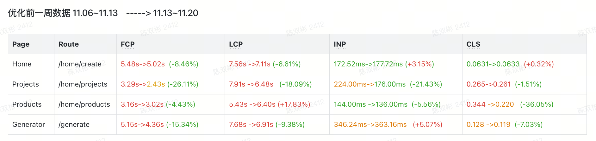

# creative-ai

性能优化实践：
主要优化指标: FCP,LCP.

#### 懒加载

组件懒加载——将非首页使用的组件懒加载，提升首屏加载速度。
优化 300ms

#### 数据请求

- 请求并行
  根据 chrome 的 performance 面板，发现查询维护状态是同步的，即 a 请求完成之后才进行 b 请求。
  解决方案：使用 useQuery 库，维护 a 请求的状态，后续 b 正常请求不用等待 a 请求完成。
  优化 150ms

- 预请求资源
  对于一些资源，使用 tt4b/pre-cache 包，对后续需要的资源在浏览器闲置时间加载，可以预请求，提前请求，减少请求时间。

#### 资源处理

- 图片处理

  - 图片压缩：
    对大型图片使用 rsbuild 的 pluginImageCompress 插件，对图片进行压缩，减小网络压力.
    优化:
    图片体积 10mb->3mb。
    fcp 优化 450ms
  - 对于首页使用到的图片，使用预加载，提前加载图片，减少 lcp 时间。
  - 开启浏览器缓存，优化二次进入页面后加载速度。

- 打包结果处理
  使用 bundleAnalyzer 插件，对打包结果进行分析，发现部分文件体积过大，单个 js 文件体积高达 3mb，可以进行优化。
  优化：
  - 对于常用的库，比如 okee-react，feelgood 库，进行强制拆分
  - 对于利用 monorepo 外部公共包的项目，使用 max，min 进行限制文件大小。

优化结果

