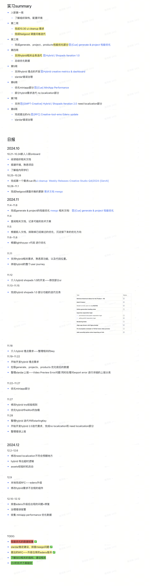
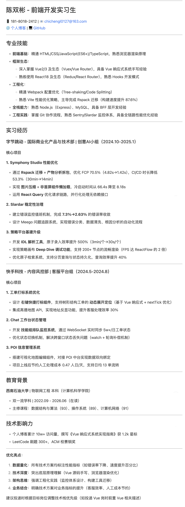

# 陈双彬 Creative AI 实习

## 团队

国际化商业产品与技术（GMPT）——创意智能与品牌创新技术——创意 ai 小组 1p

### 背景

对于商业化广告投放而言，广告主在进行广告投放之前，需要先保证有创意短视频；创意短视频制作周期长、制作成本高，是商业化收入增长的主要瓶颈之一。为了解决创意的问题，创意与生态团队应运而生，主要解决商业化场景下创意供给的问题。
创意工厂是创意一方解决方案的其中一个子方向，主要通过利用 AIGC 的能力，直接为广告主等潜在用户提供创意解决方案，提供快速生产创意的能力。

非中商业化的 User Journey:

- **creative**:
  帮助广告主解决创意供给的问题（解决方案分为一方和三方）
- ads format:
  广告样式,图文/视频/...
  承上启下，一方面做 creative 的延伸，切合 Creative 的主题，激发创意；另一方面，作为 landing page 的先锋，需要透露一定内容，符合用户点击样式后的预期
- landing page:
  用户点击广告之后出现的页面
  主要承载转化的能力，包括，购买、下载，提供线索等
  分为一方和三方
  - 一方属于 tiktok 的资产，tiktok 提供设计好的特定行业的落地页模版，广告主来使用，快速创建落地页进行投放
  - 三方落地页属于广告主的资产，广告主自行建立落地页，而三方的成员主要是对落地页优化，比如预加载、预填充等

创意短视频主要途径有两种种:

- 广告主自行制作短视频。这种方式需要广告主有较强的创意能力，根据商品信息+借助 AI 能力生成创意 demo，然后广告主再自行推广(1P)
- 通过星图等平台，链接广告主与达人，让达人帮广告主制作创意短视频(3P)

本人属于 Creative AI 1P，团队目的是:

- 帮助商业化客户获取创意灵感
- 进行创意诊断
- 生产和优化创意

3P 主要做的事：由第三方制作广告并且进行推广，比如达人和广告主对接之后，达人出版推广视频
三方创意的解决方案主要有两种:

- TTCX:Tiktok Creative Exchange, 让广告主找到适合自己的创意服务商，定制高质量的创意内容（广告主——达人,1v1）
- TTCC:Tiktok Creative Center, 广告主自助发布素材制作挑战，然后创作者参与，产出广告素材（广告主——创作者,1vN）。

### 组织架构

- 策略算法： 决定内容策略，即决定创意素材的整体轮廓
- 基建 Infrastructure: 负责创意素材的生成、管理、tracking
- 产品/能力: 将创意的能力包装秤解决方案对外输出
  - 业务出口: TTAM,Cue(Symphony),API（便于三方调用，因此做了 bff 层对接）
  - 业务项目：
    - AI 数字人、AI 翻译、视频编辑（借助 CapCut 的能力）、TTAM 创编流改造
    - P2V（由产品生成创意视频）、AIGC image

### 核心指标

- New Spending materials：新增的有广告小号素材数量
- Revenue penetration: 即生产的素材带来的广告消耗占总体广告消耗中的占比

## 实习经历

- ui clean up and feelgood: Q3 阶段 ui 需要改进 + 用户调查问卷的更新。
- performace optimization: Q4 阶段对 Cue/Avatar/Dubbing 进行优化，提升用户体验。
- hybrid creative update weekly: 每周对 TTAM 中的 hybrid creative 进行迭代更新 + 埋点开发。
- \[RFC\] creative-tools-emo edenx upgrade: 对仓库的 edenx 框架升级 同时支持 rspack 等构建工具。
- slardar 稳定性治理: 根据 slardar 平台上报的错误, 对错误进行排查/治理/忽略。

### ui clean up and feelgood

背景: Q3 阶段完成之后，发现 ui 不统一的现象，需要对 ui 进行修改。同时，因为之前的问卷内容形式单一，在各个子应用中的问卷弹窗都是同一风格，且出现时机需要根据情况调整因此需要对问卷进行优化。
这个需求是我在进入团队的第一个需求，也是我通过需求去了解我们团队的技术栈以及整体的构建。
收获: 了解到了团队的仓库架构，同时经过 ui cleanup 逐渐熟悉项目。

### performance optimization

背景: 在 Q2 结束阶段发现站点性能不太客观，且处于持续劣化状态，因此在 Q3 阶段就开始进行性能优化，同时因为我是在 Q4 阶段入职的，由我负责 Q4 阶段的性能优化工作。
方案:

- 升级 edenx 框架, 让其支持 rspack、rsbuild 等工具，加快构建流程
- 利用 bundleAnalyzer 对构建产物进行分析，后续对构建产物进行强行拆包
- 利用插件将图片进行压缩
- 懒加载非首页组件，减轻首次加载的压力
- 并行请求 将无依赖的请求进行并行请求，将长请求通过 react-query 进行优化

我的收获: 了解到了 FCP、LCP 的优化思路，以及对于整体的优化方向。
项目收益: FCP 优化了 70.5%（4.82s -> 1.42s），LCP 优化了 5%(7.28s -> 6.96s)
后续的 LCP 整体呈现劣化状态，且从 6.96s 上升到 8.16s, 后续优化重点为 LCP
FCP 优化明显，是因为 FCP 的定义为首次渲染出来第一个像素点的时间，因此在 HTML 中塞入 Loading icon，后续 React 渲染完成之后会覆盖掉
LCP 优化不明显太长了，是因为 LCP 优化阶段中的 ttfb、load delay、load time、render delay 中的 render delay 

### hybrid creative update weekly

背景: 团队在 Q3 阶段完成了 hybrid creative 的基础功能，但是由于 hybrid creative 的迭代更新比较频繁，因此需要每周进行迭代更新，以确保用户体验的
同时 hybrid 的 owner 对于需求迭代没有足够的时间进行迭代，因此这部分由我承担，后续她负责 cr
方案:

- 对 shopAds 和 hybrid creative 的迭代更新
- 组件更新迭代
- 埋点开发，以及埋点 key 的确定

### \[RFC\] creative-tools-emo edenx upgrade

背景: Creative-tool-emo 仓库中，大部分的应用使用的 Edenx 版本为 1.37.2，与目前 Edenx 最新版本 1.63.0 相差较大，无法使用最新的特性；同时项目之间的 Edenx 版本不统一可能会有潜在的风险。
目的:

- 统一各个项目/包的 Edenx 版本。目前 monorepo 中部分应用已经迁移 Rspack，导致大家的 Edenx 版本不统一不利于后续维护
- Rspack 迁移。EdenX 新项目已默认启用 Rspack 构建，生产环境使用已稳定。未迁移 Rspack 的应用可以借此机会迁到 Rspack 来获取大幅的性能提升:
- 加快 ci/cd 流程，提升开发效率

收益:

- 构建性能提升，无缓存冷启动 66.4s-> 8.186s(-87.6%)
- 统一 Edenx 版本，降低潜在风险
- ci/cd 时间减少 30mins -> 14mins(-53.3%)

### slardar 稳定性治理

背景: 为了支持 GA，持续优化我们的稳定性，我们需要定期治理高频告警，我们设立值班计划，每个值班同学负责把对应的报警问题提前排查并录入 Meego。
tips:General Availability 简称 GA，指产品发布过程中完成全量发布
方案:

- 以周维度，让值班同学对 slardar 上报错误进行下钻，并进行问题分类，并将问题录入 Meego
- 定期对 Meego 进行数据清洗，将无效问题清理掉
- 定期对 Meego 进行数据分析，发现问题并进行问题追踪，并且处理

目的:Q4 阶段完成时，报错率收敛在 3%一下，收益:7.3% -> 3%

## 2025.1

目前是转移到 creative ai infra 小组，做策略平台的建设。

### 背景

为了提升 Creative AI 在广告投放中的消耗渗透比与增量价值，团队需要持续且高效地对策略进行迭代，进而获得更为良好的效果。
同时也需要一个稳定且可靠的平台来支撑线上策略的执行
平台以策略为核心，以原子为基础，搭建一个高复用原子，稳定可靠的策略执行体系，以确保策略生产、评估、上线、A/B 实验等

Tips: 2024 Q4 末 Creative AI 在广告投放中消耗率占比为 5%

原子：为可复用的基础能力，一个原子往往对应一个 bam 服务。

策略：将多个原子进行编排为一个 workflow。（这里使用的 FlowEditorSDK，是字节跳动自研的画布引擎，与 ReactFlow 进行对比，发现在 200 个节点以下时，FlowEditorSDK 性能优于 ReactFlow 对比了 LCP 和 FPS，LCP 持平，FPS 是 ReactFlow 的 2 倍）。

测试集：针对不同策略创造对应的测试集，通过测试集的运行查看策略具体表现。

对于 AIGC 比较重要的就是策略的执行以及资产库的质量和数量。

2024Q4 阶段，策略平台的线上策略调用率为 95.25%，承接了 100%的图片策略调用和 33.27 的视频策略调用，预计在 2025Q1 阶段，策略平台的线上策略调用率将达到 100%。目前策略调用数量为 2402w

策略平台的核心指标:

1. task 失败率 / 失败数 568w/32.2%
2. 原子失败率 / 失败数
3. task 排队时间
   策略平台的使用方有：

- 内部 symphony creative 的策略团队
- 商业化的 genAi 团队
  目前 预计打造一个更加通用型的平台，迫在眉睫的是增加网关层，削弱类型数据，让其他团队能够更加轻量级接入。（现状是有类型约束的，如果其他团队接入需要花费比较大的成本）
  还需要补齐 abtest，上线流程和编排功能的优化。

同时策略平台缺少一些对应的埋点，导致优化收益不能以明确的数据展示
资产库为 infra 的一个能力，广告主提供素材，然后结合策略，进行生产成品，目前资产库就有管理，新增和删除方面的能力。
策略平台最底层的基建是 byteFlow（字节的自研工作流引擎）
前端->flowjson->asl->byteflow

### 工作

1. 原子录入支持 IDL 解析
   背景：目前原子录入的能力是手动录入，需要人工解析 IDL，耗时耗力。因此需要支持 IDL 解析，自动生成原子。
   预期收益：将创建原子的耗时由 avg 3mins-> avg 30s，提升原子录入效率。

技术方案：

- 写入了一个 bff 层，通过 bam 链接来获取对应的接口需要的信息
- 然后通过请求将数据获取到前端
- 前端拿到数据之后，通过解析格式，将内容呈现到表单中

2. 策略平台优化
   背景：策略平台建设是想方便团队管理策略，目前在使用策略平台上存在一些细节的不足
   技术方案：

- 支持原子的分页和条件查询
- 支持条件查询的持久化（状态管理库完成）
- 支持原子列表/菜单栏的收起和展开，对于策略 flow 的展示节点增加 deep dive 功能方便查看调试子策略/原子
  目前策略平台的使用方有：

- 内部 symphony creative 的策略团队
- 商业化的 genAi 团队

目前
预计打造一个更加通用型的平台，迫在眉睫的是增加网关层，削弱类型数据，让其他团队能够更加轻量级接入。（现状是有类型约束的，如果其他团队接入需要花费比较大的成本）
还需要补齐 abtest，上线流程和编排功能的优化。

同时策略平台缺少一些对应的埋点，导致优化收益不能以明确的数据展示

资产库为 infra 的一个能力，广告主提供素材，然后结合策略，进行生产成品，目前资产库就有管理，新增和删除方面的能力。

策略平台最底层的基建是 byteFlow（字节的自研工作流引擎）

前端->flowjson->asl->byteflow

### 工作

#### 原子录入支持 IDL 解析

背景：目前原子录入的能力是手动录入，需要人工解析 IDL，耗时耗力。因此需要支持 IDL 解析，自动生成原子。
预期收益：将创建原子的耗时由 avg 3mins-> avg 30s，提升原子录入效率。

技术方案：

- 写入了一个 bff 层，通过 bam 链接来获取对应的接口需要的信息，然后通过请求将数据获取到前端。
- 前端拿到数据之后，通过解析格式，将内容呈现到表单中。

#### 策略平台优化

背景：策略平台建设是想方便团队管理策略，目前在使用策略平台上存在一些细节的不足
技术方案：

- 支持原子的分页和条件查询
- 支持条件查询的持久化（状态管理库完成）
- 支持原子列表/菜单栏的收起和展开，对于策略 flow 的展示节点增加 deep dive 功能方便查看调试子策略/原子

Creative Intelligence and Brand Innovation Technology-Creative AI部门使用的AIGC基础模型包括以下几种：

1. **GPT系列**：GPT系列是当前AIGC赛道的核心模型之一，包括Open AI发布的GPT-1到GPT-3，以及微软基于GPT-3开发的Turing系列模型。这些模型在英文场景上表现尤为突出，但中文领域也有华为的盘古系列模型和智源的中文GPT系列等模型在使用。 
2. **Transformer系列**：Transformer模型也是AIGC赛道上的核心模型，包括Google的T5，Facebook的BART和M2M等。这些模型在自动摘要生成、回复生成、生成式QA、纠错、翻译等任务上表现优异。 
3. **多语言预训练模型**：这些模型包括mBERT、mT5、mBART、XLMR和mGPT等，它们可以支持其他语言场景的理解和生成任务。 
4. **自研模型**：部门还使用了自研模型，如ByteArtist平台提供的模型，这些模型结合了自主研发和开源生态，为用户提供全面的AI内容生成体验。

